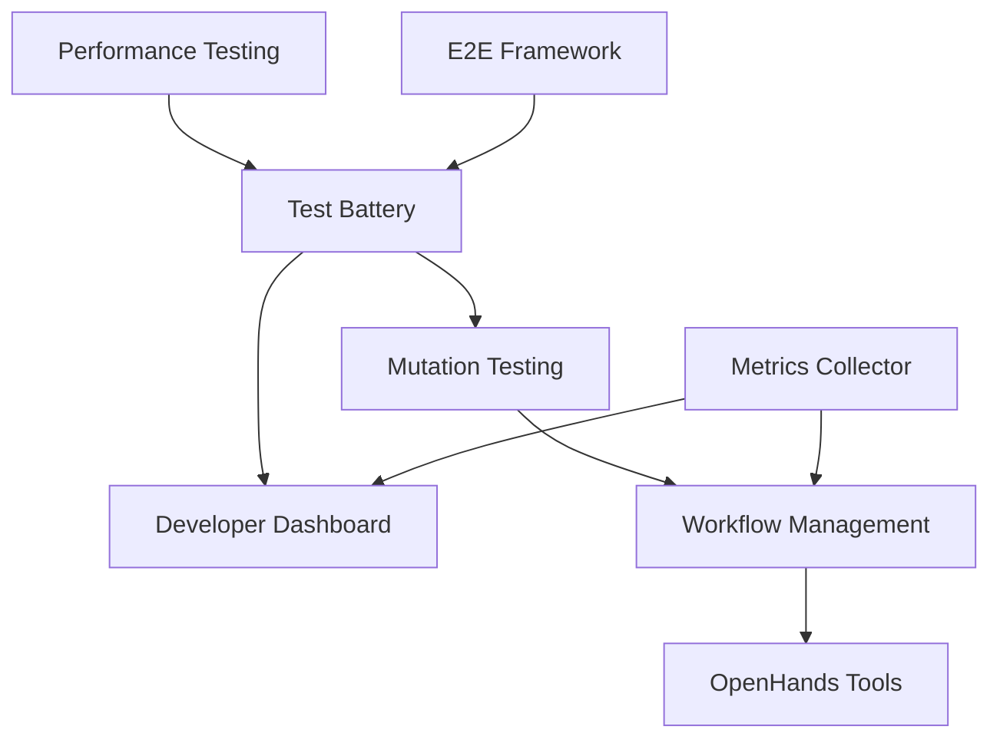

# TTA → TTA.dev Extraction Assessment

**Date**: October 29, 2025
**Repositories**:
- Source: `theinterneti/TTA`
- Target: `theinterneti/TTA.dev`

## Executive Summary

TTA contains **10 major development component categories** that should be packaged into TTA.dev for reuse across projects. Beyond the already-extracted Keploy Framework and Observability Integration, TTA has built substantial testing, monitoring, and workflow automation infrastructure that is production-ready and highly reusable.

## Already Extracted ✅

### 1. Keploy Framework
- **Location**: `TTA.dev/packages/keploy-framework`
- **Status**: Complete (see `KEPLOY_FRAMEWORK_EXTRACTION_COMPLETE.md`)
- **Size**: 16 files, ~1,500 lines
- **Features**: YAML config, test runner, recording, validation, CLI

### 2. Observability Integration (including Dashboard Infrastructure)
- **Location**: `export/tta-observability-integration/`
- **Status**: Exported, ready for TTA.dev
- **Features**:
  - OpenTelemetry APM integration
  - Router/Cache/Timeout primitives (workflow primitives)
  - Component maturity metrics
  - Circuit breaker observability
  - LLM usage and cost tracking
  - **Grafana dashboard suite** (System, Agent, LLM, Component Maturity, Circuit Breaker, Performance)
- **Cost Savings**: 30-40% through intelligent routing and caching
- **Note**: This already includes the monitoring/dashboard infrastructure that was planned for "Developer Dashboard"

### 3. Universal Agent Context
- **Location**: `packages/universal-agent-context/`
- **Status**: Complete and standalone
- **Features**:
  - Cross-platform agentic primitives (.github/ structure)
  - Augment CLI-specific primitives (.augment/ structure)
  - Chat modes, workflows, instructions, context management
  - Memory system for architectural decisions
- **Universal**: Works across Claude, Gemini, Copilot, and Augment
- **Note**: This is the extracted/packaged version of .augment/ and .github/ primitives

### 4. AI Development Toolkit
- **Location**: `packages/ai-dev-toolkit/`
- **Status**: Complete bundle
- **Features**:
  - Workflow primitives (Router, Cache, Timeout, Retry)
  - Development primitives (error recovery)
  - OpenHands integration tools
  - Monitoring & observability
  - Workflow management (quality gates, stage handlers)
- **Note**: This bundles several development tools together

---

## Priority 1: High Reusability, Production-Ready

### 3. Comprehensive Test Battery
**Location**: `tests/comprehensive_battery/`

**Why Extract**:
- Complete testing framework with mock fallbacks
- Multiple test suites: standard, adversarial, load/stress
- Data pipeline and dashboard validation
- Production-ready with extensive documentation

**Structure**:
```
comprehensive_battery/
├── comprehensive_test_battery.py    # Main orchestrator
├── run_comprehensive_tests.py       # CLI execution
├── config/
│   └── comprehensive_test_config.yaml
├── test_suites/
│   ├── standard_test_suite.py       # Normal flows
│   ├── adversarial_test_suite.py    # Edge cases, security
│   └── load_stress_test_suite.py    # Performance testing
├── validators/
│   ├── data_pipeline_validator.py   # E2E data flow
│   └── dashboard_validator.py       # Real-time monitoring
└── utils/
    ├── test_data_generator.py
    ├── metrics_collector.py
    └── report_generator.py
```

**Key Features**:
- Mock fallbacks for Redis, Neo4j, OpenRouter
- Automatic test categorization (standard, adversarial, load)
- Real-time metrics collection
- Comprehensive HTML/JSON reporting
- WebSocket testing support

**Reusability**: **Very High** - Any project needing comprehensive testing
**Estimated LOC**: 2,000-3,000 lines
**Dependencies**: pytest, pytest-asyncio, aioredis, neo4j, psutil

**Package Name**: `tta-test-battery` or `comprehensive-test-battery`

---

### 4. Mutation Testing Framework
**Location**: `tests/mutation/`, `scripts/manual_mutation_test.py`, `scripts/run_mutation_tests.sh`

**Why Extract**:
- Manual and automated mutation testing
- Cosmic-ray integration
- Comprehensive mutation result tracking
- Production-ready reporting

**Structure**:
```
mutation/
├── README.md
├── mutation_config.toml              # Cosmic-ray config
├── mutation_results/                 # Historical results
└── scripts/
    ├── manual_mutation_test.py       # 252 lines, manual mutations
    ├── run_mutation_tests.sh         # Automated execution
    └── setup_mutants_env.py          # Environment setup
```

**Key Features**:
- Manual mutation definitions with expected results
- Automatic test execution and rollback
- Mutation survival tracking
- HTML report generation
- Integration with CI/CD (GitHub Actions workflow exists)

**Sample Mutations**:
- Zero out scoring weights
- Change comparison operators
- Remove score contributions
- Modify default values
- Skip validation checks

**Reusability**: **Very High** - Mutation testing is universally valuable
**Estimated LOC**: 500-800 lines
**Dependencies**: pytest, cosmic-ray, mutmut (optional)

**Package Name**: `tta-mutation-testing` or `python-mutation-framework`

---

### 5. Workflow Management Tools
**Location**: `scripts/workflow/`

**Why Extract**:
- Quality gates for component maturity
- Stage handlers (development → staging → production)
- Spec-to-production automation
- OpenHands integration

**Structure**:
```
workflow/
├── quality_gates.py           # Coverage, complexity, security checks
├── stage_handlers.py          # Stage transition logic
├── spec_to_production.py      # Automated promotion pipeline
├── openhands_stage.py         # OpenHands integration
├── validate_async_cli.py      # Async CLI validation
└── workflow_config.yaml       # Workflow configuration
```

**Key Features**:
- **Quality Gates**:
  - Test coverage thresholds (≥70%, ≥80%, ≥85%)
  - Mutation score thresholds (≥75%, ≥80%, ≥85%)
  - Cyclomatic complexity limits (≤10, ≤8)
  - File size limits (≤1000, ≤800 lines)
  - Security issue checks
- **Stage Handlers**:
  - Development → Staging promotion
  - Staging → Production promotion
  - Automatic validation and rollback
- **Automation**:
  - Spec-driven workflow
  - GitHub issue/PR integration
  - Automated testing and validation

**Component Maturity Workflow**:
1. **Development**: ≥70% coverage, ≥75% mutation score
2. **Staging**: ≥80% coverage, ≥80% mutation score
3. **Production**: ≥85% coverage, ≥85% mutation score

**Reusability**: **Very High** - Code quality workflows are universally needed
**Estimated LOC**: 1,500-2,000 lines
**Dependencies**: pytest, coverage, pyright, ruff

**Package Name**: `tta-workflow-automation` or `component-maturity-framework`

---

### 6. Component Maturity Tracking
**Location**: `scripts/maturity/`

**Why Extract**:
- Metrics collection for code quality
- Component maturity analysis
- Integration with workflow management

**Structure**:
```
maturity/
├── ARCHITECTURE.md            # System architecture
├── metrics_collector.py       # Metrics collection
└── analyze-component-maturity.py  # (in scripts/)
```

**Key Features**:
- Test coverage metrics
- Mutation score tracking
- Cyclomatic complexity analysis
- File size monitoring
- Security issue tracking
- Historical trend analysis
- Component promotion readiness

**Metrics Collected**:
- Test coverage percentage
- Mutation test survival rate
- Code complexity scores
- File/function size metrics
- Security findings count
- Dependency health
- Documentation completeness

**Reusability**: **Very High** - Tracking code quality is universally useful
**Estimated LOC**: 800-1,200 lines
**Dependencies**: coverage, radon, bandit, pyright

**Package Name**: `tta-metrics-collector` or `code-quality-metrics`

---

### 7. Developer Dashboard (⚠️ ALREADY INCLUDED)
**Location**: `src/developer_dashboard/`

**Status**: **NOT FOR EXTRACTION** - Already covered by Observability Integration

**Reason**: The observability package already includes comprehensive dashboard infrastructure:
- Grafana dashboard suite (6 dashboards)
- Real-time metrics collection
- Component maturity tracking
- Test battery integration via metrics
- Alert management
- Historical data retention

**What Remains**: Only TTA-specific FastAPI dashboard config (`dashboard_config.py` - 262 lines)
- This is application-specific configuration, not reusable infrastructure
- Real monitoring happens through Grafana (already in observability package)
- This component should **remain in TTA** as app-specific glue code

**Recommendation**: ~~Do not extract~~ - Keep as TTA-specific integration layer

---

## Priority 2: High Value, May Need Adaptation

### 8. OpenHands Integration Tools
**Location**: Multiple scripts in `scripts/`

**Why Extract**:
- Testing and validation for OpenHands/Devin workflows
- Build component automation
- Diagnostics and monitoring
- Batch execution support

**Files**:
```
openhands/
├── test_openhands_workflow.py          # Workflow testing
├── test_openhands_integration.py       # Integration tests
├── test_openhands_e2e.py               # E2E tests
├── test_openhands_config_loading.py    # Config validation
├── test_openhands_with_real_credentials.py
├── test_openhands_fixed.py
├── diagnose_openhands.py               # System diagnostics
├── demo_openhands_subagent.py          # Demo implementation
├── demo_async_openhands_workflow.py    # Async workflow demo
├── openhands_build_component.py        # Build automation
└── verify_openhands_implementation.py  # Verification tool
```

**Key Features**:
- Workflow testing and validation
- Configuration loading and verification
- Real credential testing (with fallbacks)
- System diagnostics and health checks
- Async workflow support
- Build component automation
- E2E testing support

**Reusability**: **High** - For projects using OpenHands/Devin
**Estimated LOC**: 1,500-2,500 lines
**Dependencies**: OpenHands SDK, pytest, asyncio

**Package Name**: `tta-openhands-toolkit` or `openhands-testing-framework`

---

### 9. E2E Testing Infrastructure
**Location**: `tests/e2e/`, `tests/e2e-staging/`, Playwright configs

**Why Extract**:
- Playwright-based E2E testing
- Staging environment support
- Coverage reporting
- Multiple test configurations

**Structure**:
```
e2e/
├── tests/e2e/*.spec.ts               # E2E test specs
├── tests/e2e-staging/*.spec.ts       # Staging tests
├── playwright.config.ts              # Base config
├── playwright.coverage.config.ts     # Coverage config
├── playwright.quick.config.ts        # Quick validation
└── playwright.staging.config.ts      # Staging config
```

**Key Features**:
- Multiple environment configurations
- Coverage collection
- Quick validation mode
- Staging-specific tests
- Visual regression testing (potential)
- Parallel execution support

**Reusability**: **Medium-High** - Especially for web applications
**Estimated LOC**: Variable (depends on test count)
**Dependencies**: Playwright, TypeScript

**Package Name**: `tta-e2e-framework` or `playwright-e2e-toolkit`

---

### 10. Performance Testing Framework
**Location**: `tests/performance/`, performance scripts

**Why Extract**:
- Performance regression detection
- Load testing capabilities
- Concurrent request testing
- Budget validation

**Files**:
```
performance/
├── performance_test.py                  # Performance tests
├── performance_regression_check.py      # Regression detection
├── concurrent_load_test.py              # Load testing
└── scripts/check-performance-budget.js  # Budget checking
```

**Key Features**:
- Response time measurement
- Throughput testing
- Concurrent load simulation
- Performance budget enforcement
- Regression detection
- Baseline comparison

**Reusability**: **High** - Performance testing is universally needed
**Estimated LOC**: 800-1,200 lines
**Dependencies**: pytest, aiohttp, psutil, locust (optional)

**Package Name**: `tta-performance-testing` or `python-performance-framework`

---

## Priority 3: Consider for Universal Context

### 11. AI Workflow Primitives
**Location**: `.augment/`, `packages/universal-agent-context/`

**Status**: **May already be universal** via `universal-agent-context` package

**Structure**:
```
.augment/
├── chatmodes/          # Role-based AI interaction modes
├── workflows/          # Multi-step workflow prompts
├── instructions/       # Modular instruction files
├── context/            # Context management
├── memory/             # Persistent memory
└── user_guidelines.md
```

**Key Features**:
- Chat modes: architect, backend-dev, frontend-dev, devops, qa-engineer
- Workflow prompts: test-coverage-improvement, bug-fix, refactoring
- Instruction files: Testing, API security, therapeutic safety
- Context management: Session-based context loading
- Memory bank: Persistent decisions and learnings

**Reusability**: **Extremely High** - Universal for AI-assisted development
**Estimated LOC**: 3,000-5,000 lines (documentation-heavy)

**Note**: Check if `packages/universal-agent-context/` already contains this

**Package Name**: `universal-agent-context` (may already exist)

---

### 12. Scripts/Utilities Collection
**Location**: Various subdirectories in `scripts/`

**Potentially Reusable**:
- **Development** (`scripts/dev/`): Dev environment setup, recovery
- **Registry** (`scripts/registry/`): Component registry management
- **Visualization** (`scripts/visualization/`): Data visualization tools
- **Maintenance** (`scripts/maintenance/`): Cleanup, organization
- **Pre-commit** (`scripts/pre-commit/`): Git hooks, validation

**Recommendation**: Cherry-pick most reusable utilities rather than extracting as a whole package

---

## Additional Components to Consider

### 13. Test Component Infrastructure
**Location**: `src/test_components/calculator/`

**Status**: Appears to be example/demo components for testing
**Recommendation**: Include as examples in test battery package

### 14. Monitoring Integration
**Location**: `monitoring/`, `scripts/monitoring/`

**Features**:
- Grafana dashboard configurations
- Prometheus metrics
- Monitoring report generation

**Status**: Overlaps with observability integration
**Recommendation**: Merge with existing observability package

### 15. GitHub Actions Workflows
**Location**: `.github/workflows/`

**Potentially Reusable**:
- `mutation-testing.yml`
- `keploy-tests.yml`
- Component promotion workflows
- Quality gate checks

**Recommendation**: Include as templates in respective packages

---

## Extraction Priority Matrix

| Component | Priority | Reusability | Maturity | Est. Effort | Package Name |
|-----------|----------|-------------|----------|-------------|--------------|
| Comprehensive Test Battery | P1 | Very High | Production | Medium | `tta-test-battery` |
| Mutation Testing | P1 | Very High | Production | Small | `tta-mutation-testing` |
| Workflow Management | P1 | Very High | Production | Medium | `tta-workflow-automation` |
| Component Maturity | P1 | Very High | Production | Small | `tta-metrics-collector` |
| Developer Dashboard | P1 | High | Production | Medium | `tta-developer-dashboard` |
| OpenHands Tools | P2 | High | Staging | Medium | `tta-openhands-toolkit` |
| E2E Testing | P2 | Medium-High | Production | Small | `tta-e2e-framework` |
| Performance Testing | P2 | High | Staging | Small | `tta-performance-testing` |
| AI Workflow Primitives | P3 | Extremely High | Production | N/A* | `universal-agent-context` |
| Scripts/Utilities | P3 | Variable | Variable | Small | N/A (cherry-pick) |

*May already be extracted as `universal-agent-context`

---

## Recommended Extraction Order

### Phase 1: Core Testing Infrastructure
1. **Comprehensive Test Battery** - Foundation for all testing
2. **Mutation Testing Framework** - Quality assurance
3. **Developer Dashboard** - Monitoring and visualization

### Phase 2: Quality & Workflow
4. **Component Maturity Tracking** - Metrics collection
5. **Workflow Management Tools** - Quality gates and automation

### Phase 3: Specialized Tools
6. **Performance Testing Framework** - Performance validation
7. **OpenHands Integration Tools** - AI workflow testing
8. **E2E Testing Infrastructure** - End-to-end validation

### Phase 4: Consolidation
9. Review and merge with existing packages
10. Documentation updates
11. Cross-package integration testing

---

## Package Naming Convention

Recommended naming pattern: `tta-<component-type>`

- `tta-test-battery` - Comprehensive testing framework
- `tta-mutation-testing` - Mutation testing tools
- `tta-workflow-automation` - Quality gates and promotion
- `tta-metrics-collector` - Code quality metrics
- `tta-developer-dashboard` - Dev monitoring dashboard
- `tta-performance-testing` - Performance testing tools
- `tta-openhands-toolkit` - OpenHands integration
- `tta-e2e-framework` - E2E testing infrastructure

Alternative: Generic names for broader adoption
- `comprehensive-test-battery`
- `python-mutation-framework`
- `component-maturity-framework`
- `code-quality-metrics`
- `dev-monitoring-dashboard`

---

## Cross-Package Dependencies



**Key Integration Points**:
- Test Battery provides data to Developer Dashboard
- Mutation Testing results feed into Workflow Management
- Metrics Collector supplies data to Dashboard and Workflow
- Performance and E2E tests integrate with Test Battery
- Workflow Management can trigger OpenHands workflows

---

## Next Steps

### Immediate Actions
1. ✅ Review this assessment
2. ⬜ Prioritize packages for extraction
3. ⬜ Create extraction plan for Priority 1 components
4. ⬜ Set up TTA.dev package structure
5. ⬜ Begin extraction with Test Battery

### For Each Package
1. Create package directory structure
2. Extract and adapt code
3. Write comprehensive README
4. Add examples and templates
5. Write unit tests (if not already present)
6. Document dependencies
7. Create PyPI-ready `pyproject.toml`
8. Integration testing with other packages
9. Update TTA.dev main README
10. Publish to PyPI (optional)

### Quality Checklist
- [ ] Comprehensive README (400+ lines)
- [ ] Working examples
- [ ] Unit tests (≥70% coverage)
- [ ] Type hints throughout
- [ ] CI/CD workflow (GitHub Actions)
- [ ] License file (MIT)
- [ ] CHANGELOG.md
- [ ] Clear dependencies
- [ ] Installation instructions
- [ ] Usage documentation

---

## Conclusion

**TTA contains significantly more reusable development infrastructure than initially apparent.** Beyond Keploy and Observability, there are **8 additional high-value components** ready for extraction:

1. **Comprehensive Test Battery** - Production-ready testing framework
2. **Mutation Testing Framework** - Quality assurance automation
3. **Workflow Management Tools** - Component maturity automation
4. **Component Maturity Tracking** - Code quality metrics
5. **Developer Dashboard** - Real-time monitoring
6. **OpenHands Integration Tools** - AI workflow testing
7. **E2E Testing Infrastructure** - End-to-end validation
8. **Performance Testing Framework** - Performance validation

These components represent **10,000-15,000 lines of production-ready code** that can benefit other projects. The extraction effort is justified by the high reusability and maturity of these systems.

**Recommended Next Step**: Begin with Priority 1 components (Test Battery, Mutation Testing, Developer Dashboard) as they are production-ready and have clear value propositions.

---

**Document Status**: Draft for Review
**Last Updated**: October 29, 2025
**Author**: Assessment via GitHub Copilot
**Next Review**: After stakeholder feedback


---
**Logseq:** [[TTA.dev/.archive/Infrastructure/2025-10/Tta_dev_extraction_assessment]]
