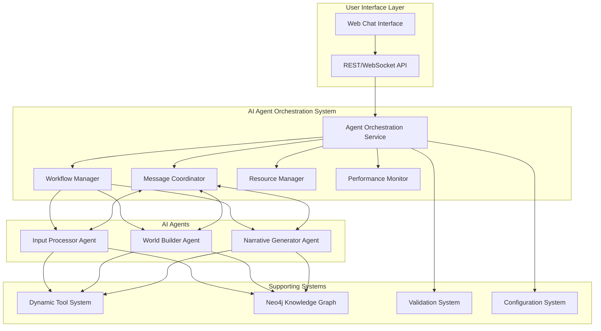

# Design Document

## Overview

The AI Agent Orchestration System serves as the central coordination layer for TTA's multi-agent architecture, managing the World Builder Agent (WBA), Input Processor Agent (IPA), and Narrative Generator Agent (NGA). Built on LangGraph workflows and integrated with the existing TTA component system, this orchestration layer ensures seamless collaboration between specialized AI agents while maintaining therapeutic safety and optimal resource utilization.

The system leverages TTA's existing infrastructure including Neo4j knowledge graphs, the dynamic tool system, and the component-based architecture to provide a robust, scalable, and therapeutically-focused agent coordination platform.

## Architecture

### High-Level Architecture



### Component Integration

The orchestration system integrates with existing TTA components:

- **Component System**: Inherits from the base `Component` class for lifecycle management
- **Configuration**: Uses `TTAConfig` and `tta_config.yaml` for centralized configuration
- **Neo4j Integration**: Leverages existing Neo4j components for knowledge persistence
- **LLM Integration**: Utilizes existing LLM components for model access
- **Carbon Tracking**: Integrates with Carbon component for emissions monitoring

## Components and Interfaces

### 1. Agent Orchestration Service (AOS)

**Primary Interface:**

```python
class AgentOrchestrationService(Component):
    def __init__(self, config: TTAConfig):
        super().__init__(
            name="agent_orchestration",
            dependencies=["neo4j", "llm", "redis"]
        )

    async def process_user_input(
        self,
        user_input: str,
        session_context: SessionContext
    ) -> OrchestrationResponse

    async def coordinate_agents(
        self,
        workflow_type: WorkflowType,
        context: AgentContext
    ) -> WorkflowResult
```

**Key Responsibilities:**

- Route incoming requests to appropriate workflows
- Coordinate agent execution sequences
- Manage session state and context
- Ensure therapeutic safety validation
- Handle error recovery and fallback strategies

### 2. Workflow Manager

**Primary Interface:**

```python
class WorkflowManager:
    async def execute_workflow(
        self,
        workflow_definition: WorkflowDefinition,
        initial_context: AgentContext
    ) -> WorkflowResult

    def register_workflow(
        self,
        workflow_type: WorkflowType,
        definition: WorkflowDefinition
    ) -> None

    async def get_workflow_status(
        self,
        workflow_id: str
    ) -> WorkflowStatus
```

**Workflow Types:**

- **Input Processing Workflow**: IPA → Context Analysis → Routing Decision
- **World Building Workflow**: WBA → World State Update → Validation
- **Narrative Generation Workflow**: NGA → Content Generation → Safety Check
- **Collaborative Workflow**: IPA → WBA → NGA → Integration

### 3. Message Coordinator

**Primary Interface:**

```python
class MessageCoordinator:
    async def send_message(
        self,
        sender: AgentId,
        recipient: AgentId,
        message: AgentMessage
    ) -> MessageResult

    async def broadcast_message(
        self,
        sender: AgentId,
        message: AgentMessage,
        recipients: List[AgentId]
    ) -> List[MessageResult]

    def subscribe_to_messages(
        self,
        agent_id: AgentId,
        message_types: List[MessageType]
    ) -> MessageSubscription

    # Reliability extensions (Task 4.2)
    async def receive(self, agent_id: AgentId, visibility_timeout: int = 5) -> Optional[ReceivedMessage]
    async def ack(self, agent_id: AgentId, token: str) -> bool
    async def nack(self, agent_id: AgentId, token: str, failure: FailureType = FailureType.TRANSIENT, error: Optional[str] = None) -> bool
    async def recover_pending(self, agent_id: Optional[AgentId] = None) -> int
    async def configure(self, *, queue_size: Optional[int] = None, retry_attempts: Optional[int] = None, backoff_base: Optional[float] = None, backoff_factor: Optional[float] = None, backoff_max: Optional[float] = None) -> None
```

**Message Types:**

- **ContextUpdate**: Shared context changes
- **TaskRequest**: Agent task assignments
- **TaskComplete**: Task completion notifications
- **ErrorNotification**: Error and failure alerts
- **ResourceRequest**: Resource allocation requests

### 4. Resource Manager

**Primary Interface:**

```python
class ResourceManager:
    async def allocate_resources(
        self,
        agent_id: AgentId,
        resource_requirements: ResourceRequirements
    ) -> ResourceAllocation

    async def monitor_usage(self) -> ResourceUsageReport

    async def optimize_allocation(
        self,
        current_workload: WorkloadMetrics
    ) -> OptimizationResult
```

**Resource Types:**

- **GPU Memory**: VRAM allocation for model inference
- **CPU Threads**: Processing thread allocation
- **Memory**: RAM allocation for agent operations
- **Network**: Bandwidth allocation for external calls
- **Storage**: Temporary storage for agent state

## Data Models

### Core Data Structures

```python
@dataclass
class AgentContext:
    session_id: str
    user_id: str
    character_id: Optional[str]
    world_id: Optional[str]
    therapeutic_profile: TherapeuticProfile
    conversation_history: List[ConversationTurn]
    world_state: WorldState
    agent_states: Dict[AgentId, AgentState]

@dataclass
class WorkflowDefinition:
    workflow_type: WorkflowType
    agent_sequence: List[AgentStep]
    parallel_steps: List[List[AgentStep]]
    error_handling: ErrorHandlingStrategy
    timeout_config: TimeoutConfiguration

@dataclass
class AgentMessage:
    message_id: str
    sender: AgentId
    recipient: AgentId
    message_type: MessageType
    payload: Dict[str, Any]
    timestamp: datetime
    priority: MessagePriority

@dataclass
class OrchestrationResponse:
    response_text: str
    updated_context: AgentContext
    workflow_metadata: WorkflowMetadata
    performance_metrics: PerformanceMetrics
    therapeutic_validation: ValidationResult
```

### Agent State Models

```python
class AgentState(BaseModel):
    agent_id: str
    status: AgentStatus  # IDLE, PROCESSING, ERROR, UNAVAILABLE
    current_task: Optional[str]
    resource_usage: ResourceUsage
    performance_metrics: AgentPerformanceMetrics
    last_activity: datetime

class SessionContext(BaseModel):
    session_id: str
    user_id: str
    active_character: Optional[Character]
    current_world: Optional[World]
    therapeutic_settings: TherapeuticSettings
    conversation_state: ConversationState
    safety_flags: List[SafetyFlag]
```

## Error Handling

### Error Categories and Strategies

1. **Agent Failure**

   - **Detection**: Health checks, timeout monitoring, exception catching
   - **Response**: Automatic restart, fallback agent activation, graceful degradation
   - **Recovery**: State restoration, context preservation, user notification

2. **Workflow Failure**

   - **Detection**: Step validation, dependency checking, output verification
   - **Response**: Workflow rollback, alternative path execution, manual intervention
   - **Recovery**: State consistency checks, context repair, workflow restart

3. **Resource Exhaustion**

   - **Detection**: Resource monitoring, threshold alerts, performance degradation
   - **Response**: Load balancing, resource reallocation, request queuing
   - **Recovery**: Resource cleanup, optimization, capacity scaling

4. **Therapeutic Safety Violations**
   - **Detection**: Content validation, safety monitoring, user feedback analysis
   - **Response**: Content blocking, alternative generation, human oversight
   - **Recovery**: Safety protocol review, model retraining, policy updates

### Error Handling Implementation

```python
class ErrorHandler:
    async def handle_agent_error(
        self,
        agent_id: AgentId,
        error: AgentError,
        context: AgentContext
    ) -> ErrorHandlingResult:
        """Handle agent-specific errors with appropriate recovery strategies."""

    async def handle_workflow_error(
        self,
        workflow_id: str,
        error: WorkflowError,
        context: AgentContext
    ) -> ErrorHandlingResult:
        """Handle workflow-level errors with rollback and recovery."""

    async def handle_safety_violation(
        self,
        violation: SafetyViolation,
        context: AgentContext
    ) -> SafetyHandlingResult:
        """Handle therapeutic safety violations with immediate protection."""
```

## Testing Strategy

### Unit Testing

- **Agent Interface Testing**: Mock agent implementations for isolated testing
- **Workflow Logic Testing**: Workflow definition validation and execution testing
- **Message Passing Testing**: Message delivery, ordering, and reliability testing
- **Resource Management Testing**: Allocation, monitoring, and optimization testing

### Integration Testing

- **Multi-Agent Workflows**: End-to-end workflow execution with real agents
- **Component Integration**: Integration with Neo4j, LLM, and other TTA components
- **Performance Testing**: Load testing, resource utilization, and scalability testing
- **Safety Testing**: Therapeutic content validation and safety protocol testing

### Test Implementation

```python
class OrchestrationSystemTests:
    async def test_basic_workflow_execution(self):
        """Test basic agent workflow coordination."""

    async def test_error_recovery(self):
        """Test error handling and recovery mechanisms."""

    async def test_resource_management(self):
        """Test resource allocation and optimization."""

    async def test_therapeutic_safety(self):
        """Test therapeutic content validation and safety."""

    async def test_performance_under_load(self):
        """Test system performance under high load."""
```

### Performance Benchmarks

- **Response Time**: < 2 seconds for standard interactions
- **Throughput**: > 100 concurrent sessions
- **Resource Efficiency**: < 80% GPU utilization under normal load
- **Error Rate**: < 1% workflow failures
- **Recovery Time**: < 5 seconds for automatic error recovery

## Configuration and Deployment

### Configuration Structure

```yaml
# Agent Orchestration Configuration
agent_orchestration:
  enabled: true
  port: 8503
  max_concurrent_workflows: 50
  workflow_timeout: 30

  # Agent Configuration
  agents:
    input_processor:
      enabled: true
      max_instances: 3
      timeout: 10
    world_builder:
      enabled: true
      max_instances: 2
      timeout: 15
    narrative_generator:
      enabled: true
      max_instances: 3
      timeout: 20

  # Resource Management
  resources:
    gpu_memory_limit: 0.8 # 80% of available VRAM
    cpu_thread_limit: 8
    memory_limit: "4GB"

  # Message Coordination
  messaging:
    queue_size: 1000
    message_timeout: 5
    retry_attempts: 3

  # Performance Monitoring
  monitoring:
    metrics_interval: 30
    health_check_interval: 10
    performance_logging: true
```

### Deployment Architecture

The orchestration system deploys as a new TTA component:

```python
class AgentOrchestrationComponent(Component):
    def __init__(self, config: TTAConfig):
        super().__init__(
            name="agent_orchestration",
            dependencies=["neo4j", "llm", "redis"]
        )

    def _start_impl(self) -> bool:
        # Initialize orchestration service
        # Start workflow manager
        # Configure message coordinator
        # Setup resource manager
        # Begin performance monitoring
        return True

    def _stop_impl(self) -> bool:
        # Gracefully shutdown workflows
        # Save agent states
        # Clean up resources
        return True
```

This design ensures seamless integration with the existing TTA architecture while providing robust, scalable, and therapeutically-safe agent orchestration capabilities.
