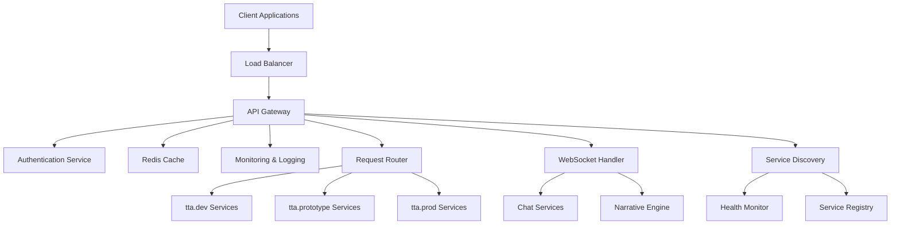

# API Gateway & Service Integration Design Document

## Overview

The API Gateway & Service Integration system will serve as the unified entry point for all TTA (Therapeutic Text Adventure) services, providing centralized routing, authentication, rate limiting, and service discovery. This design creates a scalable, secure, and therapeutically-aware gateway that consolidates the existing fragmented API endpoints across tta.dev, tta.prototype, and tta.prod repositories into a cohesive architecture.

The gateway will be implemented as a high-performance, containerized service that integrates seamlessly with the existing TTA infrastructure while maintaining therapeutic safety standards and clinical compliance requirements.

## Architecture

### High-Level Architecture



### Component Architecture

The API Gateway is structured as a modular system with the following core components:

1. **Gateway Core**: Main request processing engine built on FastAPI ✅ **IMPLEMENTED**
2. **Service Discovery**: Dynamic service registration and health monitoring ✅ **IMPLEMENTED**
3. **Authentication Module**: JWT-based authentication with therapeutic role management ✅ **IMPLEMENTED**
4. **Rate Limiting Engine**: Intelligent traffic management with therapeutic prioritization 🚧 **IN PROGRESS**
5. **WebSocket Manager**: Real-time communication handler for therapeutic sessions ⏳ **PLANNED**
6. **Security Scanner**: Therapeutic content safety and security validation ⏳ **PLANNED**
7. **Caching Layer**: Redis-based intelligent caching system ⏳ **PLANNED**
8. **Monitoring System**: Comprehensive observability and audit logging ✅ **IMPLEMENTED**

### Implemented Components (Phase 1)

#### Gateway Core (`src/api_gateway/app.py`)

- FastAPI application with comprehensive middleware stack
- Lifespan management for service initialization and cleanup
- CORS, compression, and security middleware integration
- Health and metrics endpoint routing

#### Data Models (`src/api_gateway/models/`)

- **Service Models** (`service.py`): ServiceInfo, ServiceRegistry, ServiceHealthCheck
- **Authentication Models** (`auth.py`): AuthContext, UserPermissions, TherapeuticPermission
- **Rate Limiting Models** (`rate_limiting.py`): RateLimitRule, RateLimitConfig, TherapeuticEvent
- **Gateway Models** (`gateway.py`): GatewayRequest, GatewayResponse, RouteRule, WebSocketConnection

#### Service Discovery (`src/api_gateway/services/`)

- **RedisServiceRegistry**: Redis-backed service registration and discovery
- **ServiceDiscoveryManager**: High-level service management with load balancing
- **AutoRegistrationService**: Automatic registration of TTA components

#### Authentication System (`src/api_gateway/middleware/auth.py`, `src/api_gateway/services/auth_service.py`)

- **AuthenticationMiddleware**: JWT token validation and user context extraction
- **GatewayAuthService**: Authentication service integration with TTA auth system
- **Role-based Access Control**: Therapeutic permissions and service-specific access control

#### Monitoring and Health (`src/api_gateway/monitoring/`)

- **Health Monitoring** (`health.py`): Comprehensive health checks with service dependency monitoring
- **Metrics Collection** (`metrics.py`): Prometheus-compatible metrics for gateway operations

#### Configuration Management (`src/api_gateway/config.py`)

- **GatewaySettings**: Environment-based configuration with TTA config integration
- **Production-ready defaults**: Security settings and therapeutic safety configuration

#### Core Request Processing Engine (`src/api_gateway/core/`) ✅ **IMPLEMENTED**

- **GatewayCore** (`gateway_core.py`): Main request processing engine with async pipeline

  - Async request processing with correlation IDs and performance tracking
  - Service discovery integration with health-based routing and failover
  - Request/response transformation with therapeutic safety integration
  - HTTP session management with connection pooling and timeout handling
  - Comprehensive error handling with standardized responses
  - Authentication context propagation and therapeutic session handling

- **RequestRouter** (`request_router.py`): Dynamic routing and rule management

  - Default route configuration for all TTA services (auth, players, sessions, agents, WebSocket)
  - Dynamic route management with runtime addition/removal capabilities
  - Service-based route discovery with automatic route creation
  - Therapeutic prioritization and crisis bypass routing
  - Path rewriting with regex-based pattern matching
  - WebSocket proxy route configuration with extended timeouts

- **RequestTransformer** (`request_transformer.py`): Request/response transformation service
  - Header transformation with hop-by-hop header filtering
  - Body transformation for JSON and text content with configurable rules
  - Request/response validation framework with schema support
  - Therapeutic safety processing with crisis detection and content scanning
  - Sensitive data masking for PII, SSN, credit cards, and medical data
  - Rule-based transformation system with path pattern matching

#### Service Routing and Load Balancing (`src/api_gateway/core/`) ✅ **IMPLEMENTED**

- **LoadBalancer** (`load_balancer.py`): Advanced load balancing algorithms with therapeutic awareness

  - Multiple strategies: Round-robin, weighted round-robin, least connections, health-based, therapeutic priority
  - ServiceMetrics tracking: Active connections, response times, health scores, therapeutic/crisis load
  - Therapeutic priority boosting: 1.5x weight for therapeutic requests, 2x for crisis mode
  - Health-based filtering: Automatic exclusion of services below 30% health score
  - Factory pattern: `create_load_balancer()` for strategy selection and configuration

- **CircuitBreaker** (`circuit_breaker.py`): Circuit breaker pattern for service protection

  - State management: Full state machine (closed → open → half-open → closed) with automatic transitions
  - Configurable thresholds: 5 failures for regular services, 3 for therapeutic services
  - Recovery logic: 60s timeout for regular, 30s for therapeutic services with automatic testing
  - Crisis bypass: Emergency requests can bypass open circuits when `crisis_bypass=True`
  - CircuitBreakerManager: Centralized management with health summaries and service filtering

- **ServiceRouter** (`service_router.py`): Intelligent service routing with failover and resilience
  - Load balancing integration: Seamless integration with all load balancing strategies
  - Failover mechanisms: Automatic retry with different services and exponential backoff
  - Request type awareness: 3/5/10 retries for regular/therapeutic/crisis requests
  - Service caching: 30s TTL with error fallback to cached data
  - Health monitoring: Real-time health assessment through circuit breaker integration

### Technology Stack

- **Core Framework**: FastAPI (Python) for high-performance async API handling
- **Service Discovery**: Consul or etcd for dynamic service registration
- **Authentication**: JWT with PyJWT, integrated with existing TTA auth systems
- **Caching**: Redis for session storage, rate limiting, and response caching
- **WebSocket**: FastAPI WebSocket support with Redis pub/sub for scaling
- **Monitoring**: Prometheus metrics, structured logging with correlation IDs
- **Security**: OWASP security headers, therapeutic content scanning
- **Load Balancing**: Nginx or HAProxy for upstream load distribution

## Components and Interfaces

### 1. Gateway Core Service

**Interface**: `GatewayCore`

```python
class GatewayCore:
    async def process_request(self, request: Request) -> Response
    async def route_request(self, request: Request, service_info: ServiceInfo) -> Response
    async def handle_error(self, error: Exception, request: Request) -> ErrorResponse
    async def aggregate_responses(self, responses: List[Response]) -> Response
```

**Responsibilities**:

- Main request processing and routing logic
- Request/response transformation and aggregation
- Error handling and circuit breaker implementation
- Integration with all other gateway components

### 2. Service Discovery Manager

**Interface**: `ServiceDiscovery`

```python
class ServiceDiscovery:
    async def register_service(self, service: ServiceInfo) -> bool
    async def discover_services(self, service_type: str) -> List[ServiceInfo]
    async def get_healthy_instances(self, service_name: str) -> List[ServiceInstance]
    async def update_health_status(self, service_id: str, status: HealthStatus) -> None
```

**Responsibilities**:

- Automatic service registration and deregistration
- Health check coordination and status tracking
- Dynamic routing table updates
- Integration with existing TTA service infrastructure

### 3. Authentication & Authorization Module

**Interface**: `AuthenticationManager`

```python
class AuthenticationManager:
    async def authenticate_request(self, request: Request) -> AuthContext
    async def validate_jwt_token(self, token: str) -> TokenPayload
    async def check_permissions(self, user: User, resource: str, action: str) -> bool
    async def refresh_token(self, refresh_token: str) -> TokenPair
```

**Responsibilities**:

- JWT token validation and refresh
- Role-based access control (RBAC) enforcement
- Therapeutic role and permission management
- Integration with existing TTA authentication systems

### 4. Rate Limiting Engine

**Interface**: `RateLimiter`

```python
class RateLimiter:
    async def check_rate_limit(self, user_id: str, endpoint: str) -> RateLimitResult
    async def apply_therapeutic_priority(self, request: Request) -> Priority
    async def update_rate_limits(self, config: RateLimitConfig) -> None
    async def get_rate_limit_status(self, user_id: str) -> RateLimitStatus
```

**Responsibilities**:

- Per-user and per-endpoint rate limiting
- Therapeutic session prioritization
- Adaptive rate limiting based on system load
- DDoS protection and IP-based blocking

### 5. WebSocket Connection Manager

**Interface**: `WebSocketManager`

```python
class WebSocketManager:
    async def handle_connection(self, websocket: WebSocket) -> None
    async def broadcast_message(self, room_id: str, message: Message) -> None
    async def manage_session_state(self, session_id: str, state: SessionState) -> None
    async def handle_therapeutic_events(self, event: TherapeuticEvent) -> None
```

**Responsibilities**:

- WebSocket connection lifecycle management
- Real-time message routing and broadcasting
- Session state preservation and recovery
- Therapeutic safety event handling

### 6. Security & Safety Scanner

**Interface**: `SecurityScanner`

```python
class SecurityScanner:
    async def scan_request_content(self, content: str) -> SecurityScanResult
    async def validate_therapeutic_safety(self, content: str) -> SafetyResult
    async def apply_security_headers(self, response: Response) -> Response
    async def audit_therapeutic_interaction(self, interaction: Interaction) -> None
```

**Responsibilities**:

- Content security scanning and validation
- Therapeutic safety protocol enforcement
- Security header application
- Audit trail generation for compliance

## Data Models

### Core Data Structures

```python
@dataclass
class ServiceInfo:
    name: str
    version: str
    endpoints: List[str]
    health_check_url: str
    dependencies: List[str]
    therapeutic_priority: int

@dataclass
class AuthContext:
    user_id: str
    roles: List[str]
    permissions: List[str]
    therapeutic_clearance: str
    session_id: str

@dataclass
class RateLimitConfig:
    requests_per_minute: int
    burst_limit: int
    therapeutic_multiplier: float
    priority_bypass: bool

@dataclass
class TherapeuticEvent:
    event_type: str
    severity: str
    user_id: str
    content: str
    timestamp: datetime
    requires_escalation: bool
```

### Database Schema

The gateway will use Redis for session storage and caching, with the following key patterns:

- **Service Registry**: `services:{service_name}` → ServiceInfo
- **Health Status**: `health:{service_id}` → HealthStatus
- **Rate Limits**: `ratelimit:{user_id}:{endpoint}` → RateLimitCounter
- **Session Data**: `session:{session_id}` → SessionState
- **Cache Data**: `cache:{cache_key}` → CachedResponse

## Error Handling

### Error Classification and Response Strategy

1. **Client Errors (4xx)**:

   - Authentication failures → 401 with therapeutic-safe error messages
   - Authorization failures → 403 with role-specific guidance
   - Rate limiting → 429 with retry-after headers
   - Validation errors → 400 with detailed field-level feedback

2. **Server Errors (5xx)**:

   - Service unavailable → 503 with circuit breaker status
   - Gateway timeout → 504 with retry recommendations
   - Internal errors → 500 with correlation IDs for tracking

3. **Therapeutic Safety Errors**:
   - Content safety violations → Custom 422 with safety guidance
   - Crisis detection → Immediate escalation with 202 acknowledgment
   - Privacy violations → 451 with compliance information

### Circuit Breaker Implementation

```python
class CircuitBreaker:
    def __init__(self, failure_threshold: int = 5, timeout: int = 60):
        self.failure_threshold = failure_threshold
        self.timeout = timeout
        self.failure_count = 0
        self.last_failure_time = None
        self.state = "CLOSED"  # CLOSED, OPEN, HALF_OPEN
```

**Design Rationale**: Circuit breakers prevent cascade failures and provide graceful degradation when backend services become unavailable, which is critical for maintaining therapeutic session continuity.

## Testing Strategy

### Unit Testing Approach

1. **Component Isolation**: Each gateway component will have comprehensive unit tests with mocked dependencies
2. **Authentication Testing**: JWT validation, role-based access control, and token refresh scenarios
3. **Rate Limiting Testing**: Various traffic patterns, burst handling, and therapeutic prioritization
4. **WebSocket Testing**: Connection lifecycle, message routing, and session state management

### Integration Testing Strategy

1. **Service Discovery Integration**: Test with actual service registration and health check scenarios
2. **End-to-End Request Flow**: Complete request routing through all gateway components
3. **WebSocket Integration**: Real-time communication with multiple concurrent connections
4. **Security Integration**: Content scanning, safety protocols, and audit logging

### Load Testing Requirements

1. **Performance Benchmarks**:

   - Target: 10,000 concurrent connections
   - Response time: <100ms for cached responses, <500ms for proxied requests
   - Throughput: 50,000 requests per minute sustained

2. **Therapeutic Load Patterns**:
   - Simulate therapeutic session bursts
   - Test WebSocket scaling with multiple concurrent sessions
   - Validate rate limiting under various user behavior patterns

### Security Testing

1. **Penetration Testing**: Regular security assessments focusing on therapeutic data protection
2. **Content Safety Testing**: Validate therapeutic content scanning and safety protocols
3. **Compliance Testing**: Ensure HIPAA and therapeutic privacy requirements are met

## Implementation Considerations

### Deployment Architecture

The API Gateway will be deployed as a containerized service with the following characteristics:

1. **High Availability**: Multiple gateway instances behind a load balancer
2. **Horizontal Scaling**: Auto-scaling based on CPU, memory, and connection metrics
3. **Health Monitoring**: Kubernetes health checks and readiness probes
4. **Configuration Management**: Environment-based configuration with the existing `config/tta_config.yaml` system

### Integration with Existing TTA Infrastructure

1. **Configuration Integration**: Extend `config/tta_config.yaml` with gateway-specific settings
2. **Service Discovery**: Integrate with existing component discovery mechanisms
3. **Authentication**: Leverage existing TTA authentication systems and user management
4. **Monitoring**: Integrate with existing logging and monitoring infrastructure

### Performance Optimization Strategies

1. **Connection Pooling**: Maintain persistent connections to backend services
2. **Response Caching**: Intelligent caching of therapeutic content and user data
3. **Request Batching**: Aggregate multiple requests where therapeutically appropriate
4. **Async Processing**: Full async/await implementation for maximum concurrency

### Security Implementation Details

1. **TLS Termination**: Handle SSL/TLS at the gateway level with certificate management
2. **Header Security**: Implement OWASP security headers (HSTS, CSP, X-Frame-Options)
3. **Input Validation**: Comprehensive request validation and sanitization
4. **Audit Logging**: Structured logging with correlation IDs for therapeutic compliance

**Design Rationale**: This architecture provides a scalable, secure, and therapeutically-aware API gateway that can grow with the TTA platform while maintaining the highest standards for user safety and clinical compliance. The modular design allows for independent scaling and updates of different gateway components while preserving system stability.
