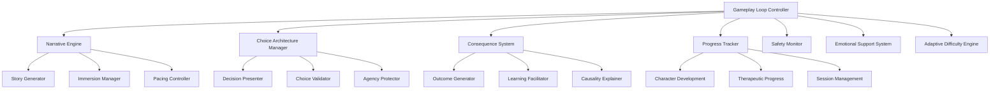

# Core Gameplay Loop Design Document

## Overview

The Core Gameplay Loop system serves as the central orchestration engine for TTA's therapeutic adventure experiences. It manages the cyclical flow of narrative presentation, choice-making, consequence processing, and progress tracking that forms the heart of the therapeutic gaming experience.

The system is designed around a state-driven architecture that maintains narrative coherence while adapting to user therapeutic needs, emotional state, and progress level. It integrates seamlessly with TTA's existing therapeutic content systems, character development frameworks, and safety monitoring components.

## Architecture

### High-Level System Architecture



### Core Components Integration

The system integrates with existing TTA infrastructure:

- **Neo4j Knowledge Graph**: Stores narrative state, character relationships, and therapeutic progress
- **Redis Cache**: Manages session state, choice history, and real-time user interactions
- **Therapeutic Content System**: Provides scenario templates and therapeutic frameworks
- **Character Development System**: Tracks growth and applies consequences to character attributes
- **Safety Monitoring System**: Continuously monitors emotional state and triggers support when needed

## Components and Interfaces

### 1. Gameplay Loop Controller

**Primary Interface**: `GameplayLoopController`

```python
class GameplayLoopController:
    def start_session(self, user_id: str, session_config: SessionConfig) -> SessionState
    def process_user_choice(self, session_id: str, choice: UserChoice) -> GameplayState
    def advance_narrative(self, session_id: str) -> NarrativeState
    def handle_session_pause(self, session_id: str) -> PauseState
    def end_session(self, session_id: str) -> SessionSummary
```

**Key Responsibilities**:
- Orchestrates the main gameplay cycle
- Manages session lifecycle and state transitions
- Coordinates between all subsystems
- Ensures therapeutic safety throughout the experience

**Design Rationale**: Centralized controller pattern ensures consistent state management and provides a single point of control for the complex interactions between narrative, therapeutic, and safety systems.

### 2. Narrative Engine

**Primary Interface**: `NarrativeEngine`

```python
class NarrativeEngine:
    def generate_scene(self, context: NarrativeContext) -> Scene
    def adapt_complexity(self, user_profile: UserProfile, content: str) -> str
    def maintain_immersion(self, transition: SceneTransition) -> TransitionNarrative
    def provide_recap(self, session_history: SessionHistory) -> Recap
```

**Key Responsibilities**:
- Generates rich, immersive narrative content
- Adapts storytelling complexity to user needs
- Maintains narrative coherence across sessions
- Provides smooth transitions and recaps

**Design Rationale**: Separates narrative generation from game logic, allowing for specialized focus on storytelling quality while maintaining integration with therapeutic goals.

### 3. Choice Architecture Manager

**Primary Interface**: `ChoiceArchitectureManager`

```python
class ChoiceArchitectureManager:
    def generate_choices(self, scenario: Scenario, user_context: UserContext) -> List[Choice]
    def validate_choice_meaningfulness(self, choices: List[Choice]) -> ValidationResult
    def provide_choice_guidance(self, user_struggle: StruggleIndicator) -> Guidance
    def track_choice_patterns(self, user_id: str, choice: Choice) -> PatternAnalysis
```

**Key Responsibilities**:
- Creates meaningful, therapeutically relevant choices
- Ensures choices lead to different outcomes
- Provides guidance without removing agency
- Tracks choice patterns for therapeutic insight

**Design Rationale**: Dedicated choice management ensures that decision-making remains central to the therapeutic process while maintaining narrative quality and user agency.

### 4. Consequence System

**Primary Interface**: `ConsequenceSystem`

```python
class ConsequenceSystem:
    def generate_consequences(self, choice: Choice, context: GameContext) -> ConsequenceSet
    def frame_learning_opportunity(self, negative_outcome: Outcome) -> LearningFrame
    def reinforce_positive_patterns(self, positive_outcome: Outcome) -> Reinforcement
    def explain_causality(self, choice: Choice, outcome: Outcome) -> CausalExplanation
```

**Key Responsibilities**:
- Generates logical, proportionate consequences
- Frames outcomes as learning opportunities
- Reinforces therapeutic principles
- Provides clear causal explanations

**Design Rationale**: Separates consequence logic from narrative generation, allowing for sophisticated therapeutic framing while maintaining story coherence.

### 5. Adaptive Difficulty Engine

**Primary Interface**: `AdaptiveDifficultyEngine`

```python
class AdaptiveDifficultyEngine:
    def calibrate_challenge(self, user_progress: TherapeuticProgress) -> DifficultyLevel
    def adjust_complexity(self, performance_data: PerformanceData) -> ComplexityAdjustment
    def provide_support(self, struggle_indicators: List[StruggleIndicator]) -> SupportMeasures
    def explain_adjustments(self, adjustment: DifficultyAdjustment) -> NarrativeExplanation
```

**Key Responsibilities**:
- Monitors user performance and therapeutic readiness
- Adjusts challenge levels dynamically
- Provides additional support when needed
- Maintains immersion during difficulty adjustments

**Design Rationale**: Dynamic difficulty adjustment is crucial for therapeutic effectiveness, requiring sophisticated monitoring and adjustment capabilities that are best handled by a dedicated system.

### 6. Emotional Safety System

**Primary Interface**: `EmotionalSafetySystem`

```python
class EmotionalSafetySystem:
    def monitor_emotional_state(self, user_interactions: List[Interaction]) -> EmotionalState
    def provide_content_warnings(self, upcoming_content: Content) -> ContentWarning
    def offer_support_options(self, distress_indicators: DistressIndicators) -> SupportOptions
    def activate_crisis_protocols(self, crisis_indicators: CrisisIndicators) -> CrisisResponse
```

**Key Responsibilities**:
- Continuously monitors emotional safety
- Provides appropriate warnings and controls
- Offers immediate support when needed
- Activates crisis protocols when necessary

**Design Rationale**: Safety is paramount in therapeutic applications, requiring dedicated monitoring and response systems that can operate independently of other game systems.

## Data Models

### Core Data Structures

```python
@dataclass
class SessionState:
    session_id: str
    user_id: str
    current_scene: Scene
    choice_history: List[UserChoice]
    character_state: CharacterState
    therapeutic_progress: TherapeuticProgress
    emotional_state: EmotionalState
    difficulty_level: DifficultyLevel
    session_start_time: datetime
    last_activity: datetime

@dataclass
class Scene:
    scene_id: str
    narrative_content: str
    available_choices: List[Choice]
    emotional_intensity: EmotionalIntensity
    therapeutic_focus: List[TherapeuticConcept]
    immersion_elements: ImmersionElements
    safety_considerations: SafetyConsiderations

@dataclass
class Choice:
    choice_id: str
    description: str
    therapeutic_approach: TherapeuticApproach
    difficulty_level: DifficultyLevel
    potential_consequences: List[ConsequencePreview]
    character_requirements: CharacterRequirements
    emotional_impact: EmotionalImpact

@dataclass
class ConsequenceSet:
    immediate_consequences: List[Consequence]
    delayed_consequences: List[DelayedConsequence]
    character_changes: CharacterChanges
    therapeutic_insights: List[TherapeuticInsight]
    narrative_impacts: List[NarrativeImpact]
    learning_opportunities: List[LearningOpportunity]
```

### Neo4j Graph Schema

```cypher
// Core entities
CREATE CONSTRAINT session_id FOR (s:Session) REQUIRE s.session_id IS UNIQUE;
CREATE CONSTRAINT scene_id FOR (sc:Scene) REQUIRE sc.scene_id IS UNIQUE;
CREATE CONSTRAINT choice_id FOR (c:Choice) REQUIRE c.choice_id IS UNIQUE;

// Relationships
(:Session)-[:CURRENT_SCENE]->(:Scene)
(:Session)-[:MADE_CHOICE]->(:Choice)
(:Choice)-[:LEADS_TO]->(:Scene)
(:Choice)-[:RESULTS_IN]->(:Consequence)
(:Scene)-[:OFFERS_CHOICE]->(:Choice)
(:Scene)-[:FOCUSES_ON]->(:TherapeuticConcept)
```

## Error Handling

### Error Categories and Responses

1. **Narrative Generation Failures**
   - Fallback to template-based content
   - Maintain session continuity
   - Log for content improvement

2. **Choice Validation Errors**
   - Provide default meaningful choices
   - Explain limitations to user
   - Maintain therapeutic value

3. **Consequence System Failures**
   - Use simplified consequence logic
   - Ensure learning opportunities remain
   - Maintain causal clarity

4. **Safety System Alerts**
   - Immediate intervention protocols
   - Graceful session suspension
   - Connection to support resources

5. **Session State Corruption**
   - Attempt state recovery from Neo4j
   - Provide session restart options
   - Preserve character progress

### Error Recovery Strategies

```python
class ErrorRecoveryManager:
    def handle_narrative_failure(self, context: NarrativeContext) -> FallbackNarrative
    def recover_session_state(self, session_id: str) -> RecoveryResult
    def provide_graceful_degradation(self, system_failure: SystemFailure) -> DegradedExperience
    def maintain_therapeutic_continuity(self, interruption: Interruption) -> ContinuityPlan
```

## Testing Strategy

### Unit Testing Approach

1. **Component Isolation Testing**
   - Mock external dependencies
   - Test core logic independently
   - Validate therapeutic principles

2. **Integration Testing**
   - Test component interactions
   - Validate data flow
   - Ensure safety system integration

3. **Therapeutic Effectiveness Testing**
   - Validate learning outcomes
   - Test adaptive difficulty
   - Measure engagement metrics

### End-to-End Testing Scenarios

1. **Complete Gameplay Loop**
   - Full session from start to finish
   - Multiple choice paths
   - Character development validation

2. **Safety System Activation**
   - Crisis detection and response
   - Emotional support provision
   - Graceful session handling

3. **Adaptive Difficulty Scenarios**
   - Challenge level adjustments
   - Support provision
   - User preference accommodation

4. **Social Feature Integration**
   - Collaborative adventure flows
   - Privacy protection
   - Conflict resolution

### Performance Testing

- **Response Time Requirements**: < 2 seconds for choice processing
- **Concurrent User Support**: 1000+ simultaneous sessions
- **Memory Management**: Efficient session state handling
- **Database Performance**: Optimized Neo4j queries for narrative state

## Implementation Considerations

### Therapeutic Safety Integration

The system must integrate deeply with TTA's existing safety monitoring infrastructure:

- Real-time emotional state monitoring through interaction analysis
- Immediate crisis intervention capabilities
- Seamless integration with external support resources
- Comprehensive audit trails for therapeutic review

### Scalability Considerations

- **Session State Management**: Redis-based caching with Neo4j persistence
- **Content Generation**: Async processing with result caching
- **User Load Balancing**: Distributed session management
- **Database Optimization**: Indexed queries and connection pooling

### Privacy and Security

- **Data Minimization**: Store only necessary therapeutic data
- **Encryption**: All sensitive data encrypted at rest and in transit
- **Access Controls**: Role-based access to therapeutic information
- **Audit Logging**: Comprehensive logging for compliance and safety

### Integration with Existing Systems

The Core Gameplay Loop must seamlessly integrate with:

- **Character Development System**: Apply consequences to character attributes
- **Therapeutic Content Management**: Access scenario templates and frameworks
- **Progress Tracking**: Update therapeutic milestones and achievements
- **Social Systems**: Support collaborative adventures when enabled
- **Monitoring and Analytics**: Provide data for therapeutic effectiveness analysis

This design ensures that the Core Gameplay Loop serves as an effective orchestration layer while maintaining the therapeutic focus, safety requirements, and technical standards established by the TTA platform.