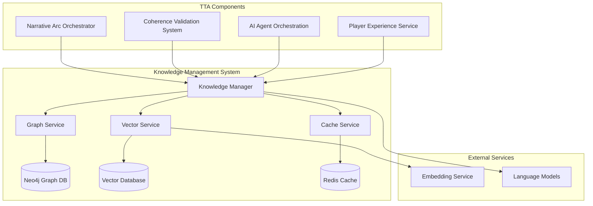

# Knowledge Management System Design

## Overview

The Knowledge Management System (KMS) serves as the central intelligence layer for the TTA platform, providing unified access to structured knowledge graphs and semantic search capabilities. The system combines Neo4j graph databases with vector embeddings to enable both relational and semantic knowledge operations, supporting therapeutic content delivery, narrative coherence, and cross-session user experience continuity.

The KMS follows TTA's component-based architecture, integrating with existing infrastructure while providing a clean abstraction layer for knowledge operations across all system components.

## Architecture

### High-Level Architecture



### Component Integration

The KMS integrates with TTA's existing component system:

- **Component System**: Inherits from base `Component` class for lifecycle management
- **Configuration**: Uses `TTAConfig` and `tta_config.yaml` for centralized configuration
- **Neo4j Integration**: Leverages existing Neo4j instances (ports 7687, 7688) for different repositories
- **Redis Integration**: Uses Redis for caching and session management
- **Embedding Models**: Integrates with configured embedding models (BAAI/bge-small-en-v1.5, intfloat/e5-small-v2)

## Components and Interfaces

### 1. Knowledge Manager (Core Orchestrator)

**Primary Interface:**
```python
class KnowledgeManager(Component):
    def __init__(self, config: TTAConfig):
        super().__init__(
            name="knowledge_manager",
            dependencies=["neo4j", "redis", "embedding_service"]
        )
        self.graph_service = GraphService(config)
        self.vector_service = VectorService(config)
        self.cache_service = CacheService(config)
    
    async def store_knowledge(self, knowledge: KnowledgeItem) -> str:
        """Store knowledge in both graph and vector stores"""
        
    async def retrieve_knowledge(self, query: KnowledgeQuery) -> List[KnowledgeResult]:
        """Unified knowledge retrieval with hybrid search"""
        
    async def update_knowledge(self, knowledge_id: str, updates: Dict) -> bool:
        """Update knowledge maintaining consistency across stores"""
        
    async def delete_knowledge(self, knowledge_id: str) -> bool:
        """Delete knowledge from all stores with cascade handling"""
```

### 2. Graph Service (Neo4j Operations)

**Interface:**
```python
class GraphService(Component):
    def __init__(self, config: TTAConfig):
        super().__init__(
            name="graph_service",
            dependencies=["neo4j"]
        )
        self.neo4j_client = Neo4jClient(config)
    
    async def create_node(self, node: GraphNode) -> str:
        """Create node with therapeutic safety validation"""
        
    async def create_relationship(self, rel: GraphRelationship) -> str:
        """Create relationship with consistency checks"""
        
    async def query_graph(self, cypher: str, params: Dict) -> List[Dict]:
        """Execute Cypher queries with performance monitoring"""
        
    async def get_subgraph(self, center_node: str, depth: int) -> SubGraph:
        """Retrieve subgraph for context building"""
```

### 3. Vector Service (Semantic Search)

**Interface:**
```python
class VectorService(Component):
    def __init__(self, config: TTAConfig):
        super().__init__(
            name="vector_service",
            dependencies=["embedding_service"]
        )
        self.embedding_client = EmbeddingClient(config)
        self.vector_store = VectorStore(config)
    
    async def embed_content(self, content: str) -> List[float]:
        """Generate embeddings using configured models"""
        
    async def store_embedding(self, content_id: str, embedding: List[float], metadata: Dict) -> str:
        """Store embedding with therapeutic metadata"""
        
    async def semantic_search(self, query: str, filters: Dict, limit: int) -> List[VectorResult]:
        """Perform semantic search with therapeutic filtering"""
        
    async def similarity_search(self, embedding: List[float], threshold: float) -> List[VectorResult]:
        """Find similar content by embedding similarity"""
```

### 4. Cache Service (Performance Optimization)

**Interface:**
```python
class CacheService(Component):
    def __init__(self, config: TTAConfig):
        super().__init__(
            name="cache_service",
            dependencies=["redis"]
        )
        self.redis_client = RedisClient(config)
    
    async def cache_result(self, key: str, result: Any, ttl: int) -> bool:
        """Cache knowledge query results"""
        
    async def get_cached(self, key: str) -> Optional[Any]:
        """Retrieve cached results with validation"""
        
    async def invalidate_cache(self, pattern: str) -> int:
        """Invalidate cache entries by pattern"""
        
    async def cache_session_context(self, session_id: str, context: Dict) -> bool:
        """Cache user session knowledge context"""
```

## Data Models

### Core Knowledge Models

```python
@dataclass
class KnowledgeItem:
    id: Optional[str]
    content: str
    content_type: KnowledgeType
    therapeutic_tags: List[str]
    relationships: List[KnowledgeRelationship]
    metadata: Dict[str, Any]
    privacy_level: PrivacyLevel
    created_at: datetime
    updated_at: datetime

@dataclass
class KnowledgeQuery:
    query_text: str
    query_type: QueryType  # SEMANTIC, GRAPH, HYBRID
    filters: Dict[str, Any]
    therapeutic_context: TherapeuticContext
    session_id: Optional[str]
    limit: int = 10
    include_relationships: bool = True

@dataclass
class KnowledgeResult:
    knowledge_item: KnowledgeItem
    relevance_score: float
    therapeutic_score: float
    relationship_context: List[GraphRelationship]
    source: ResultSource  # GRAPH, VECTOR, CACHE
```

### Graph Schema Models

```python
# Node Types
class NodeType(Enum):
    USER = "User"
    CHARACTER = "Character"
    NARRATIVE_ELEMENT = "NarrativeElement"
    THERAPEUTIC_CONCEPT = "TherapeuticConcept"
    WORLD_STATE = "WorldState"
    SESSION = "Session"

# Relationship Types
class RelationshipType(Enum):
    INTERACTS_WITH = "INTERACTS_WITH"
    CONTAINS = "CONTAINS"
    RELATES_TO = "RELATES_TO"
    THERAPEUTIC_LINK = "THERAPEUTIC_LINK"
    TEMPORAL_SEQUENCE = "TEMPORAL_SEQUENCE"
    NARRATIVE_ARC = "NARRATIVE_ARC"

@dataclass
class GraphNode:
    id: str
    node_type: NodeType
    properties: Dict[str, Any]
    therapeutic_metadata: TherapeuticMetadata
    privacy_level: PrivacyLevel

@dataclass
class GraphRelationship:
    source_id: str
    target_id: str
    relationship_type: RelationshipType
    properties: Dict[str, Any]
    strength: float
    created_at: datetime
```

### Vector Models

```python
@dataclass
class VectorEmbedding:
    content_id: str
    embedding: List[float]
    model_name: str
    embedding_metadata: Dict[str, Any]
    therapeutic_tags: List[str]
    created_at: datetime

@dataclass
class VectorResult:
    content_id: str
    content: str
    similarity_score: float
    therapeutic_relevance: float
    metadata: Dict[str, Any]
    embedding: Optional[List[float]]
```

## Error Handling

### Error Categories and Responses

```python
class KnowledgeError(Exception):
    """Base exception for knowledge management errors"""
    pass

class GraphConnectionError(KnowledgeError):
    """Neo4j connection or query errors"""
    def __init__(self, message: str, retry_after: int = 5):
        super().__init__(message)
        self.retry_after = retry_after

class VectorServiceError(KnowledgeError):
    """Vector database or embedding service errors"""
    pass

class ConsistencyError(KnowledgeError):
    """Data consistency errors between stores"""
    def __init__(self, message: str, affected_stores: List[str]):
        super().__init__(message)
        self.affected_stores = affected_stores

class TherapeuticSafetyError(KnowledgeError):
    """Therapeutic content safety violations"""
    def __init__(self, message: str, safety_level: str):
        super().__init__(message)
        self.safety_level = safety_level
```

### Error Handling Strategies

1. **Graceful Degradation**: When one storage backend fails, continue with available services
2. **Retry Logic**: Implement exponential backoff for transient failures
3. **Circuit Breaker**: Prevent cascade failures by temporarily disabling failing services
4. **Consistency Recovery**: Automated reconciliation between graph and vector stores
5. **Therapeutic Safety**: Immediate blocking of unsafe content with admin alerts

## Testing Strategy

### Unit Testing

```python
class TestKnowledgeManager(unittest.TestCase):
    def setUp(self):
        self.config = create_test_config()
        self.knowledge_manager = KnowledgeManager(self.config)
    
    async def test_store_knowledge_success(self):
        """Test successful knowledge storage"""
        
    async def test_retrieve_knowledge_hybrid_search(self):
        """Test hybrid graph + vector search"""
        
    async def test_consistency_maintenance(self):
        """Test consistency between graph and vector stores"""
        
    async def test_therapeutic_safety_validation(self):
        """Test therapeutic content safety checks"""
```

### Integration Testing

```python
class TestKnowledgeSystemIntegration(unittest.TestCase):
    async def test_neo4j_vector_consistency(self):
        """Test consistency between Neo4j and vector database"""
        
    async def test_cross_session_persistence(self):
        """Test knowledge persistence across user sessions"""
        
    async def test_performance_under_load(self):
        """Test system performance with concurrent operations"""
        
    async def test_therapeutic_workflow_integration(self):
        """Test integration with therapeutic content workflows"""
```

### Performance Testing

- **Query Response Time**: < 500ms for standard queries
- **Concurrent Operations**: Support 100+ concurrent knowledge operations
- **Memory Usage**: Efficient caching with configurable TTL
- **Scalability**: Horizontal scaling support for vector operations

## Security and Privacy

### Data Protection

1. **Encryption**: All therapeutic data encrypted at rest and in transit
2. **Access Control**: Role-based access with therapeutic context awareness
3. **Audit Logging**: Complete audit trail for all knowledge operations
4. **Data Anonymization**: Automatic PII detection and anonymization
5. **Privacy Boundaries**: User-specific knowledge isolation

### Therapeutic Safety

1. **Content Validation**: All stored content validated for therapeutic appropriateness
2. **Safety Scoring**: Automatic therapeutic safety scoring for all content
3. **Crisis Detection**: Real-time monitoring for crisis indicators
4. **Professional Boundaries**: Clear separation between AI assistance and professional therapy

## Configuration

### Knowledge Manager Configuration

```yaml
# config/tta_config.yaml
knowledge_management:
  enabled: true
  graph_service:
    neo4j_uri: "bolt://localhost:7687"
    connection_pool_size: 10
    query_timeout: 30
  vector_service:
    embedding_model: "BAAI/bge-small-en-v1.5"
    vector_dimension: 384
    similarity_threshold: 0.7
  cache_service:
    redis_uri: "redis://localhost:6379"
    default_ttl: 3600
    max_memory: "256mb"
  therapeutic_safety:
    safety_threshold: 0.8
    crisis_keywords: ["crisis", "emergency", "harm"]
    validation_timeout: 5
  performance:
    max_concurrent_operations: 100
    query_timeout: 500
    batch_size: 50
```

## Deployment Considerations

### Component Dependencies

- **Neo4j**: Requires Neo4j 5.x with APOC procedures
- **Redis**: Redis 6.x+ for caching and session management
- **Embedding Service**: Local or remote embedding model service
- **Python Dependencies**: neo4j>=5.8.0, redis>=4.0.0, numpy, scikit-learn

### Monitoring and Observability

1. **Health Checks**: Component health monitoring with dependency checks
2. **Performance Metrics**: Query latency, throughput, error rates
3. **Therapeutic Metrics**: Safety score distributions, crisis detection rates
4. **Resource Usage**: Memory, CPU, and storage utilization tracking

### Scaling Considerations

1. **Read Replicas**: Neo4j read replicas for query scaling
2. **Vector Sharding**: Distributed vector storage for large datasets
3. **Cache Clustering**: Redis clustering for high availability
4. **Load Balancing**: Request distribution across service instances