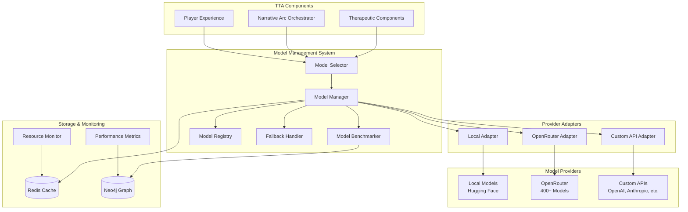
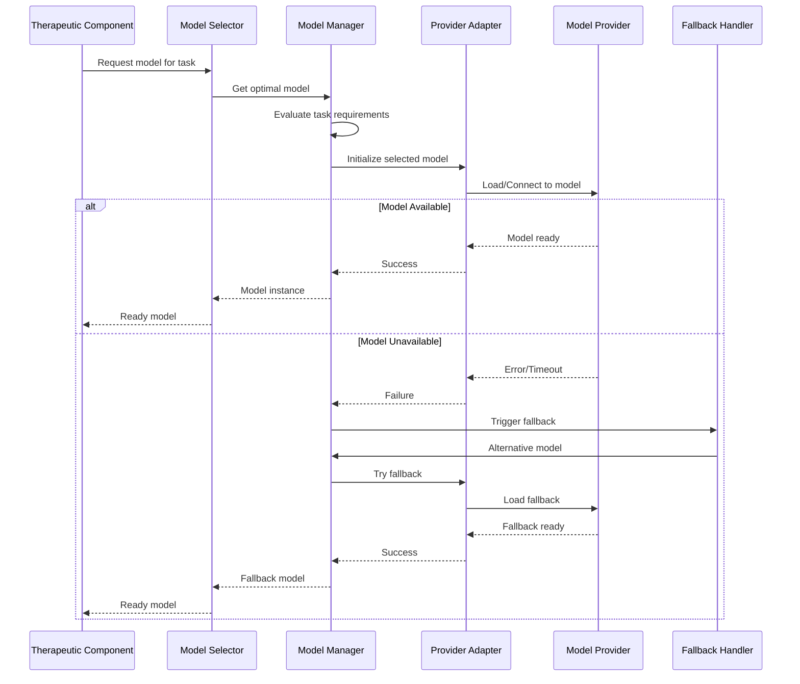
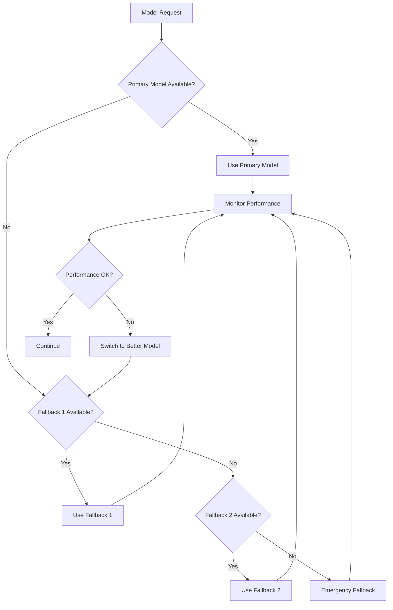

# Design Document

## Overview

The Model Management & Selection System provides a comprehensive framework for managing AI models across multiple providers within the TTA platform. The system supports local models (via Hugging Face Transformers), cloud providers (OpenRouter with free model filtering), and custom API integrations. It features intelligent model selection based on task requirements, performance benchmarking, resource monitoring, and robust fallback mechanisms to ensure therapeutic sessions remain uninterrupted.

The design prioritizes therapeutic safety, user choice, cost optimization, and seamless integration with TTA's existing component architecture.

## Architecture

### High-Level Architecture



### Component Interaction Flow



## Components and Interfaces

### 1. Model Selector (`ModelSelector`)

**Purpose:** Central orchestrator for model selection and request routing.

**Key Methods:**
```python
class ModelSelector(Component):
    def select_model(self, task_type: TaskType, requirements: ModelRequirements) -> ModelInstance
    def get_available_models(self, filters: ModelFilters = None) -> List[ModelInfo]
    def validate_model_compatibility(self, model_id: str, task_type: TaskType) -> bool
    def estimate_cost(self, model_id: str, estimated_tokens: int) -> CostEstimate
```

**Interfaces:**
- `IModelProvider`: Interface for all model provider adapters
- `ITaskAnalyzer`: Interface for analyzing task requirements
- `IFallbackStrategy`: Interface for fallback decision making

### 2. Model Manager (`ModelManager`)

**Purpose:** Manages model lifecycle, configuration, and provider coordination.

**Key Methods:**
```python
class ModelManager(Component):
    def register_provider(self, provider: IModelProvider) -> None
    def configure_model(self, config: ModelConfiguration) -> None
    def get_model_status(self, model_id: str) -> ModelStatus
    def update_model_metrics(self, model_id: str, metrics: PerformanceMetrics) -> None
    def cleanup_inactive_models(self) -> None
```

### 3. Provider Adapters

#### Local Model Adapter (`LocalModelAdapter`)
```python
class LocalModelAdapter(IModelProvider):
    def load_model(self, model_id: str, config: LocalModelConfig) -> LocalModelInstance
    def check_resource_requirements(self, model_id: str) -> ResourceRequirements
    def estimate_memory_usage(self, model_id: str) -> MemoryEstimate
    def supports_quantization(self, model_id: str) -> List[QuantizationType]
```

#### OpenRouter Adapter (`OpenRouterAdapter`)
```python
class OpenRouterAdapter(IModelProvider):
    def get_available_models(self, include_free: bool = True) -> List[OpenRouterModel]
    def filter_free_models(self, models: List[OpenRouterModel]) -> List[OpenRouterModel]
    def create_client(self, api_key: str) -> OpenRouterClient
    def estimate_cost(self, model_id: str, tokens: int) -> float
```

#### Custom API Adapter (`CustomAPIAdapter`)
```python
class CustomAPIAdapter(IModelProvider):
    def register_api_config(self, config: APIConfiguration) -> None
    def validate_api_key(self, provider: str, api_key: str) -> ValidationResult
    def create_client(self, provider: str, config: APIConfiguration) -> APIClient
    def test_connection(self, provider: str) -> ConnectionStatus
```

### 4. Model Benchmarker (`ModelBenchmarker`)

**Purpose:** Continuous performance evaluation and comparison.

**Key Methods:**
```python
class ModelBenchmarker(Component):
    def run_benchmark_suite(self, model_id: str) -> BenchmarkResults
    def compare_models(self, model_ids: List[str], task_type: TaskType) -> ComparisonReport
    def schedule_periodic_benchmarks(self, interval: timedelta) -> None
    def get_performance_trends(self, model_id: str, timeframe: timedelta) -> TrendAnalysis
```

### 5. Resource Monitor (`ResourceMonitor`)

**Purpose:** Real-time system resource monitoring and optimization.

**Key Methods:**
```python
class ResourceMonitor(Component):
    def get_system_resources(self) -> SystemResources
    def monitor_model_usage(self, model_id: str) -> ResourceUsage
    def predict_resource_needs(self, model_id: str, load: int) -> ResourcePrediction
    def suggest_optimizations(self) -> List[OptimizationSuggestion]
```

## Data Models

### Core Data Structures

```python
@dataclass
class ModelConfiguration:
    model_id: str
    provider_type: ProviderType
    config_params: Dict[str, Any]
    resource_limits: ResourceLimits
    fallback_models: List[str]
    therapeutic_safety_level: SafetyLevel

@dataclass
class ModelRequirements:
    task_type: TaskType
    max_latency_ms: int
    min_quality_score: float
    max_cost_per_token: float
    required_capabilities: List[ModelCapability]
    context_length_needed: int

@dataclass
class PerformanceMetrics:
    model_id: str
    timestamp: datetime
    response_time_ms: float
    quality_score: float
    resource_usage: ResourceUsage
    error_rate: float
    therapeutic_safety_score: float

@dataclass
class OpenRouterModel:
    id: str
    name: str
    description: str
    pricing: PricingInfo
    context_length: int
    is_free: bool
    capabilities: List[str]
    provider_info: ProviderInfo

@dataclass
class LocalModelInfo:
    model_id: str
    huggingface_id: str
    model_size: str
    quantization_options: List[str]
    memory_requirements: MemoryRequirements
    supported_tasks: List[TaskType]
```

### Configuration Schema

```yaml
model_management:
  enabled: true
  default_provider: "openrouter"

  providers:
    local:
      enabled: true
      models_cache_dir: "./models"
      max_concurrent_models: 2
      auto_quantization: true
      gpu_memory_fraction: 0.8

    openrouter:
      enabled: true
      api_key: "${OPENROUTER_API_KEY}"
      prefer_free_models: true
      max_cost_per_million_tokens: 10.0
      rate_limit_buffer: 0.8

    custom_apis:
      enabled: true
      providers:
        openai:
          api_key: "${OPENAI_API_KEY}"
          base_url: "https://api.openai.com/v1"
        anthropic:
          api_key: "${ANTHROPIC_API_KEY}"
          base_url: "https://api.anthropic.com"

  selection_strategy:
    primary_criteria: "cost_effectiveness"
    fallback_criteria: "availability"
    therapeutic_safety_weight: 0.4
    performance_weight: 0.3
    cost_weight: 0.3

  benchmarking:
    enabled: true
    benchmark_interval: "24h"
    therapeutic_test_scenarios: true
    performance_thresholds:
      min_quality_score: 0.7
      max_response_time_ms: 5000
      max_error_rate: 0.05
```

## Error Handling

### Fallback Strategy



### Error Categories and Responses

1. **Model Loading Errors**
   - Insufficient resources → Suggest smaller model or cloud alternative
   - Model not found → Download from Hugging Face or use fallback
   - Corruption → Re-download or use backup

2. **API Errors**
   - Rate limiting → Queue requests or switch provider
   - Authentication → Prompt for valid API key
   - Network issues → Retry with exponential backoff

3. **Performance Degradation**
   - High latency → Switch to faster model
   - Low quality → Switch to higher-quality model
   - Resource exhaustion → Scale down or optimize

### Therapeutic Safety Safeguards

```python
class TherapeuticSafetyValidator:
    def validate_model_output(self, output: str, context: TherapeuticContext) -> SafetyResult
    def check_crisis_indicators(self, conversation: List[Message]) -> CrisisLevel
    def ensure_therapeutic_boundaries(self, model_response: str) -> ValidationResult
    def log_safety_incident(self, incident: SafetyIncident) -> None
```

## Testing Strategy

### Unit Testing
- Individual component functionality
- Provider adapter integration
- Model selection algorithms
- Resource monitoring accuracy

### Integration Testing
- End-to-end model selection flow
- Fallback mechanism reliability
- Performance benchmarking accuracy
- Multi-provider coordination

### Performance Testing
- Load testing with multiple concurrent requests
- Resource usage under stress
- Fallback response times
- Cost optimization effectiveness

### Therapeutic Safety Testing
- Crisis detection accuracy
- Inappropriate content filtering
- Therapeutic boundary maintenance
- Safety incident logging

### Test Scenarios

```python
class ModelManagementTestSuite:
    def test_local_model_loading(self):
        """Test loading and using local Hugging Face models"""

    def test_openrouter_free_model_filtering(self):
        """Test filtering and selection of free OpenRouter models"""

    def test_custom_api_integration(self):
        """Test custom API key management and usage"""

    def test_fallback_mechanisms(self):
        """Test automatic fallback when primary models fail"""

    def test_resource_monitoring(self):
        """Test resource usage monitoring and optimization"""

    def test_therapeutic_safety_validation(self):
        """Test therapeutic safety checks and crisis detection"""

    def test_cost_optimization(self):
        """Test cost-effective model selection"""

    def test_performance_benchmarking(self):
        """Test continuous performance evaluation"""
```

## Security Considerations

### API Key Management
- Encrypted storage using industry-standard encryption
- Environment variable injection for production
- Key rotation support
- Audit logging for key usage

### Model Validation
- Checksum verification for downloaded models
- Digital signature validation where available
- Sandboxed model execution
- Output sanitization

### Privacy Protection
- No logging of sensitive therapeutic content
- Encrypted communication with cloud providers
- Local processing preference for sensitive data
- GDPR/HIPAA compliance considerations

## Performance Optimization

### Caching Strategy
- Model metadata caching in Redis
- Response caching for repeated queries
- Provider availability caching
- Performance metrics caching

### Resource Management
- Lazy model loading
- Automatic model unloading when idle
- GPU memory optimization
- CPU core allocation

### Network Optimization
- Connection pooling for API providers
- Request batching where supported
- Compression for large payloads
- CDN usage for model downloads

This design provides a robust, scalable, and therapeutically-safe model management system that integrates seamlessly with TTA's existing architecture while providing users with maximum flexibility in their AI model choices.
