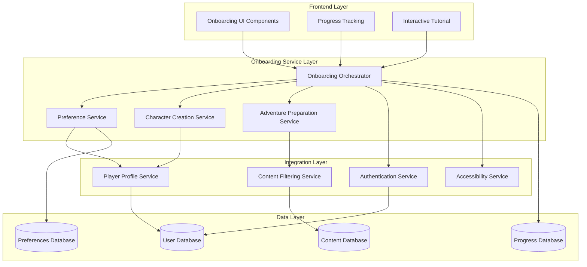

# Player Onboarding System Design

## Overview

The Player Onboarding System is a critical component that creates the first impression and guides new users through their initial TTA journey. The system transforms curiosity into confident participation by emphasizing adventure, exploration, and interactive storytelling while maintaining therapeutic depth as optional layers for interested users.

The design prioritizes user experience flow, progressive disclosure of complexity, and seamless integration with TTA's core therapeutic adventure platform. The system operates as a guided journey that builds excitement and confidence while collecting necessary user preferences and setup information.

## Architecture

### High-Level Architecture



### Component Integration with TTA Architecture

The onboarding system integrates with existing TTA components:

- **Authentication Service**: Leverages existing user management infrastructure
- **Player Profile Service**: Extends existing player data models
- **Content Management**: Utilizes existing content filtering and safety systems
- **Neo4j Knowledge Graph**: Stores user preferences and onboarding progress relationships
- **Redis Cache**: Maintains session state during onboarding flow

## Components and Interfaces

### 1. Onboarding Orchestrator

**Purpose**: Central coordinator managing the entire onboarding flow and state transitions.

**Key Responsibilities**:
- Flow state management and progression logic
- Integration with all onboarding services
- Progress persistence and recovery
- Accessibility adaptation coordination

**Interface**:
```python
class OnboardingOrchestrator(Component):
    def start_onboarding(self, user_id: str) -> OnboardingSession
    def continue_onboarding(self, session_id: str) -> OnboardingState
    def complete_step(self, session_id: str, step: OnboardingStep, data: dict) -> StepResult
    def skip_step(self, session_id: str, step: OnboardingStep, reason: str) -> StepResult
    def get_progress(self, session_id: str) -> OnboardingProgress
    def handle_accessibility_request(self, session_id: str, needs: AccessibilityNeeds) -> AdaptationResult
```

### 2. Preference Discovery Service

**Purpose**: Manages adventure preference exploration and recommendation matching.

**Key Responsibilities**:
- Present adventure themes and world types
- Collect and validate user preferences
- Generate personalized recommendations
- Handle uncertainty and exploration modes

**Interface**:
```python
class PreferenceDiscoveryService(Component):
    def get_adventure_themes(self) -> List[AdventureTheme]
    def present_preference_options(self, user_context: UserContext) -> PreferenceOptions
    def record_preferences(self, user_id: str, preferences: UserPreferences) -> ValidationResult
    def enable_exploration_mode(self, user_id: str) -> ExplorationConfig
    def generate_recommendations(self, preferences: UserPreferences) -> List[AdventureRecommendation]
```

### 3. Character Creation Service

**Purpose**: Guides users through meaningful character creation with narrative context.

**Key Responsibilities**:
- Provide character creation options with world lore
- Explain choice impacts on adventure experience
- Support guided creation for overwhelmed users
- Generate character previews and adventure connections

**Interface**:
```python
class CharacterCreationService(Component):
    def get_character_options(self, world_context: WorldContext) -> CharacterOptions
    def preview_choice_impact(self, choice: CharacterChoice) -> ImpactPreview
    def create_guided_character(self, preferences: UserPreferences) -> GuidedCharacterResult
    def finalize_character(self, user_id: str, character_data: CharacterData) -> Character
    def generate_adventure_preview(self, character: Character) -> AdventurePreview
```

### 4. Tutorial and Orientation Service

**Purpose**: Provides interactive learning experiences for platform navigation.

**Key Responsibilities**:
- Deliver progressive tutorial content
- Track user competency and adaptation
- Provide practice environments
- Offer alternative learning paths

**Interface**:
```python
class TutorialService(Component):
    def start_training_quest(self, user_id: str) -> TutorialSession
    def present_tutorial_step(self, session_id: str, step: TutorialStep) -> StepContent
    def validate_user_action(self, session_id: str, action: UserAction) -> ValidationFeedback
    def provide_alternative_explanation(self, step: TutorialStep, difficulty: str) -> AlternativeContent
    def complete_tutorial(self, session_id: str) -> CompletionResult
```

### 5. Content Preferences Service

**Purpose**: Manages content filtering, comfort settings, and boundary configuration.

**Key Responsibilities**:
- Present content preference options
- Configure content filtering systems
- Validate boundary settings
- Provide support resource information

**Interface**:
```python
class ContentPreferencesService(Component):
    def get_content_categories(self) -> List[ContentCategory]
    def configure_content_filters(self, user_id: str, filters: ContentFilters) -> FilterResult
    def validate_comfort_settings(self, settings: ComfortSettings) -> ValidationResult
    def get_support_resources(self, user_context: UserContext) -> List[SupportResource]
    def update_preferences(self, user_id: str, preferences: ContentPreferences) -> UpdateResult
```

### 6. Accessibility Adaptation Service

**Purpose**: Provides accessibility accommodations throughout the onboarding process.

**Key Responsibilities**:
- Detect accessibility needs
- Adapt interface and interaction methods
- Provide alternative content formats
- Ensure inclusive experience delivery

**Interface**:
```python
class AccessibilityService(Component):
    def detect_accessibility_needs(self, user_interaction: UserInteraction) -> AccessibilityNeeds
    def adapt_interface(self, needs: AccessibilityNeeds) -> InterfaceAdaptation
    def provide_audio_descriptions(self, content: Content) -> AudioContent
    def offer_alternative_inputs(self, interaction_type: str) -> List[InputMethod]
    def adjust_pacing(self, user_id: str, cognitive_needs: CognitiveNeeds) -> PacingAdjustment
```

## Data Models

### Core Data Structures

```python
@dataclass
class OnboardingSession:
    session_id: str
    user_id: str
    current_step: OnboardingStep
    progress: OnboardingProgress
    preferences: UserPreferences
    accessibility_needs: Optional[AccessibilityNeeds]
    created_at: datetime
    updated_at: datetime

@dataclass
class OnboardingProgress:
    completed_steps: List[OnboardingStep]
    current_step: OnboardingStep
    total_steps: int
    completion_percentage: float
    milestones_achieved: List[str]
    time_spent: timedelta

@dataclass
class UserPreferences:
    adventure_themes: List[str]
    world_types: List[str]
    story_complexity: str
    interaction_style: str
    content_filters: ContentFilters
    exploration_mode: bool

@dataclass
class CharacterData:
    name: str
    background: str
    traits: List[str]
    world_connection: str
    adventure_style: str
    starting_location: str

@dataclass
class ContentFilters:
    intensity_level: str
    excluded_themes: List[str]
    trigger_warnings: List[str]
    support_preferences: SupportPreferences

@dataclass
class AccessibilityNeeds:
    visual_support: bool
    motor_adaptations: bool
    cognitive_adjustments: bool
    communication_aids: bool
    preferred_formats: List[str]
```

### Database Schema Design

**Neo4j Graph Relationships**:
```cypher
// User onboarding progress and preferences
(User)-[:HAS_ONBOARDING_SESSION]->(OnboardingSession)
(OnboardingSession)-[:COMPLETED_STEP]->(OnboardingStep)
(User)-[:HAS_PREFERENCES]->(UserPreferences)
(UserPreferences)-[:PREFERS_THEME]->(AdventureTheme)
(User)-[:CREATED_CHARACTER]->(Character)
(Character)-[:BELONGS_TO_WORLD]->(World)
```

**Redis Session Storage**:
```json
{
  "onboarding_session:{session_id}": {
    "user_id": "string",
    "current_step": "string",
    "step_data": "object",
    "progress": "object",
    "accessibility_adaptations": "object",
    "expires_at": "timestamp"
  }
}
```

## Error Handling

### Error Categories and Responses

1. **User Input Validation Errors**
   - Provide immediate, friendly feedback
   - Offer correction suggestions
   - Maintain user progress and context

2. **System Integration Failures**
   - Graceful degradation with offline capabilities
   - Retry mechanisms with exponential backoff
   - User notification with alternative pathways

3. **Accessibility Adaptation Failures**
   - Fallback to basic accessible formats
   - Manual assistance request options
   - Alternative interaction methods

4. **Content Loading Failures**
   - Cached content fallbacks
   - Simplified onboarding flow options
   - Progress preservation and recovery

### Error Recovery Strategies

```python
class OnboardingErrorHandler:
    def handle_validation_error(self, error: ValidationError) -> UserFeedback
    def handle_system_failure(self, error: SystemError) -> RecoveryAction
    def handle_accessibility_failure(self, error: AccessibilityError) -> AlternativeMethod
    def preserve_progress(self, session_id: str, error_context: dict) -> bool
    def provide_manual_assistance(self, user_id: str, issue: str) -> SupportTicket
```

## Testing Strategy

### Unit Testing Approach

1. **Component Isolation Testing**
   - Mock external dependencies
   - Test individual service logic
   - Validate data transformations
   - Verify error handling paths

2. **Interface Contract Testing**
   - Validate API contracts
   - Test data serialization/deserialization
   - Verify response formats
   - Check error response structures

### Integration Testing Strategy

1. **Service Integration Tests**
   - Test component interactions
   - Validate data flow between services
   - Test authentication integration
   - Verify database operations

2. **User Journey Testing**
   - End-to-end onboarding flows
   - Accessibility pathway testing
   - Error recovery scenario testing
   - Performance under load testing

### Accessibility Testing Requirements

1. **Screen Reader Compatibility**
   - NVDA, JAWS, VoiceOver testing
   - Semantic HTML validation
   - ARIA label verification
   - Navigation flow testing

2. **Motor Accessibility Testing**
   - Keyboard-only navigation
   - Voice control compatibility
   - Switch navigation support
   - Touch target size validation

3. **Cognitive Accessibility Testing**
   - Content complexity assessment
   - Pacing adaptation validation
   - Alternative explanation testing
   - Progress clarity verification

### Performance Testing Criteria

- **Response Time**: < 2 seconds for all onboarding interactions
- **Concurrent Users**: Support 1000+ simultaneous onboarding sessions
- **Data Persistence**: 99.9% reliability for progress saving
- **Accessibility Adaptation**: < 500ms for interface modifications

## Design Decisions and Rationales

### 1. Adventure-First Framing
**Decision**: Frame all onboarding elements in adventure and exploration terms rather than therapeutic language.
**Rationale**: Aligns with requirements to prioritize adventure experience and make therapeutic elements optional depth rather than primary focus.

### 2. Progressive Disclosure Architecture
**Decision**: Implement step-by-step revelation of platform complexity with skip options.
**Rationale**: Prevents user overwhelm while accommodating different learning preferences and time constraints.

### 3. Microservice Component Design
**Decision**: Separate concerns into focused services (preferences, character creation, tutorial, etc.).
**Rationale**: Enables independent scaling, testing, and maintenance while supporting TTA's component-based architecture.

### 4. Session-Based State Management
**Decision**: Use Redis for session state with Neo4j for persistent relationships.
**Rationale**: Provides fast session access during onboarding while building long-term user relationship data for future personalization.

### 5. Accessibility-First Design
**Decision**: Build accessibility adaptations into core architecture rather than as add-ons.
**Rationale**: Ensures inclusive experience delivery and compliance with accessibility requirements from the ground up.

### 6. Content Preference Integration
**Decision**: Integrate content filtering directly into onboarding rather than separate configuration.
**Rationale**: Establishes user comfort boundaries early and demonstrates TTA's commitment to user safety and personalization.

### 7. Recovery and Resilience Focus
**Decision**: Implement comprehensive error handling and progress preservation.
**Rationale**: First impressions are critical; system failures during onboarding could permanently lose potential users.

This design addresses all requirements while maintaining consistency with TTA's therapeutic focus, component architecture, and accessibility commitments. The system provides a welcoming, engaging introduction to TTA's adventure platform while establishing the foundation for personalized therapeutic experiences.