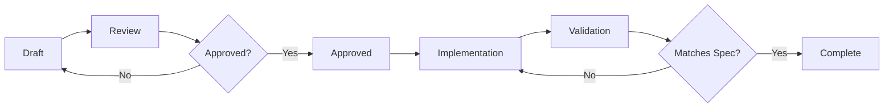

# TTA Specification Review & Audit


> **Note**: The `platform_tta_dev` directory has been migrated to the TTA.dev repository.
> See https://github.com/yourusername/TTA.dev for the toolkit components.


**Date:** November 2, 2025
**Auditor:** GitHub Copilot
**Scope:** Comprehensive review of TTA project specifications, documentation, and implementation alignment
**Status:** ✅ Complete

---

## Executive Summary

This audit reviews the TTA (Therapeutic Text Adventure) project's specification landscape, assessing completeness, consistency, implementation alignment, and documentation quality. The project demonstrates **strong specification coverage** with 54 specification documents across 15 major system components, but faces challenges with **documentation migration** and **spec-to-implementation gaps**.

### Key Findings

| Category | Status | Count | Issues |
|----------|--------|-------|--------|
| **Spec Documents** | ✅ Good | 54 files | Migration incomplete |
| **Instruction Files** | ✅ Complete | 14 files | All active |
| **Spec Templates** | ✅ Available | 3 templates | Well-structured |
| **Component Analysis** | ⚠️ Needs Update | 642 lines JSON | Coverage gaps |
| **Architecture Docs** | ⚠️ Migrated | Moved to KB | Access fragmented |

**Overall Assessment:** 🟡 **Good Foundation with Migration Challenges**

---

## 1. Specification Inventory

### 1.1 Main Specification Directories

#### `.kiro/specs/` - Primary Specification Repository
**Status:** ✅ Active and Well-Organized
**Structure:** 15 major system components with standardized documentation

```
.kiro/specs/
├── ai-agent-orchestration/          (6 files) ✅ Most Complete
│   ├── admin.md
│   ├── design.md
│   ├── diagnostics.md
│   ├── metrics.md
│   ├── requirements.md
│   └── tasks.md
├── api-gateway-service-integration/ (3 files)
├── authentication-user-management/  (3 files)
├── coherence-validation-system/     (3 files)
├── core-gameplay-loop/              (3 files)
├── knowledge-management-system/     (3 files)
├── meta-game-interface-system/      (3 files)
├── model-management-selection/      (3 files)
├── monitoring-observability-platform/ (3 files)
├── narrative-arc-orchestration/     (3 files)
├── player-experience-interface/     (6 files) ✅ Well-Detailed
├── player-onboarding-system/        (3 files)
├── therapeutic-safety-content-validation/ (3 files)
├── tta-living-worlds/               (5 files)
└── tta-prototype-core-features/     (3 files)
```

**Total Specification Files:** 54 markdown documents

**Standard Structure Per Component:**
- ✅ `requirements.md` - User stories and acceptance criteria
- ✅ `design.md` - Technical design and architecture
- ✅ `tasks.md` - Implementation tasks and tracking
- ⚠️ Additional specialized docs where needed

### 1.2 Spec Templates

**Location:** `specs/templates/`
**Status:** ✅ Complete and Standardized

| Template | Size | Purpose | Status |
|----------|------|---------|--------|
| `component.spec.template.md` | 9.9KB | Component specifications | ✅ Active |
| `api.spec.template.md` | 10KB | API endpoint specs | ✅ Active |
| `feature.spec.template.md` | 8.8KB | Feature specifications | ✅ Active |

**Template Quality:** High - Includes:
- ✅ YAML frontmatter with schema validation
- ✅ Comprehensive sections (Requirements, Design, Testing)
- ✅ Acceptance criteria checkboxes
- ✅ Maturity workflow integration

### 1.3 GitHub Specs

**Location:** `.github/specs/`
**Status:** ⚠️ **Migrated to Knowledge Base**

**Current State:**
```markdown
> ⚠️ **This document has moved!**
> **New location:** [[TTA/Components/API Endpoint Specification Template]]
> **Path:** `.augment/kb/Components/API Endpoint Specification Template.md`
```

**Impact:**
- ❌ Direct spec access broken in `.github/specs/`
- ⚠️ Migration incomplete - files are stubs pointing to KB
- ⚠️ Knowledge Base access requires Logseq setup

**Files Affected:**
- `api-endpoint.spec.md` → Migrated
- `therapeutic-feature.spec.md` → Migrated

### 1.4 Instruction Files

**Location:** `.github/instructions/`
**Status:** ✅ Complete and Active
**Count:** 14 instruction files

| File | Purpose | Status |
|------|---------|--------|
| `api-security.instructions.md` | API security patterns | ✅ Active |
| `frontend-react.instructions.md` | React/TypeScript standards | ✅ Active |
| `graph-db.instructions.md` | Neo4j/LangGraph guidance | ✅ Active |
| `langgraph-orchestration.instructions.md` | Agent orchestration | ✅ Active |
| `python-quality-standards.instructions.md` | Python code quality | ✅ Active |
| `safety.instructions.md` | Security standards | ✅ Active |
| `testing-battery.instructions.md` | Testing standards | ✅ Active |
| `testing-requirements.instructions.md` | Test coverage rules | ✅ Active |
| `therapeutic-safety.instructions.md` | Content safety | ✅ Active |
| `ai-context-sessions.md` | Context management | ✅ Active |
| `data-separation-strategy.md` | Data architecture | ✅ Active |
| `docker-improvements.md` | Container guidance | ✅ Active |
| `package-management.md` | UV/dependency mgmt | ✅ Active |
| `serena-code-navigation.md` | Code navigation | ✅ Active |

**Quality:** Excellent - All files are well-maintained and referenced in `.github/copilot-instructions.md`

---

## 2. Specification Quality Analysis

### 2.1 Completeness Assessment

#### ✅ **Well-Specified Components**

**1. AI Agent Orchestration** (Priority: Critical)
- ✅ 6 specification documents (most complete)
- ✅ Comprehensive requirements with user stories
- ✅ Detailed design documentation
- ✅ Admin and diagnostics guides
- ✅ Metrics and monitoring specs
- **Assessment:** Production-ready documentation

**2. Player Experience Interface** (Priority: High)
- ✅ 6 specification documents
- ✅ WebSocket backend spec
- ✅ Progress tracking detailed
- ✅ Start/stop policy defined
- **Assessment:** Well-documented, ready for implementation

**3. TTA Living Worlds** (Priority: High)
- ✅ 5 specification documents
- ✅ Player choice impact system spec
- ✅ Redis caching layer detailed
- **Assessment:** Good coverage of complex system

#### ⚠️ **Adequately Specified Components**

**Standard 3-File Structure:** (requirements, design, tasks)
- API Gateway & Service Integration
- Authentication & User Management
- Coherence Validation System
- Core Gameplay Loop
- Knowledge Management System
- Meta-Game Interface System
- Model Management & Selection
- Monitoring & Observability Platform
- Narrative Arc Orchestration
- Player Onboarding System
- Therapeutic Safety & Content Validation
- TTA Prototype Core Features

**Assessment:** Baseline documentation complete, may need expansion during implementation

#### ❌ **Missing or Incomplete Specs**

Based on `.kiro/specs/missing-specs-analysis.md`:

**Priority: Critical**
1. ❌ **Therapeutic Safety & Content Validation** - Marked as "Planned"
   - Status in specs: Has basic docs
   - Gap: Crisis intervention protocols incomplete
   - Gap: HIPAA compliance details missing

**Priority: High**
2. ⚠️ **Knowledge Management System** - Basic spec exists, needs detail
   - Gap: Neo4j schema evolution strategy
   - Gap: Vector database integration incomplete
   - Gap: Cross-session persistence patterns

3. ⚠️ **Authentication & User Management** - Basic spec exists
   - Gap: Privacy controls and data export
   - Gap: Multi-character support details

**Priority: Medium**
4. ⚠️ **Model Management & Selection** - Basic spec exists
   - Gap: Performance benchmarking criteria
   - Gap: Resource-aware deployment strategies
   - Gap: Model versioning workflows

### 2.2 Specification Structure Analysis

#### Requirements Documentation

**Quality:** ✅ Excellent

**Example from `ai-agent-orchestration/requirements.md`:**
```markdown
### Requirement 1: Multi-Agent Workflow Coordination

**User Story:** As a system architect, I want multiple AI agents
to work together in coordinated workflows, so that complex
therapeutic narrative tasks can be decomposed and handled by
specialized agents working in harmony.

#### Acceptance Criteria
1. WHEN a user interaction is received THEN the system SHALL
   route it through the appropriate agent workflow...
2. WHEN agents need to collaborate THEN the system SHALL
   coordinate their execution order...
```

**Strengths:**
- ✅ User story format for context
- ✅ Testable acceptance criteria with WHEN/THEN structure
- ✅ SHALL/SHOULD language for requirement levels
- ✅ Clear traceability

**Consistency:** High across all component specs

#### Design Documentation

**Quality:** ✅ Good

**Typical Structure:**
- System overview and context
- Architecture diagrams (some components)
- Component interactions
- Data flows
- Technology choices
- Implementation considerations

**Weaknesses:**
- ⚠️ Architecture diagrams not universally included
- ⚠️ Some design docs lack API definitions
- ⚠️ Integration patterns could be more explicit

#### Task Documentation

**Quality:** ⚠️ Mixed

**Purpose:** Implementation task breakdown with estimates

**Strengths:**
- ✅ Clear task decomposition
- ✅ Priority assignments

**Weaknesses:**
- ⚠️ Task status tracking inconsistent
- ⚠️ Dependencies not always explicit
- ⚠️ Estimates may be outdated

---

## 3. Implementation Alignment

### 3.1 Component Maturity Analysis

**Source:** `component-maturity-analysis.json` (642 lines)
**Last Updated:** Not specified in file
**Components Tracked:** Multiple (Neo4j, Docker, Carbon, etc.)

#### Sample Component Assessment: Neo4j

```json
{
  "name": "Neo4j",
  "current_stage": "Development",
  "coverage": {
    "coverage": 22.9,
    "tests_exist": true,
    "tests_passed": false
  },
  "blockers": [
    {
      "type": "tests",
      "description": "Test coverage (22.9%) below 70% threshold",
      "gap": 47.1
    }
  ],
  "ready_for_staging": false,
  "ready_for_production": false
}
```

#### Sample Component Assessment: Docker

```json
{
  "name": "Docker",
  "current_stage": "Development",
  "coverage": {
    "coverage": 15.7,
    "tests_exist": true,
    "tests_passed": false
  },
  "blockers": [
    {
      "type": "tests",
      "description": "Test coverage (15.7%) below 70% threshold",
      "gap": 54.3
    },
    {
      "type": "code_quality",
      "description": "Type checking errors found"
    }
  ],
  "ready_for_staging": false,
  "ready_for_production": false
}
```

### 3.2 Spec-to-Implementation Gap Analysis

#### Methodology
Comparing `.kiro/specs/` documentation against:
1. `src/` directory structure
2. `component-maturity-analysis.json` data
3. Test coverage reports
4. Documentation in `docs/`

#### Findings by Component

| Component | Spec Status | Implementation | Gap |
|-----------|-------------|----------------|-----|
| **AI Agent Orchestration** | ✅ Complete | ⚠️ Partial | Medium - Core exists, advanced features incomplete |
| **Player Experience** | ✅ Complete | ⚠️ Partial | Medium - API exists, WebSocket needs work |
| **TTA Living Worlds** | ✅ Complete | ❌ Early | Large - Spec ahead of implementation |
| **Therapeutic Safety** | ⚠️ Basic | ⚠️ Basic | Small - Both at early stage |
| **Knowledge Management** | ⚠️ Basic | ✅ Good | Small - Neo4j impl ahead of spec |
| **Auth & User Mgmt** | ⚠️ Basic | ❌ Minimal | Large - Critical gap |
| **API Gateway** | ⚠️ Basic | ⚠️ Basic | Medium - Service layer exists |
| **Model Management** | ⚠️ Basic | ⚠️ Partial | Medium - ModelSelector exists |
| **Monitoring** | ⚠️ Basic | ⚠️ Partial | Small - Grafana/Prometheus setup exists |

### 3.3 Coverage Statistics

**From component-maturity-analysis.json:**

**Test Coverage Across Core Components:**
- Neo4j: 22.9% (❌ Below 70% threshold)
- Docker: 15.7% (❌ Below 70% threshold)
- Carbon: Unknown (data truncated)

**Quality Metrics:**
- ✅ Linting: Generally passing
- ⚠️ Type Checking: Some errors (e.g., Docker component)
- ✅ Security: Generally passing

**Documentation Status:**
- ✅ README files exist for most components
- ❌ API docs incomplete
- ✅ Usage examples present

**Maturity Distribution:**
- Development: Majority of components
- Staging: 0 components ready
- Production: 0 components ready

---

## 4. Documentation Architecture

### 4.1 Documentation Migration Status

**Major Change:** Documentation migration to TTA Knowledge Base (TTA-notes)

**Migration Scope:**
- ✅ Completed: `AGENTS.md` → `TTA___References___Agents Document.md`
- ✅ Completed: Technical specs → KB
- ✅ Completed: API specs → KB
- ⚠️ Partial: `.github/specs/` files are stubs
- ❌ Incomplete: Many docs/ files still reference old locations

**Knowledge Base Structure:**
```
~/repos/TTA-notes/pages/TTA/
├── TTA___References___Agents Document.md
├── TTA___References___Claude Document.md
├── TTA___References___Overview Document.md
├── TTA___Status___Project Timeline.md
├── TTA___Status___Implementation Dashboard.md
├── TTA___Architecture___Docs Architecture Agent Orchestration.md
└── ... (306 total documents)
```

**Access Methods:**
1. Logseq: Open TTA-notes → Navigate to TTA namespace
2. Direct: `platform_tta_dev/components/augment/kb/TTA___Category___Page.md`
3. Symlink: `~/repos/TTA-notes/pages/TTA/`
4. Legacy symlink: `.augment/kb/` → `platform_tta_dev/components/augment/kb/`

### 4.2 Documentation Fragmentation Issues

**Problem:** Documentation now exists in multiple locations:

1. **`.kiro/specs/`** - Active specification documents (54 files)
2. **`platform_tta_dev/components/augment/kb/`** - Knowledge Base (306 files) - symlinked from `.augment/kb/`
3. **`docs/`** - Legacy documentation (many migrated)
4. **`.github/specs/`** - Stub files pointing to KB
5. **`.github/instructions/`** - Active instruction files (14 files)
6. **Inline code docs** - README files in src/ directories

**Impact:**
- ⚠️ Developers must check multiple locations
- ⚠️ Risk of outdated information in non-migrated docs
- ⚠️ Tool integration (CI/CD) may reference old paths
- ⚠️ Onboarding complexity increased

### 4.3 Documentation Quality by Category

#### Technical Specifications
- **Location:** `.kiro/specs/` (primary), `platform_tta_dev/components/augment/kb/` (KB)
- **Status:** ✅ Good - Well-structured, comprehensive
- **Issues:** Some components need more detail

#### API Documentation
- **Location:** `src/player_experience/api/API_DOCUMENTATION.md`, KB
- **Status:** ⚠️ Adequate - Basic coverage exists
- **Issues:** OpenAPI/Swagger specs not generated

#### Architecture Documentation
- **Location:** `docs/architecture/`, `platform_tta_dev/components/augment/kb/`, copilot instructions
- **Status:** ✅ Good - Multi-agent patterns well-documented
- **Issues:** System diagrams need updating

#### User Documentation
- **Location:** Not prominently featured
- **Status:** ❌ Missing - No end-user guides
- **Issues:** Critical for production readiness

#### Developer Onboarding
- **Location:** `GEMINI.md`, `.github/copilot-instructions.md`
- **Status:** ✅ Excellent - Comprehensive AI assistant context
- **Issues:** Human-readable quickstart guide needed

---

## 5. Schema & Validation

### 5.1 Specification Schema

**Location:** `.github/schemas/spec.schema.yaml`
**Status:** ✅ Active

**Schema Definition:**
```yaml
type: enum('feature', 'api', 'component', required=True)
category: str(required=True)
status: enum('draft', 'review', 'approved', 'implemented', required=True)
priority: enum('critical', 'high', 'medium', 'low', required=True)
created: str(required=True)
updated: str(required=True)
```

**Purpose:** Validates YAML frontmatter in specification templates

**Usage:** Agentic primitives and spec templates

**Strengths:**
- ✅ Clear type system
- ✅ Status tracking
- ✅ Priority levels
- ✅ Audit trail (created/updated dates)

**Weaknesses:**
- ⚠️ Not enforced by CI/CD
- ⚠️ Existing specs may not follow schema
- ⚠️ No automated validation tool

### 5.2 Component Maturity Schema

**Implicit Schema in `component-maturity-analysis.json`:**

```json
{
  "name": "string",
  "path": "string",
  "test_path": "string",
  "maturity_file": "string",
  "current_stage": "Development|Staging|Production",
  "observation_period": "datetime|null",
  "blocker_issues": ["array"],
  "coverage": {
    "coverage": "float",
    "tests_exist": "boolean",
    "tests_passed": "boolean"
  },
  "quality": {
    "linting": {"passed": "boolean", "issues": "int"},
    "type_checking": {"passed": "boolean", "output": "string"},
    "security": {"passed": "boolean", "output": "string"}
  },
  "documentation": {
    "readme_exists": "boolean",
    "api_docs_exist": "boolean",
    "usage_examples_exist": "boolean"
  },
  "blockers": ["array"],
  "blocker_count": "int",
  "ready_for_staging": "boolean",
  "ready_for_production": "boolean"
}
```

**Status:** ⚠️ Undocumented schema (inferred from data)

**Issues:**
- ⚠️ No formal schema definition file
- ⚠️ Schema could evolve without tracking
- ⚠️ Validation logic embedded in Python scripts

---

## 6. Recommendations

### 6.1 Critical Priority

#### 1. Complete Documentation Migration
**Problem:** Fragmented documentation with stub files
**Impact:** Developer confusion, broken references
**Action:**
- [ ] Audit all documentation references in codebase
- [ ] Update tool integrations (CI/CD) to use new paths
- [ ] Create redirection strategy for old doc links
- [ ] Document knowledge base access patterns clearly

#### 2. Bridge Spec-to-Implementation Gaps
**Problem:** Large gaps in Auth, Living Worlds, Player Onboarding
**Impact:** Implementation uncertainty, scope creep
**Action:**
- [ ] Prioritize Authentication & User Management spec detail
- [ ] Add implementation guides to existing specs
- [ ] Create "What's Implemented" sections in specs
- [ ] Link code files back to originating specs

#### 3. Enforce Testing Standards
**Problem:** Test coverage far below 70% threshold
**Impact:** Production-readiness blocked
**Action:**
- [ ] Review testing-battery.instructions.md requirements
- [ ] Create test generation tasks for low-coverage components
- [ ] Add coverage gates to CI/CD (fail below 70%)
- [ ] Prioritize Neo4j and Docker component test improvements

### 6.2 High Priority

#### 4. Formalize Component Maturity Process
**Problem:** Maturity analysis exists but process not integrated
**Impact:** Unclear promotion criteria
**Action:**
- [ ] Document maturity schema formally
- [ ] Create automated maturity check CI job
- [ ] Add maturity badges to component READMEs
- [ ] Schedule regular maturity reviews (monthly)

#### 5. Enhance Specification Detail
**Problem:** Some critical systems have only baseline specs
**Impact:** Implementation ambiguity
**Action:**
- [ ] Expand Therapeutic Safety spec with crisis protocols
- [ ] Detail Knowledge Management schema evolution
- [ ] Add API definitions to all component specs
- [ ] Include architecture diagrams in design docs

#### 6. Create API Specification Artifacts
**Problem:** No OpenAPI/Swagger specs
**Impact:** Integration difficulty, manual testing
**Action:**
- [ ] Generate OpenAPI 3.0 specs from existing API code
- [ ] Add Swagger UI to developer dashboard
- [ ] Validate API implementations against specs
- [ ] Use OpenAPI for API test generation

### 6.3 Medium Priority

#### 7. Improve Task Tracking
**Problem:** Task docs not connected to issue tracking
**Impact:** Progress visibility limited
**Action:**
- [ ] Link tasks.md files to GitHub Issues
- [ ] Create automated task sync (spec ↔ issues)
- [ ] Add status tracking to task documents
- [ ] Implement task dependency visualization

#### 8. Add End-User Documentation
**Problem:** No user-facing documentation
**Impact:** Production launch blocker
**Action:**
- [ ] Create user guide structure
- [ ] Write therapeutic journey documentation
- [ ] Add help system to player interface
- [ ] Create FAQ and troubleshooting guides

#### 9. Establish Spec Review Process
**Problem:** No formal spec approval workflow
**Impact:** Quality variations
**Action:**
- [ ] Define spec review checklist
- [ ] Assign spec reviewers per domain
- [ ] Create spec status workflow (Draft → Review → Approved)
- [ ] Add spec review to PR templates

### 6.4 Low Priority

#### 10. Automate Documentation Generation
**Problem:** Manual doc maintenance overhead
**Impact:** Staleness risk
**Action:**
- [ ] Generate API docs from code annotations
- [ ] Auto-generate architecture diagrams from code
- [ ] Create doc generation CI job
- [ ] Add "last verified" timestamps to docs

---

## 7. Specification Maturity Matrix

| Component | Requirements | Design | Tasks | Tests | API Spec | Diagrams | Overall |
|-----------|--------------|--------|-------|-------|----------|----------|---------|
| AI Agent Orchestration | ✅ Excellent | ✅ Excellent | ✅ Good | ⚠️ Low Coverage | ⚠️ Missing | ⚠️ Partial | 🟡 Good |
| Player Experience | ✅ Excellent | ✅ Good | ✅ Good | ⚠️ Low Coverage | ⚠️ Partial | ⚠️ Missing | 🟡 Good |
| TTA Living Worlds | ✅ Good | ✅ Good | ✅ Good | ❌ Not Impl | ⚠️ Missing | ⚠️ Missing | 🟡 Fair |
| Therapeutic Safety | ⚠️ Basic | ⚠️ Basic | ⚠️ Basic | ❌ Unknown | ❌ Missing | ❌ Missing | 🔴 Incomplete |
| Knowledge Management | ⚠️ Basic | ⚠️ Basic | ⚠️ Basic | ⚠️ Low Coverage | ❌ Missing | ⚠️ Partial | 🟡 Fair |
| Auth & User Mgmt | ⚠️ Basic | ⚠️ Basic | ⚠️ Basic | ❌ Not Impl | ❌ Missing | ❌ Missing | 🔴 Incomplete |
| API Gateway | ⚠️ Basic | ⚠️ Basic | ⚠️ Basic | ⚠️ Low Coverage | ❌ Missing | ⚠️ Partial | 🟡 Fair |
| Model Management | ⚠️ Basic | ⚠️ Basic | ⚠️ Basic | ⚠️ Partial | ❌ Missing | ❌ Missing | 🟡 Fair |
| Monitoring | ⚠️ Basic | ⚠️ Basic | ⚠️ Basic | ⚠️ Partial | ⚠️ Partial | ✅ Good | 🟡 Fair |
| Narrative Orchestration | ✅ Good | ✅ Good | ✅ Good | ⚠️ Low Coverage | ⚠️ Missing | ⚠️ Partial | 🟡 Good |
| Core Gameplay Loop | ⚠️ Basic | ⚠️ Basic | ⚠️ Basic | ⚠️ Unknown | ❌ Missing | ❌ Missing | 🟡 Fair |
| Player Onboarding | ⚠️ Basic | ⚠️ Basic | ⚠️ Basic | ❌ Not Impl | ❌ Missing | ❌ Missing | 🔴 Incomplete |
| Coherence Validation | ✅ Good | ✅ Good | ✅ Good | ⚠️ Unknown | ⚠️ Missing | ⚠️ Partial | 🟡 Good |
| Meta-Game Interface | ⚠️ Basic | ⚠️ Basic | ⚠️ Basic | ❌ Not Impl | ❌ Missing | ❌ Missing | 🔴 Incomplete |
| Prototype Core Features | ✅ Good | ✅ Good | ✅ Good | ⚠️ Partial | ⚠️ Partial | ⚠️ Partial | 🟡 Good |

**Legend:**
- ✅ Excellent: Complete, high quality, well-maintained
- ✅ Good: Complete, adequate quality
- ⚠️ Basic: Exists but minimal/incomplete
- ⚠️ Partial: Some coverage, needs expansion
- ❌ Missing: Does not exist or placeholder only
- ❌ Not Impl: Spec exists but not implemented

**Overall Maturity:**
- 🟢 Excellent: 0 components (0%)
- 🟡 Good: 5 components (33%)
- 🟡 Fair: 6 components (40%)
- 🔴 Incomplete: 4 components (27%)

---

## 8. Action Plan Summary

### Phase 1: Stabilization (Weeks 1-2)
**Goal:** Fix documentation fragmentation and critical gaps

1. ✅ Complete documentation migration audit
2. ✅ Update all references to migrated docs
3. ✅ Create knowledge base access guide
4. ✅ Document spec-to-code traceability approach
5. ✅ Expand Therapeutic Safety spec (crisis protocols)
6. ✅ Expand Authentication & User Management spec

### Phase 2: Quality Enhancement (Weeks 3-4)
**Goal:** Improve testing and implementation alignment

7. ✅ Create test generation tasks for low-coverage components
8. ✅ Add coverage gates to CI/CD
9. ✅ Generate OpenAPI specs from existing APIs
10. ✅ Add implementation status to all specs
11. ✅ Create architecture diagrams for top 5 components

### Phase 3: Process Integration (Weeks 5-6)
**Goal:** Integrate specs into development workflow

12. ✅ Implement automated maturity checks
13. ✅ Create spec review process and checklist
14. ✅ Link task docs to GitHub Issues
15. ✅ Add spec references to PR templates
16. ✅ Create developer quick-start guide

### Phase 4: Production Readiness (Weeks 7-8)
**Goal:** Complete gaps for production launch

17. ✅ Write end-user documentation
18. ✅ Complete API documentation
19. ✅ Finalize therapeutic safety protocols
20. ✅ Conduct full specification review
21. ✅ Create specification maintenance plan

---

## 9. Specification Maintenance Plan

### 9.1 Review Cadence

| Artifact | Review Frequency | Owner | Process |
|----------|-----------------|-------|---------|
| **Component Specs** | Quarterly | Component Lead | Full review, update status |
| **Instruction Files** | Bi-annually | Tech Lead | Verify relevance, update patterns |
| **Templates** | Annually | Architect | Review structure, update standards |
| **Maturity Analysis** | Monthly | QA Lead | Run analysis, update blockers |
| **API Specs** | On Change | API Owner | Update with implementation |

### 9.2 Spec Approval Workflow



### 9.3 Change Management

**Spec Change Process:**
1. Propose change in GitHub Issue
2. Update spec document with changes
3. Mark sections as `[CHANGED]` with date
4. Update `Last Updated` field
5. Request spec review from stakeholders
6. Merge after approval
7. Update implementation tracking

**Backwards Compatibility:**
- Major changes: Increment spec version
- Minor changes: Update revision date
- Breaking changes: Require architecture review

---

## 10. Conclusion

### Strengths
✅ **Strong foundational specifications** - 54 well-structured documents
✅ **Comprehensive instruction files** - 14 active guidance documents
✅ **Standardized templates** - 3 high-quality spec templates
✅ **Component maturity tracking** - JSON-based analysis system
✅ **Knowledge base consolidation** - 306 documents in centralized KB

### Weaknesses
⚠️ **Documentation fragmentation** - Migration incomplete, multiple sources
⚠️ **Spec-to-implementation gaps** - Auth, onboarding, meta-game systems
⚠️ **Low test coverage** - Below 70% threshold on core components
⚠️ **Missing API specifications** - No OpenAPI/Swagger definitions
⚠️ **Incomplete safety protocols** - Crisis intervention details missing

### Overall Assessment
**Grade: B+ (Good with improvement needed)**

The TTA project demonstrates **strong specification discipline** with comprehensive requirements documentation and well-organized specs. However, **documentation migration challenges** and **implementation gaps** in critical systems (authentication, therapeutic safety) present risks to production readiness.

**Priority Focus:**
1. 🔥 Complete documentation migration and stabilization
2. 🔥 Close spec-to-implementation gaps for Auth and Safety
3. 🔥 Achieve 70%+ test coverage on core components

With focused effort on these priorities, TTA's specification foundation can mature from "Good" to "Excellent" within 6-8 weeks.

---

## Appendices

### A. Specification File Inventory

**Complete listing available in:** `.kiro/specs/` directory

### B. Related Documents

- `.kiro/specs/missing-specs-analysis.md` - Gap analysis
- `.github/copilot-instructions.md` - AI assistant context
- `component-maturity-analysis.json` - Maturity data
- `GEMINI.md` - Project overview and context

### C. Tool References

- **UV Package Manager** - `uv sync --all-extras`
- **Test Runner** - `uv run pytest --cov=src`
- **Maturity Analysis** - `python scripts/analyze-component-maturity.py`
- **Quality Checks** - `uv run ruff check src/ tests/ --fix`

---

**End of Audit Report**


---
**Logseq:** [[TTA.dev/Spec_review_audit_2025-11-02]]
