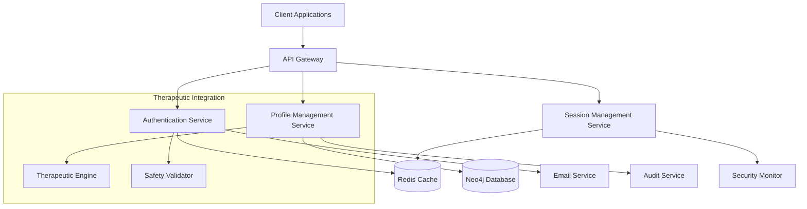

# Authentication & User Management System Design

## Overview

The Authentication & User Management system provides secure, privacy-focused user registration, authentication, and profile management for the TTA platform. The system is designed with therapeutic safety as a core principle, supporting multiple character profiles per user while maintaining strict data protection and security standards.

This system integrates with the broader TTA ecosystem through configuration-driven service discovery and follows the component-based architecture pattern established in the platform.

## Architecture

### High-Level Architecture

The authentication system follows a microservices architecture with clear separation of concerns:



### Component Integration

The system integrates with existing TTA components:
- **Neo4j**: Stores user profiles, character data, and therapeutic preferences
- **Redis**: Manages sessions, rate limiting, and temporary data
- **Email Service**: Handles verification and security notifications
- **Therapeutic Engine**: Receives user context and preferences
- **Safety Validator**: Ensures therapeutic boundaries are maintained

## Components and Interfaces

### 1. Authentication Service

**Responsibilities:**
- User registration and email verification
- Login/logout operations
- Password management and security
- Rate limiting and account lockout

**Key Interfaces:**

```python
class AuthenticationService(Component):
    def register_user(self, email: str, password: str, profile_data: dict) -> AuthResult
    def authenticate_user(self, email: str, password: str) -> AuthResult
    def verify_email(self, verification_token: str) -> bool
    def reset_password(self, email: str) -> bool
    def change_password(self, user_id: str, old_password: str, new_password: str) -> bool
```

**Design Decisions:**
- Uses bcrypt for password hashing with configurable work factor
- Implements exponential backoff for failed authentication attempts
- Email verification required before account activation
- Generic error messages to prevent user enumeration attacks

### 2. Session Management Service

**Responsibilities:**
- Session creation and validation
- Token management (JWT with refresh tokens)
- Multi-device session handling
- Session security monitoring

**Key Interfaces:**

```python
class SessionService(Component):
    def create_session(self, user_id: str, device_info: dict) -> SessionToken
    def validate_session(self, token: str) -> SessionInfo
    def refresh_session(self, refresh_token: str) -> SessionToken
    def invalidate_session(self, token: str) -> bool
    def list_user_sessions(self, user_id: str) -> List[SessionInfo]
```

**Design Decisions:**
- JWT tokens with 30-minute expiration for security
- Refresh tokens stored in Redis with 7-day expiration
- Device fingerprinting for additional security
- Automatic session cleanup for expired tokens

### 3. Profile Management Service

**Responsibilities:**
- User profile CRUD operations
- Character profile management
- Therapeutic preferences management
- Privacy settings and data control

**Key Interfaces:**

```python
class ProfileService(Component):
    def get_user_profile(self, user_id: str) -> UserProfile
    def update_user_profile(self, user_id: str, updates: dict) -> bool
    def create_character(self, user_id: str, character_data: dict) -> Character
    def get_user_characters(self, user_id: str) -> List[Character]
    def update_therapeutic_preferences(self, user_id: str, preferences: dict) -> bool
    def export_user_data(self, user_id: str) -> DataExport
    def delete_user_account(self, user_id: str) -> bool
```

**Design Decisions:**
- Character limit of 5 per user to maintain therapeutic focus
- Audit logging for all profile changes
- Soft delete with 30-day retention for account deletion
- Granular privacy controls with clear explanations

### 4. Security Monitor Service

**Responsibilities:**
- Suspicious activity detection
- Security event logging
- Automated threat response
- Administrator alerting

**Key Interfaces:**

```python
class SecurityMonitor(Component):
    def log_security_event(self, event: SecurityEvent) -> None
    def detect_suspicious_activity(self, user_id: str, activity: dict) -> ThreatLevel
    def trigger_security_response(self, threat: SecurityThreat) -> None
    def generate_security_report(self, timeframe: TimeRange) -> SecurityReport
```

## Data Models

### User Model

```python
@dataclass
class User:
    user_id: str
    email: str
    password_hash: str
    email_verified: bool
    created_at: datetime
    last_login: datetime
    account_status: AccountStatus
    failed_login_attempts: int
    locked_until: Optional[datetime]

    # Privacy and preferences
    privacy_settings: PrivacySettings
    therapeutic_preferences: TherapeuticPreferences
    data_retention_preferences: DataRetentionSettings
```

### Character Model

```python
@dataclass
class Character:
    character_id: str
    user_id: str
    name: str
    created_at: datetime
    therapeutic_profile: TherapeuticProfile
    progress_data: dict
    preferences: CharacterPreferences
    is_active: bool
```

### Session Model

```python
@dataclass
class Session:
    session_id: str
    user_id: str
    token: str
    refresh_token: str
    created_at: datetime
    expires_at: datetime
    device_info: DeviceInfo
    ip_address: str
    is_active: bool
```

### Neo4j Graph Schema

The system uses Neo4j to model relationships between users, characters, and therapeutic data:

```cypher
// User nodes
CREATE (u:User {
    user_id: string,
    email: string,
    created_at: datetime,
    privacy_level: string
})

// Character nodes
CREATE (c:Character {
    character_id: string,
    name: string,
    created_at: datetime,
    therapeutic_focus: [string]
})

// Relationships
CREATE (u)-[:OWNS]->(c)
CREATE (c)-[:HAS_PROGRESS]->(p:Progress)
CREATE (u)-[:HAS_PREFERENCES]->(pref:Preferences)
```

## Error Handling

### Authentication Errors

- **Invalid Credentials**: Generic "Invalid email or password" message
- **Account Locked**: Clear message with unlock time
- **Email Not Verified**: Prompt to resend verification email
- **Rate Limited**: Clear message with retry time

### Session Errors

- **Expired Session**: Automatic redirect to login with context preservation
- **Invalid Token**: Clear session and require re-authentication
- **Concurrent Session Limit**: Allow user to choose which session to terminate

### Profile Management Errors

- **Validation Errors**: Field-specific error messages
- **Character Limit Exceeded**: Clear explanation with upgrade options
- **Privacy Setting Conflicts**: Explanation of implications and alternatives

### Security Errors

- **Suspicious Activity**: Temporary restrictions with clear explanation
- **Data Export Delays**: Status updates and estimated completion time
- **Account Deletion**: Clear confirmation process with data retention information

## Testing Strategy

### Unit Testing

- **Authentication Logic**: Password hashing, token generation, validation
- **Session Management**: Token lifecycle, expiration handling
- **Profile Operations**: CRUD operations, validation logic
- **Security Features**: Rate limiting, threat detection algorithms

### Integration Testing

- **Database Operations**: Neo4j queries, Redis operations
- **Email Service**: Verification and notification workflows
- **Therapeutic Integration**: Context passing, preference application
- **Multi-Service Workflows**: Registration, login, profile updates

### Security Testing

- **Penetration Testing**: Authentication bypass attempts, session hijacking
- **Load Testing**: Rate limiting effectiveness, concurrent user handling
- **Privacy Testing**: Data export accuracy, deletion completeness
- **Therapeutic Safety**: Boundary enforcement, inappropriate content blocking

### End-to-End Testing

- **User Registration Flow**: Complete registration and verification process
- **Character Management**: Creation, switching, deletion workflows
- **Privacy Controls**: Settings application, data export/deletion
- **Security Scenarios**: Account lockout, suspicious activity response

## Configuration Integration

The system integrates with TTA's central configuration system:

```yaml
# config/tta_config.yaml
tta:
  dev:
    authentication:
      enabled: true
      port: 8001
      jwt_secret: ${JWT_SECRET}
      session_timeout: 1800  # 30 minutes
      max_login_attempts: 5
      lockout_duration: 1800  # 30 minutes
      password_requirements:
        min_length: 8
        require_special_chars: true
        require_numbers: true

    profile_management:
      enabled: true
      port: 8002
      max_characters_per_user: 5
      data_export_timeout: 2592000  # 30 days
      account_deletion_grace_period: 2592000  # 30 days

    session_management:
      enabled: true
      redis_connection: "redis://localhost:6379"
      jwt_expiration: 1800  # 30 minutes
      refresh_token_expiration: 604800  # 7 days
```

## Deployment Considerations

### Service Dependencies

- **Redis**: Required for session storage and rate limiting
- **Neo4j**: Required for user and character data persistence
- **Email Service**: Required for verification and notifications
- **Therapeutic Engine**: Optional, for enhanced personalization

### Scaling Considerations

- **Stateless Services**: All services designed to be horizontally scalable
- **Session Storage**: Redis cluster for high availability
- **Database Sharding**: Neo4j clustering for large user bases
- **Caching Strategy**: Multi-layer caching for frequently accessed data

### Security Hardening

- **Network Security**: Service-to-service authentication
- **Data Encryption**: At-rest and in-transit encryption
- **Audit Logging**: Comprehensive security event logging
- **Monitoring**: Real-time security monitoring and alerting

## Therapeutic Safety Integration

### Content Filtering

- User therapeutic preferences automatically applied to content systems
- Safety boundaries enforced at the authentication layer
- Inappropriate content blocked based on user comfort levels

### Crisis Intervention

- Automatic detection of concerning user behavior patterns
- Integration with therapeutic support systems
- Emergency contact and intervention protocols

### Privacy Protection

- Therapeutic data segregated with enhanced protection
- Role-based access for therapeutic staff
- Audit trails for all therapeutic data access

This design ensures that the Authentication & User Management system not only meets all specified requirements but also integrates seamlessly with TTA's therapeutic mission and technical architecture.
