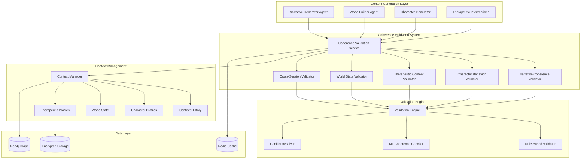

# Coherence Validation System Design

## Overview

The Coherence Validation System serves as the narrative integrity guardian for the TTA platform, ensuring that all generated content maintains logical consistency, character authenticity, and therapeutic appropriateness. This system operates as a real-time validation layer that checks narrative elements against established context, character profiles, world states, and therapeutic frameworks before content is delivered to users.

The system integrates seamlessly with TTA's component architecture, leveraging Neo4j knowledge graphs for context storage, Redis for performance caching, and the existing therapeutic safety frameworks to provide comprehensive coherence validation within the required 500ms response time.

## Architecture

### High-Level Architecture



### Component Integration

The coherence validation system integrates with existing TTA components:

- **Component System**: Inherits from base `Component` class for lifecycle management
- **Neo4j Integration**: Uses existing Neo4j components for context and history storage
- **Redis Integration**: Leverages Redis for validation result caching and performance optimization
- **Therapeutic Safety**: Integrates with therapeutic safety validation for comprehensive content checking
- **Agent Orchestration**: Provides validation services to the agent orchestration system

## Components and Interfaces

### CoherenceValidationService

**Purpose**: Main orchestration component that coordinates all coherence validation processes

**Interface**:
```python
class CoherenceValidationService(Component):
    def __init__(self):
        super().__init__(
            name="coherence_validation_service",
            dependencies=["neo4j", "redis", "therapeutic_safety_validator"]
        )

    async def validate_content(self, content: ContentPayload, context: ValidationContext) -> CoherenceResult:
        """Main validation entry point for all content types"""
        pass

    async def validate_narrative_event(self, event: NarrativeEvent, story_context: StoryContext) -> NarrativeCoherenceResult:
        """Validate narrative events for story consistency"""
        pass

    async def validate_character_action(self, action: CharacterAction, character_context: CharacterContext) -> CharacterCoherenceResult:
        """Validate character actions against established personality and history"""
        pass

    def get_validation_metrics(self) -> ValidationMetrics:
        """Retrieve performance and accuracy metrics"""
        pass
```

**Key Responsibilities**:
- Coordinate validation pipeline execution
- Route content to appropriate specialized validators
- Aggregate validation results and confidence scores
- Manage validation performance and caching
- Handle validation conflicts and resolution

### NarrativeCoherenceValidator

**Purpose**: Validates narrative consistency and logical flow of story elements

**Interface**:
```python
class NarrativeCoherenceValidator(Component):
    def __init__(self):
        super().__init__(
            name="narrative_coherence_validator",
            dependencies=["neo4j", "redis"]
        )

    async def validate_story_consistency(self, event: NarrativeEvent, story_history: StoryHistory) -> ConsistencyResult:
        """Validate narrative event against established story context"""
        pass

    async def check_plot_continuity(self, plot_point: PlotPoint, narrative_arc: NarrativeArc) -> ContinuityResult:
        """Check plot point continuity within narrative arc"""
        pass

    async def validate_cause_effect_chains(self, event: NarrativeEvent, context: CausalContext) -> CausalityResult:
        """Validate logical cause-effect relationships"""
        pass
```

**Key Features**:
- Story timeline consistency checking
- Plot point logical flow validation
- Cause-effect relationship verification
- Narrative arc continuity assessment
- Story element contradiction detection

### CharacterBehaviorValidator

**Purpose**: Ensures character actions and dialogue remain consistent with established personalities

**Interface**:
```python
class CharacterBehaviorValidator(Component):
    def __init__(self):
        super().__init__(
            name="character_behavior_validator",
            dependencies=["neo4j", "redis"]
        )

    async def validate_character_action(self, action: CharacterAction, character_profile: CharacterProfile) -> BehaviorResult:
        """Validate character action against personality profile"""
        pass

    async def validate_dialogue_consistency(self, dialogue: Dialogue, character_voice: CharacterVoice) -> DialogueResult:
        """Validate dialogue matches character voice and personality"""
        pass

    async def validate_relationship_evolution(self, relationship_change: RelationshipChange, relationship_history: RelationshipHistory) -> RelationshipResult:
        """Validate character relationship changes are realistic"""
        pass
```

**Key Features**:
- Personality trait consistency checking
- Character voice and dialogue validation
- Relationship evolution realism assessment
- Character development trajectory validation
- Behavioral pattern recognition and verification

### TherapeuticContentValidator

**Purpose**: Validates therapeutic appropriateness and alignment with therapeutic frameworks

**Interface**:
```python
class TherapeuticContentValidator(Component):
    def __init__(self):
        super().__init__(
            name="therapeutic_content_validator",
            dependencies=["therapeutic_safety_validator", "neo4j"]
        )

    async def validate_therapeutic_intervention(self, intervention: TherapeuticIntervention, user_profile: TherapeuticProfile) -> TherapeuticResult:
        """Validate therapeutic intervention appropriateness"""
        pass

    async def validate_emotional_content(self, content: EmotionalContent, user_readiness: ReadinessLevel) -> EmotionalResult:
        """Validate emotional content matches user readiness"""
        pass

    async def validate_therapeutic_progress(self, progress_element: ProgressElement, therapeutic_goals: TherapeuticGoals) -> ProgressResult:
        """Validate content supports therapeutic progress"""
        pass
```

**Key Features**:
- Therapeutic framework alignment checking
- User readiness level assessment
- Emotional content appropriateness validation
- Therapeutic goal support verification
- Clinical guideline compliance checking

### WorldStateValidator

**Purpose**: Maintains consistency of world elements, locations, and environmental factors

**Interface**:
```python
class WorldStateValidator(Component):
    def __init__(self):
        super().__init__(
            name="world_state_validator",
            dependencies=["neo4j", "redis"]
        )

    async def validate_location_consistency(self, location: Location, world_state: WorldState) -> LocationResult:
        """Validate location descriptions match established geography"""
        pass

    async def validate_temporal_consistency(self, time_change: TimeChange, world_timeline: WorldTimeline) -> TemporalResult:
        """Validate time-dependent elements update appropriately"""
        pass

    async def validate_object_state(self, object_reference: ObjectReference, object_history: ObjectHistory) -> ObjectResult:
        """Validate object states and locations are consistent"""
        pass
```

**Key Features**:
- Location description consistency checking
- Temporal logic and timeline validation
- Object state and location tracking
- Environmental rule enforcement
- Physical world constraint validation

### CrossSessionValidator

**Purpose**: Ensures consistency across user sessions and long-term narrative continuity

**Interface**:
```python
class CrossSessionValidator(Component):
    def __init__(self):
        super().__init__(
            name="cross_session_validator",
            dependencies=["neo4j", "encrypted_storage"]
        )

    async def validate_session_continuity(self, session_context: SessionContext, user_history: UserHistory) -> ContinuityResult:
        """Validate session continuity with user history"""
        pass

    async def validate_persistent_elements(self, persistent_data: PersistentData, stored_context: StoredContext) -> PersistenceResult:
        """Validate persistent elements remain consistent"""
        pass

    async def resolve_cross_session_conflicts(self, conflicts: List[SessionConflict]) -> ConflictResolution:
        """Resolve conflicts between session data"""
        pass
```

**Key Features**:
- Cross-session data consistency checking
- Persistent element validation
- Session conflict detection and resolution
- Long-term narrative continuity maintenance
- User history accuracy verification

## Data Models

### Core Data Structures

```python
@dataclass
class ContentPayload:
    content_id: str
    content_type: ContentType
    content_data: Dict[str, Any]
    generation_context: GenerationContext
    timestamp: datetime
    source_agent: str

@dataclass
class ValidationContext:
    user_id: str
    session_id: str
    character_id: Optional[str]
    world_id: str
    story_context: StoryContext
    character_profiles: Dict[str, CharacterProfile]
    world_state: WorldState
    therapeutic_profile: TherapeuticProfile

@dataclass
class CoherenceResult:
    is_coherent: bool
    confidence_score: float
    validation_details: ValidationDetails
    conflicts_detected: List[CoherenceConflict]
    suggestions: List[CoherenceSuggestion]
    processing_time_ms: int

@dataclass
class CoherenceConflict:
    conflict_type: ConflictType
    severity: ConflictSeverity
    description: str
    conflicting_elements: List[str]
    suggested_resolution: Optional[str]
    confidence: float

@dataclass
class StoryContext:
    narrative_arc: NarrativeArc
    plot_points: List[PlotPoint]
    story_timeline: Timeline
    established_facts: List[StoryFact]
    causal_chains: List[CausalChain]
    themes: List[Theme]
```

### Validation Result Models

```python
class ValidationDetails(BaseModel):
    narrative_validation: Optional[NarrativeValidationResult]
    character_validation: Optional[CharacterValidationResult]
    therapeutic_validation: Optional[TherapeuticValidationResult]
    world_state_validation: Optional[WorldStateValidationResult]
    cross_session_validation: Optional[CrossSessionValidationResult]

class NarrativeValidationResult(BaseModel):
    story_consistency: ConsistencyScore
    plot_continuity: ContinuityScore
    causal_logic: CausalityScore
    timeline_coherence: TimelineScore
    detected_contradictions: List[NarrativeContradiction]

class CharacterValidationResult(BaseModel):
    personality_consistency: PersonalityScore
    dialogue_authenticity: DialogueScore
    relationship_realism: RelationshipScore
    character_development: DevelopmentScore
    behavioral_patterns: List[BehaviorPattern]
```

## Error Handling

### Validation Pipeline Error Handling

**Performance Timeout Handling**:
- Maximum validation time: 500ms per content piece
- Progressive validation with early termination for time-critical scenarios
- Cached validation results for repeated content patterns

**Validation Conflict Resolution**:
- Automated conflict resolution for minor inconsistencies
- Escalation to human review for major narrative conflicts
- Fallback to rule-based validation if ML components fail

**Cross-Session Data Integrity**:
- Automatic data consistency checking on session restoration
- Conflict detection and resolution for contradictory session data
- Backup and recovery mechanisms for corrupted context data

### Component Failure Handling

**Validator Component Failures**:
- Circuit breaker pattern for failing validation components
- Graceful degradation to basic rule-based validation
- Automatic component restart and health monitoring

**Data Layer Failures**:
- Redis cache failure fallback to direct Neo4j queries
- Neo4j connection failure handling with local context caching
- Data corruption detection and recovery procedures

## Testing Strategy

### Unit Testing

**Component Testing**:
- Individual validator component testing with mock data
- Validation rule testing with edge cases and boundary conditions
- Performance testing for 500ms response time requirement
- Conflict detection accuracy testing with known inconsistencies

**Integration Testing**:
- End-to-end validation pipeline testing
- Cross-component validation workflow testing
- Data persistence and retrieval testing
- Cache performance and consistency testing

### Performance Testing

**Response Time Testing**:
- Validation speed testing under various content complexity levels
- Concurrent validation request handling
- Cache hit/miss ratio optimization testing
- Resource utilization monitoring under load

**Accuracy Testing**:
- Validation accuracy testing with manually verified test cases
- False positive/negative rate measurement
- Confidence score calibration testing
- Cross-validator agreement measurement

### Test Implementation

```python
class CoherenceValidationTests:
    async def test_narrative_consistency_validation(self):
        """Test narrative consistency detection and validation."""

    async def test_character_behavior_validation(self):
        """Test character behavior consistency checking."""

    async def test_therapeutic_content_validation(self):
        """Test therapeutic appropriateness validation."""

    async def test_world_state_coherence(self):
        """Test world state consistency validation."""

    async def test_cross_session_continuity(self):
        """Test cross-session data consistency."""

    async def test_validation_performance(self):
        """Test validation performance meets 500ms requirement."""

    async def test_conflict_resolution(self):
        """Test automatic conflict detection and resolution."""
```

## Design Decisions and Rationales

### Multi-Layer Validation Architecture

**Decision**: Implement specialized validators for different coherence aspects
**Rationale**: Allows for domain-specific validation logic while maintaining modularity and testability. Each validator can be optimized for its specific validation domain.

### Caching Strategy for Performance

**Decision**: Implement Redis caching for validation results and context data
**Rationale**: Meets the 500ms performance requirement by avoiding repeated validation of similar content and caching frequently accessed context data.

### Confidence Scoring System

**Decision**: Provide confidence scores for all validation results
**Rationale**: Enables graduated responses to validation results, allowing for different handling of high-confidence vs. low-confidence validation failures.

### Rule-Based and ML Hybrid Approach

**Decision**: Combine rule-based validation with ML-based coherence checking
**Rationale**: Rule-based validation provides reliable, explainable results for clear cases, while ML validation handles complex, nuanced coherence assessment.

### Cross-Session Conflict Resolution

**Decision**: Implement automatic conflict detection with manual escalation
**Rationale**: Maintains narrative continuity automatically for minor conflicts while ensuring human oversight for major narrative inconsistencies that could affect therapeutic outcomes.

### Integration with Therapeutic Safety

**Decision**: Integrate closely with therapeutic safety validation systems
**Rationale**: Ensures that coherence validation supports therapeutic goals and doesn't conflict with safety requirements, maintaining the platform's therapeutic focus.

This design ensures comprehensive coherence validation while maintaining the real-time performance requirements and therapeutic focus that are essential to the TTA platform's effectiveness.


---
**Logseq:** [[TTA.dev/_archive/Kiro/Specs/Specs/Coherence-validation-system/Design]]
