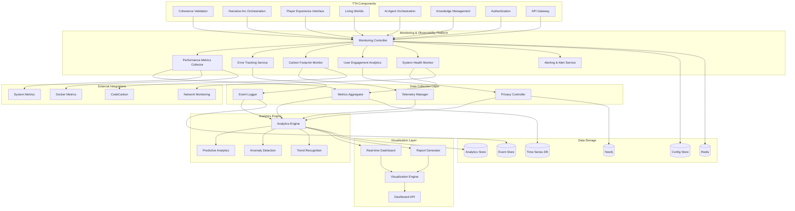

# Monitoring & Observability Platform Design

## Overview

The Monitoring & Observability Platform serves as the comprehensive system health and performance intelligence layer for the TTA platform. This system provides real-time monitoring, error tracking, performance analytics, carbon footprint monitoring, and user engagement insights while maintaining strict privacy compliance for therapeutic applications.

The platform integrates seamlessly with TTA's multi-repository architecture (tta.dev, tta.prototype, tta.prod), leveraging existing infrastructure components and the tta.sh CLI system. It provides both real-time operational insights and historical analytics to support data-driven optimization of therapeutic outcomes and system performance.

## Architecture

### High-Level Architecture



### Component Integration

The monitoring platform integrates with existing TTA infrastructure:

- **Component System**: Inherits from base `Component` class for lifecycle management
- **tta.sh CLI**: Provides monitoring commands and status checking
- **Configuration System**: Uses central `tta_config.yaml` for all monitoring settings
- **Multi-Repository**: Monitors components across tta.dev, tta.prototype, and tta.prod
- **Docker Integration**: Monitors containerized services and resource usage
- **Privacy Framework**: Ensures therapeutic data privacy compliance

## Components and Interfaces

### MonitoringController

**Purpose**: Main orchestration component that coordinates all monitoring and observability functions

**Interface**:
```python
class MonitoringController(Component):
    def __init__(self):
        super().__init__(
            name="monitoring_controller",
            dependencies=["redis", "neo4j", "time_series_db"]
        )

    async def start_monitoring(self, component_name: str) -> MonitoringSession:
        """Start monitoring for a specific component"""
        pass

    async def stop_monitoring(self, component_name: str) -> bool:
        """Stop monitoring for a specific component"""
        pass

    async def get_system_status(self) -> SystemStatus:
        """Get comprehensive system status"""
        pass

    async def configure_monitoring(self, config: MonitoringConfig) -> bool:
        """Configure monitoring parameters"""
        pass

    def get_monitoring_metrics(self) -> MonitoringMetrics:
        """Retrieve monitoring system performance metrics"""
        pass
```

**Key Responsibilities**:
- Coordinate all monitoring subsystems
- Manage monitoring lifecycle for TTA components
- Handle monitoring configuration and updates
- Provide unified monitoring status and control
- Integrate with tta.sh CLI system

### PerformanceMetricsCollector

**Purpose**: Collects comprehensive performance metrics from all TTA components

**Interface**:
```python
class PerformanceMetricsCollector(Component):
    def __init__(self):
        super().__init__(
            name="performance_metrics_collector",
            dependencies=["time_series_db", "redis"]
        )

    async def collect_component_metrics(self, component: str) -> ComponentMetrics:
        """Collect performance metrics for a specific component"""
        pass

    async def collect_ai_model_metrics(self, model_invocation: ModelInvocation) -> AIMetrics:
        """Collect AI model performance and usage metrics"""
        pass

    async def collect_database_metrics(self, db_operation: DatabaseOperation) -> DatabaseMetrics:
        """Collect database operation performance metrics"""
        pass

    async def collect_network_metrics(self, network_activity: NetworkActivity) -> NetworkMetrics:
        """Collect network and WebSocket performance metrics"""
        pass

    def get_performance_summary(self, time_range: TimeRange) -> PerformanceSummary:
        """Get aggregated performance summary"""
        pass
```

**Key Features**:
- Real-time performance metric collection
- AI model inference time and resource tracking
- Database query performance monitoring
- Network and WebSocket connection monitoring
- Resource utilization tracking (CPU, memory, GPU)

### ErrorTrackingService

**Purpose**: Comprehensive error tracking, categorization, and alerting system

**Interface**:
```python
class ErrorTrackingService(Component):
    def __init__(self):
        super().__init__(
            name="error_tracking_service",
            dependencies=["event_store", "redis", "alerting_service"]
        )

    async def track_error(self, error: ErrorEvent, context: ErrorContext) -> ErrorTrackingResult:
        """Track and categorize an error event"""
        pass

    async def analyze_error_patterns(self, time_range: TimeRange) -> ErrorPatternAnalysis:
        """Analyze error patterns and trends"""
        pass

    async def trigger_alert(self, error: CriticalError) -> AlertResult:
        """Trigger alerts for critical errors"""
        pass

    async def resolve_error(self, error_id: str, resolution: ErrorResolution) -> bool:
        """Mark error as resolved and track resolution"""
        pass

    def get_error_metrics(self) -> ErrorMetrics:
        """Get error tracking metrics and statistics"""
        pass
```

**Key Features**:
- Full stack trace capture with context
- Error pattern recognition and grouping
- Intelligent alerting with escalation
- Error resolution tracking
- Impact assessment for therapeutic services

### CarbonFootprintMonitor

**Purpose**: Monitors and optimizes carbon footprint of AI operations using CodeCarbon integration

**Interface**:
```python
class CarbonFootprintMonitor(Component):
    def __init__(self):
        super().__init__(
            name="carbon_footprint_monitor",
            dependencies=["time_series_db", "codecarbon"]
        )

    async def start_carbon_tracking(self, operation: AIOperation) -> CarbonTrackingSession:
        """Start carbon footprint tracking for an AI operation"""
        pass

    async def stop_carbon_tracking(self, session_id: str) -> CarbonFootprintResult:
        """Stop tracking and get carbon footprint results"""
        pass

    async def generate_carbon_report(self, time_range: TimeRange) -> CarbonReport:
        """Generate carbon footprint report with recommendations"""
        pass

    async def analyze_carbon_efficiency(self, model_usage: ModelUsage) -> EfficiencyAnalysis:
        """Analyze carbon efficiency of model usage patterns"""
        pass

    def get_carbon_metrics(self) -> CarbonMetrics:
        """Get carbon footprint metrics and trends"""
        pass
```

**Key Features**:
- Real-time energy consumption tracking
- GPU power usage monitoring
- Carbon emission calculations
- Efficiency optimization recommendations
- Sustainability reporting and trends

### UserEngagementAnalytics

**Purpose**: Privacy-compliant user engagement analytics for therapeutic effectiveness insights

**Interface**:
```python
class UserEngagementAnalytics(Component):
    def __init__(self):
        super().__init__(
            name="user_engagement_analytics",
            dependencies=["analytics_store", "privacy_controller", "neo4j"]
        )

    async def track_engagement_event(self, event: EngagementEvent) -> bool:
        """Track user engagement event with privacy protection"""
        pass

    async def analyze_session_patterns(self, time_range: TimeRange) -> SessionAnalysis:
        """Analyze therapeutic session patterns"""
        pass

    async def generate_engagement_insights(self, criteria: AnalyticsCriteria) -> EngagementInsights:
        """Generate insights on user engagement and therapeutic effectiveness"""
        pass

    async def correlate_engagement_outcomes(self, engagement_data: EngagementData) -> CorrelationAnalysis:
        """Correlate engagement patterns with therapeutic outcomes"""
        pass

    def get_engagement_metrics(self) -> EngagementMetrics:
        """Get anonymized engagement metrics"""
        pass
```

**Key Features**:
- Privacy-compliant engagement tracking
- Therapeutic session effectiveness analysis
- User journey pattern recognition
- Anonymized outcome correlation
- Engagement optimization recommendations

### SystemHealthMonitor

**Purpose**: Comprehensive system health monitoring with predictive capabilities

**Interface**:
```python
class SystemHealthMonitor(Component):
    def __init__(self):
        super().__init__(
            name="system_health_monitor",
            dependencies=["time_series_db", "redis", "docker_metrics", "predictive_analytics"]
        )

    async def monitor_component_health(self, component: str) -> HealthStatus:
        """Monitor health status of a specific component"""
        pass

    async def check_dependency_health(self, dependencies: List[str]) -> DependencyHealth:
        """Check health of system dependencies"""
        pass

    async def predict_system_issues(self, current_metrics: SystemMetrics) -> PredictiveAnalysis:
        """Predict potential system issues based on current trends"""
        pass

    async def perform_health_check(self, component: str) -> HealthCheckResult:
        """Perform comprehensive health check"""
        pass

    def get_system_health_summary(self) -> SystemHealthSummary:
        """Get overall system health summary"""
        pass
```

**Key Features**:
- Real-time component health monitoring
- Dependency health checking
- Predictive issue detection
- Automated health checks
- Resource utilization monitoring

### AlertingService

**Purpose**: Intelligent alerting system with escalation and notification management

**Interface**:
```python
class AlertingService(Component):
    def __init__(self):
        super().__init__(
            name="alerting_service",
            dependencies=["event_store", "redis", "notification_system"]
        )

    async def create_alert(self, alert: AlertDefinition) -> AlertResult:
        """Create and trigger an alert"""
        pass

    async def escalate_alert(self, alert_id: str, escalation_level: EscalationLevel) -> bool:
        """Escalate alert to higher priority level"""
        pass

    async def resolve_alert(self, alert_id: str, resolution: AlertResolution) -> bool:
        """Resolve alert and update status"""
        pass

    async def configure_alert_rules(self, rules: AlertRules) -> bool:
        """Configure alerting rules and thresholds"""
        pass

    def get_alert_metrics(self) -> AlertMetrics:
        """Get alerting system metrics"""
        pass
```

**Key Features**:
- Intelligent alert prioritization
- Multi-channel notification delivery
- Alert escalation workflows
- Alert fatigue prevention
- Resolution tracking and metrics

## Data Models

### Core Data Structures

```python
@dataclass
class MonitoringSession:
    session_id: str
    component_name: str
    start_time: datetime
    monitoring_config: MonitoringConfig
    active_collectors: List[str]
    status: MonitoringStatus

@dataclass
class SystemStatus:
    overall_health: HealthLevel
    component_statuses: Dict[str, ComponentStatus]
    active_alerts: List[Alert]
    performance_summary: PerformanceSummary
    carbon_footprint: CarbonFootprint
    last_updated: datetime

@dataclass
class ComponentMetrics:
    component_name: str
    timestamp: datetime
    cpu_usage: float
    memory_usage: float
    response_time_ms: float
    request_count: int
    error_count: int
    availability: float

@dataclass
class AIMetrics:
    model_name: str
    inference_time_ms: float
    token_count: int
    gpu_utilization: float
    energy_consumption: float
    carbon_emissions: float
    request_timestamp: datetime

@dataclass
class ErrorEvent:
    error_id: str
    component: str
    error_type: ErrorType
    severity: ErrorSeverity
    message: str
    stack_trace: str
    context: Dict[str, Any]
    timestamp: datetime
    user_session_id: Optional[str]
```

### Analytics Data Models

```python
class PerformanceSummary(BaseModel):
    average_response_time: float
    peak_response_time: float
    throughput_per_second: float
    error_rate: float
    availability_percentage: float
    resource_utilization: ResourceUtilization

class EngagementMetrics(BaseModel):
    session_duration_avg: float
    interaction_frequency: float
    completion_rate: float
    user_retention_rate: float
    therapeutic_progress_indicators: List[ProgressIndicator]

class CarbonReport(BaseModel):
    total_emissions_kg: float
    energy_consumption_kwh: float
    efficiency_score: float
    recommendations: List[EfficiencyRecommendation]
    comparison_to_baseline: float
    trend_analysis: TrendAnalysis

class AlertDefinition(BaseModel):
    alert_id: str
    name: str
    description: str
    condition: AlertCondition
    severity: AlertSeverity
    escalation_rules: List[EscalationRule]
    notification_channels: List[NotificationChannel]
```

## Error Handling

### Monitoring System Resilience

**Self-Monitoring Capabilities**:
- Monitor the monitoring system itself for failures
- Automatic failover to backup monitoring instances
- Graceful degradation when monitoring components fail

**Data Collection Failures**:
- Retry mechanisms for failed metric collection
- Local buffering when central storage is unavailable
- Data integrity validation and corruption detection

**Privacy Protection Failures**:
- Automatic data anonymization failure detection
- Emergency data purging for privacy violations
- Audit trail for all privacy-related operations

### Performance and Scalability

**High-Volume Data Handling**:
- Efficient data aggregation and sampling strategies
- Automatic data archiving and retention management
- Load balancing for monitoring data processing

**Real-Time Dashboard Performance**:
- Caching strategies for dashboard data
- Progressive loading for complex visualizations
- Automatic refresh rate adjustment based on system load

## Testing Strategy

### Unit Testing

**Component Testing**:
- Individual monitoring component testing with mock data
- Metric collection accuracy testing
- Alert triggering and escalation testing
- Privacy compliance validation testing

**Integration Testing**:
- End-to-end monitoring pipeline testing
- Cross-component monitoring workflow testing
- Dashboard data accuracy and real-time updates
- Alert delivery and notification testing

### Performance Testing

**Monitoring Overhead Testing**:
- Impact of monitoring on system performance
- Resource utilization of monitoring components
- Scalability testing under high metric volume
- Dashboard response time under load

**Data Accuracy Testing**:
- Metric collection accuracy validation
- Alert threshold accuracy testing
- Analytics calculation verification
- Privacy anonymization effectiveness testing

### Test Implementation

```python
class MonitoringPlatformTests:
    async def test_performance_metrics_collection(self):
        """Test accurate performance metric collection."""

    async def test_error_tracking_and_alerting(self):
        """Test error detection, tracking, and alert generation."""

    async def test_carbon_footprint_monitoring(self):
        """Test carbon footprint tracking and reporting."""

    async def test_user_engagement_analytics(self):
        """Test privacy-compliant engagement analytics."""

    async def test_system_health_monitoring(self):
        """Test system health monitoring and prediction."""

    async def test_dashboard_performance(self):
        """Test dashboard response time meets 5-second requirement."""

    async def test_privacy_compliance(self):
        """Test privacy protection and data anonymization."""
```

## Design Decisions and Rationales

### Time-Series Database for Metrics Storage

**Decision**: Use specialized time-series database for metrics storage
**Rationale**: Optimizes storage and query performance for time-based monitoring data, supports efficient aggregation and retention policies.

### Privacy-First Analytics Design

**Decision**: Implement privacy protection at the data collection layer
**Rationale**: Ensures therapeutic user privacy is protected from the start, prevents accidental exposure of sensitive information.

### Multi-Layer Alerting System

**Decision**: Implement intelligent alerting with escalation and fatigue prevention
**Rationale**: Ensures critical issues are addressed promptly while preventing alert overload that could desensitize operators.

### CodeCarbon Integration for Sustainability

**Decision**: Integrate CodeCarbon for comprehensive carbon footprint monitoring
**Rationale**: Aligns with ethical AI practices and provides actionable insights for reducing environmental impact of therapeutic AI operations.

### Component-Based Monitoring Architecture

**Decision**: Design monitoring as modular components following TTA patterns
**Rationale**: Ensures consistency with TTA architecture, enables selective monitoring deployment, and facilitates testing and maintenance.

### Real-Time Dashboard with Caching

**Decision**: Implement real-time dashboards with intelligent caching
**Rationale**: Provides immediate operational insights while managing system resources efficiently and meeting performance requirements.

### Predictive Analytics Integration

**Decision**: Include predictive capabilities for proactive issue detection
**Rationale**: Enables prevention of issues before they impact therapeutic users, improving overall system reliability and user experience.

This design ensures comprehensive monitoring and observability while maintaining the privacy, performance, and therapeutic focus that are essential to the TTA platform's mission.


---
**Logseq:** [[TTA.dev/_archive/Kiro/Specs/Specs/Monitoring-observability-platform/Design]]
