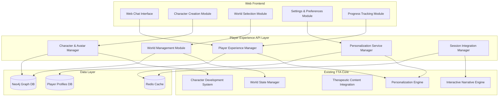
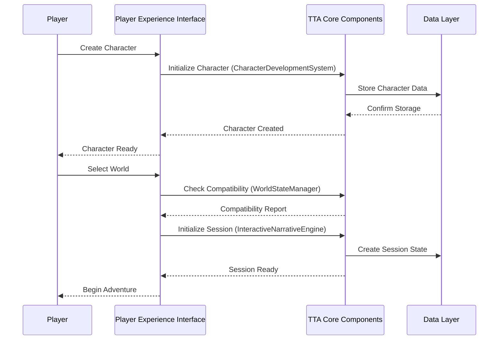

# Design Document

## Overview

The Player Experience Interface is a comprehensive web-based system that provides players with intuitive control over their therapeutic text adventure experience. The system integrates with the existing TTA architecture, leveraging the prototype's therapeutic components while introducing new player-facing interfaces for character management, world selection, and experience customization.

The design follows a modular, component-based architecture that separates concerns between player interface management, therapeutic content delivery, and data persistence. It builds upon the existing TTA orchestration system and extends the prototype's therapeutic capabilities with player-centric features.

## Architecture

### High-Level Architecture



### Component Architecture

The system is organized into distinct layers:

1. **Web Frontend Layer**: React-based web interface components
2. **API Layer**: FastAPI-based REST and WebSocket services
3. **Business Logic Layer**: Integration with existing TTA therapeutic components
4. **Data Layer**: Extended data models and persistence

## Components and Interfaces

### 1. Player Experience Manager (PEM)

**Purpose**: Central orchestrator for all player experience functionality

**Key Interfaces**:
```python
class PlayerExperienceManager:
    def create_player_profile(self, player_data: PlayerProfileData) -> PlayerProfile
    def get_player_dashboard(self, player_id: str) -> PlayerDashboard
    def switch_character_context(self, player_id: str, character_id: str, world_id: str) -> SessionContext
    def update_therapeutic_preferences(self, player_id: str, preferences: TherapeuticPreferences) -> bool
    def get_progress_summary(self, player_id: str) -> ProgressSummary
```

**Dependencies**:
- Character & Avatar Manager
- World Management Module
- Personalization Service Manager
- Session Integration Manager

### 2. Character & Avatar Manager (CAM)

**Purpose**: Manages character creation, customization, and lifecycle

**Key Interfaces**:
```python
class CharacterAvatarManager:
    def create_character(self, player_id: str, character_data: CharacterCreationData) -> Character
    def get_player_characters(self, player_id: str) -> List[Character]
    def update_character(self, character_id: str, updates: CharacterUpdates) -> Character
    def delete_character(self, character_id: str) -> bool
    def get_character_therapeutic_profile(self, character_id: str) -> TherapeuticProfile
```

**Integration Points**:
- Extends existing `CharacterDevelopmentSystem`
- Integrates with `PersonalizationEngine` for character-specific adaptations

### 3. World Management Module (WMM)

**Purpose**: Handles world discovery, selection, and customization

**Key Interfaces**:
```python
class WorldManagementModule:
    def get_available_worlds(self, player_id: str) -> List[WorldSummary]
    def get_world_details(self, world_id: str) -> WorldDetails
    def customize_world_parameters(self, world_id: str, parameters: WorldParameters) -> CustomizedWorld
    def check_world_compatibility(self, character_id: str, world_id: str) -> CompatibilityReport
    def initialize_character_in_world(self, character_id: str, world_id: str) -> WorldSession
```

**Integration Points**:
- Leverages existing `WorldStateManager` and `WorldbuildingSettingManagement`
- Integrates with `TherapeuticEnvironmentGenerator`

### 4. Web Chat Interface (WCI)

**Purpose**: Provides real-time chat interface for therapeutic interactions

**Key Features**:
- WebSocket-based real-time communication
- Rich text formatting for therapeutic content
- Interactive elements (buttons, guided exercises)
- Accessibility compliance (WCAG 2.1 AA)
- Mobile-responsive design

**Technical Stack**:
- Frontend: React with TypeScript
- Real-time: Socket.IO
- Styling: Tailwind CSS with accessibility plugins
- State Management: Redux Toolkit

### 5. Personalization Service Manager (PSM)

**Purpose**: Manages therapeutic personalization and adaptation

**Key Interfaces**:
```python
class PersonalizationServiceManager:
    def update_therapeutic_settings(self, player_id: str, settings: TherapeuticSettings) -> bool
    def get_adaptive_recommendations(self, player_id: str) -> List[Recommendation]
    def process_feedback(self, player_id: str, feedback: PlayerFeedback) -> AdaptationResult
    def get_crisis_support_resources(self, player_id: str) -> CrisisSupportResources
```

**Integration Points**:
- Extends existing `PersonalizationEngine`
- Integrates with `ProgressBasedTherapeuticAdaptation`

## Data Models

### Core Player Data Models

```python
@dataclass
class PlayerProfile:
    player_id: str
    username: str
    email: str
    created_at: datetime
    therapeutic_preferences: TherapeuticPreferences
    privacy_settings: PrivacySettings
    characters: List[str]  # Character IDs
    active_sessions: Dict[str, str]  # character_id -> session_id
    progress_summary: ProgressSummary

@dataclass
class Character:
    character_id: str
    player_id: str
    name: str
    appearance: CharacterAppearance
    background: CharacterBackground
    therapeutic_profile: TherapeuticProfile
    created_at: datetime
    last_active: datetime
    active_worlds: List[str]

@dataclass
class TherapeuticPreferences:
    intensity_level: IntensityLevel  # LOW, MEDIUM, HIGH
    preferred_approaches: List[TherapeuticApproach]
    trigger_warnings: List[str]
    comfort_topics: List[str]
    avoid_topics: List[str]
    crisis_contact_info: Optional[CrisisContactInfo]

@dataclass
class WorldSummary:
    world_id: str
    name: str
    description: str
    therapeutic_themes: List[str]
    difficulty_level: DifficultyLevel
    estimated_duration: timedelta
    compatibility_score: float  # 0.0 to 1.0
    preview_image: Optional[str]
```

### Session Management Models

```python
@dataclass
class SessionContext:
    session_id: str
    player_id: str
    character_id: str
    world_id: str
    therapeutic_settings: TherapeuticSettings
    created_at: datetime
    last_interaction: datetime
    progress_markers: List[ProgressMarker]

@dataclass
class PlayerDashboard:
    player_id: str
    active_characters: List[Character]
    recent_sessions: List[SessionSummary]
    progress_highlights: List[ProgressHighlight]
    recommendations: List[Recommendation]
    upcoming_milestones: List[Milestone]
```

## Error Handling

### Error Categories

1. **Validation Errors**: Invalid input data, constraint violations
2. **Authentication Errors**: Invalid credentials, expired sessions
3. **Authorization Errors**: Insufficient permissions, privacy violations
4. **Business Logic Errors**: Character limits exceeded, incompatible world selection
5. **Integration Errors**: Therapeutic component failures, database connectivity
6. **Crisis Situations**: Mental health emergencies, safety concerns

### Error Handling Strategy

```python
class PlayerExperienceError(Exception):
    """Base exception for player experience errors."""
    pass

class CharacterLimitExceededError(PlayerExperienceError):
    """Raised when player tries to create more than 5 characters."""
    pass

class WorldIncompatibilityError(PlayerExperienceError):
    """Raised when character-world combination is incompatible."""
    pass

class TherapeuticSafetyError(PlayerExperienceError):
    """Raised when therapeutic safety concerns are detected."""
    pass
```

### Crisis Detection and Response

```python
class CrisisDetectionSystem:
    def detect_crisis_indicators(self, interaction_data: InteractionData) -> CrisisAssessment
    def trigger_crisis_protocol(self, player_id: str, crisis_type: CrisisType) -> CrisisResponse
    def provide_immediate_resources(self, player_id: str) -> List[CrisisResource]
```

## Testing Strategy

### Unit Testing

- **Component Testing**: Individual component functionality
- **Integration Testing**: Component interaction validation
- **Data Model Testing**: Validation and constraint testing
- **API Testing**: Endpoint functionality and error handling

### End-to-End Testing

- **User Journey Testing**: Complete player workflows
- **Therapeutic Effectiveness Testing**: Intervention delivery validation
- **Performance Testing**: Response time and scalability
- **Accessibility Testing**: WCAG compliance validation

### Testing Tools

- **Backend**: pytest, pytest-asyncio, factory_boy
- **Frontend**: Jest, React Testing Library, Cypress
- **API**: FastAPI TestClient, httpx
- **Database**: pytest-postgresql, fakeredis

### Test Data Management

```python
class TestDataFactory:
    @staticmethod
    def create_test_player() -> PlayerProfile

    @staticmethod
    def create_test_character(player_id: str) -> Character

    @staticmethod
    def create_test_world() -> WorldSummary

    @staticmethod
    def create_therapeutic_session(character_id: str, world_id: str) -> SessionContext
```

## Security and Privacy

### Authentication and Authorization

- **JWT-based authentication** with refresh tokens
- **Role-based access control** (Player, Therapist, Admin)
- **Session management** with automatic timeout
- **Multi-factor authentication** for sensitive operations

### Data Privacy

- **GDPR compliance** with right to erasure
- **Data minimization** - collect only necessary data
- **Encryption at rest** for sensitive therapeutic data
- **Audit logging** for all data access and modifications

### Therapeutic Data Protection

```python
class TherapeuticDataProtection:
    def encrypt_therapeutic_content(self, content: str) -> EncryptedContent
    def anonymize_research_data(self, player_data: PlayerData) -> AnonymizedData
    def audit_data_access(self, player_id: str, accessor: str, operation: str) -> AuditEntry
    def handle_data_deletion_request(self, player_id: str) -> DeletionReport
```

## Performance Considerations

### Scalability Requirements

- **Concurrent Users**: Support 1000+ simultaneous chat sessions
- **Response Time**: < 200ms for UI interactions, < 2s for therapeutic responses
- **Data Storage**: Efficient storage for character and session data
- **Caching Strategy**: Redis-based caching for frequently accessed data

### Optimization Strategies

1. **Database Optimization**:
   - Indexed queries for character and world lookups
   - Connection pooling for Neo4j and PostgreSQL
   - Read replicas for dashboard queries

2. **Caching Strategy**:
   - Player profile caching (30 minutes TTL)
   - World data caching (24 hours TTL)
   - Session state caching (real-time updates)

3. **Frontend Optimization**:
   - Code splitting for different interface modules
   - Lazy loading for character and world assets
   - WebSocket connection pooling

### Monitoring and Metrics

```python
class PerformanceMetrics:
    def track_response_time(self, endpoint: str, duration: float)
    def track_user_engagement(self, player_id: str, interaction_type: str)
    def track_therapeutic_effectiveness(self, session_id: str, metrics: TherapeuticMetrics)
    def track_system_health(self, component: str, status: HealthStatus)
```

## Integration with Existing TTA Components

### Therapeutic Component Integration

The Player Experience Interface integrates seamlessly with existing TTA therapeutic components:

1. **PersonalizationEngine**: Extended to support player-driven preferences
2. **CharacterDevelopmentSystem**: Enhanced with player-created characters
3. **TherapeuticContentIntegration**: Adapted for player-controlled therapeutic intensity
4. **InteractiveNarrativeEngine**: Modified to support character-world switching

### Data Flow Integration



### Configuration Integration

The system extends the existing TTA configuration structure:

```yaml
# config/tta_config.yaml extension
player_experience:
  enabled: true
  web_interface:
    host: "0.0.0.0"
    port: 8080
    cors_origins: ["http://localhost:3000"]
  character_limits:
    max_characters_per_player: 5
    character_name_max_length: 50
  world_management:
    compatibility_threshold: 0.6
    world_cache_ttl: 86400
  therapeutic_settings:
    default_intensity: "medium"
    crisis_detection_enabled: true
    safety_monitoring_interval: 300
```


---
**Logseq:** [[TTA.dev/_archive/Kiro/Specs/Specs/Player-experience-interface/Design]]
