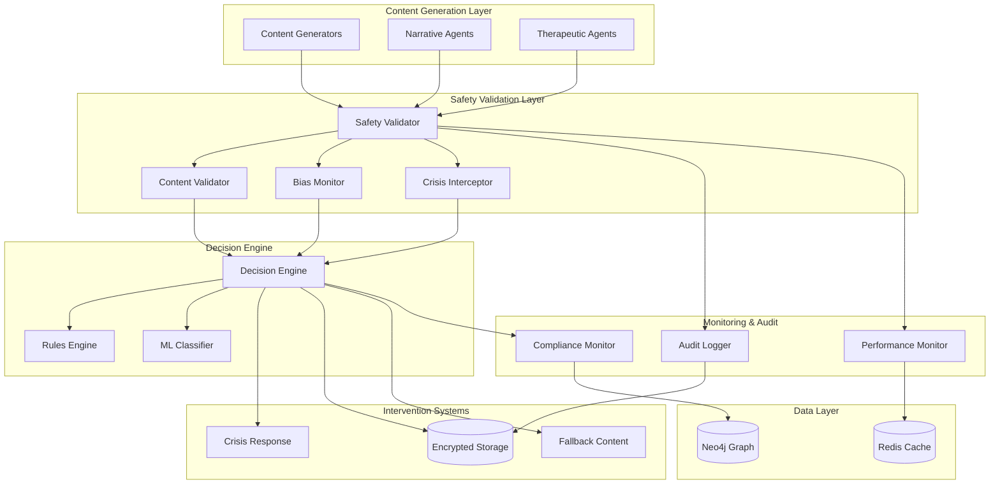

# Therapeutic Safety & Content Validation System Design

## Overview

The Therapeutic Safety & Content Validation system serves as the critical safety layer for the TTA platform, ensuring all AI-generated content meets therapeutic appropriateness standards while maintaining real-time performance. This system operates as a middleware layer between content generation components and user delivery, implementing comprehensive validation, crisis intervention, bias detection, and privacy protection mechanisms.

The system is designed to be non-intrusive to the user experience while providing robust protection against therapeutic harm. It integrates seamlessly with TTA's component-based architecture and supports the platform's commitment to ethical AI practices and user wellbeing.

## Architecture

### High-Level Architecture



### Component Architecture

The system follows TTA's component-based design pattern with the following core components:

1. **SafetyValidationOrchestrator**: Main orchestration component that coordinates all validation processes
2. **ContentSafetyValidator**: Validates content against therapeutic safety guidelines
3. **BiasDetectionEngine**: Identifies and mitigates bias in generated content
4. **CrisisInterventionSystem**: Handles crisis detection and emergency response
5. **PrivacyProtectionManager**: Ensures data privacy and security compliance
6. **AuditTrailManager**: Maintains comprehensive audit logs and compliance reporting

## Components and Interfaces

### SafetyValidationOrchestrator

**Purpose**: Central coordination of all safety validation processes

**Interface**:
```python
class SafetyValidationOrchestrator(Component):
    def __init__(self):
        super().__init__(
            name="safety_validation_orchestrator",
            dependencies=["redis", "neo4j", "content_safety_validator",
                         "bias_detection_engine", "crisis_intervention_system"]
        )

    async def validate_content(self, content: ContentPayload, context: ValidationContext) -> ValidationResult:
        """Main validation entry point"""
        pass

    async def handle_crisis_detection(self, user_input: str, user_context: UserContext) -> CrisisResponse:
        """Handle detected crisis situations"""
        pass

    def get_validation_metrics(self) -> ValidationMetrics:
        """Retrieve performance and safety metrics"""
        pass
```

**Key Responsibilities**:
- Coordinate validation pipeline execution
- Manage validation timeouts and performance requirements
- Handle escalation to human oversight
- Integrate with therapeutic monitoring systems

### ContentSafetyValidator

**Purpose**: Validates content against therapeutic safety guidelines and appropriateness standards

**Interface**:
```python
class ContentSafetyValidator(Component):
    def __init__(self):
        super().__init__(
            name="content_safety_validator",
            dependencies=["redis"]
        )

    async def validate_therapeutic_content(self, content: str, therapeutic_context: TherapeuticContext) -> SafetyResult:
        """Validate content for therapeutic appropriateness"""
        pass

    async def check_age_appropriateness(self, content: str, user_age: int, content_preferences: ContentPreferences) -> AgeAppropriatenessResult:
        """Validate content for age and preference appropriateness"""
        pass

    def update_safety_guidelines(self, guidelines: SafetyGuidelines) -> bool:
        """Update therapeutic safety guidelines"""
        pass
```

**Key Features**:
- Real-time content validation (< 200ms response time)
- Therapeutic framework alignment checking
- Age and maturity level filtering
- Content boundary respect
- Evidence-based therapeutic approach validation

### BiasDetectionEngine

**Purpose**: Identifies and mitigates bias related to protected characteristics

**Interface**:
```python
class BiasDetectionEngine(Component):
    def __init__(self):
        super().__init__(
            name="bias_detection_engine",
            dependencies=["redis"]
        )

    async def detect_bias(self, content: str, context: BiasContext) -> BiasDetectionResult:
        """Detect bias in generated content"""
        pass

    async def suggest_bias_mitigation(self, biased_content: str, bias_type: BiasType) -> MitigationSuggestion:
        """Suggest bias-free alternatives"""
        pass

    def log_bias_incident(self, incident: BiasIncident) -> bool:
        """Log bias incidents for pattern analysis"""
        pass
```

**Key Features**:
- Multi-dimensional bias detection (race, gender, sexuality, religion, disability)
- Pattern recognition for systematic bias
- Alternative content generation suggestions
- Bias incident logging and analysis
- Model feedback integration

### CrisisInterventionSystem

**Purpose**: Handles crisis detection and emergency response protocols

**Interface**:
```python
class CrisisInterventionSystem(Component):
    def __init__(self):
        super().__init__(
            name="crisis_intervention_system",
            dependencies=["neo4j", "emergency_services_connector"]
        )

    async def detect_crisis_indicators(self, user_input: str, user_history: UserHistory) -> CrisisAssessment:
        """Detect crisis or self-harm indicators"""
        pass

    async def activate_crisis_protocol(self, crisis_level: CrisisLevel, user_context: UserContext) -> CrisisResponse:
        """Activate appropriate crisis intervention"""
        pass

    async def provide_crisis_resources(self, user_location: Location, crisis_type: CrisisType) -> CrisisResources:
        """Provide location-appropriate crisis resources"""
        pass
```

**Key Features**:
- Real-time crisis indicator detection
- Graduated crisis response protocols
- Emergency services integration
- Crisis resource provision
- Follow-up support coordination

### PrivacyProtectionManager

**Purpose**: Ensures comprehensive privacy protection and data security

**Interface**:
```python
class PrivacyProtectionManager(Component):
    def __init__(self):
        super().__init__(
            name="privacy_protection_manager",
            dependencies=["encrypted_storage", "anonymization_service"]
        )

    async def encrypt_sensitive_data(self, data: SensitiveData) -> EncryptedData:
        """Encrypt sensitive therapeutic data"""
        pass

    async def anonymize_user_data(self, user_data: UserData) -> AnonymizedData:
        """Anonymize personal identifiers"""
        pass

    async def handle_data_deletion_request(self, user_id: str, deletion_scope: DeletionScope) -> DeletionResult:
        """Handle user data deletion requests"""
        pass
```

**Key Features**:
- End-to-end encryption for sensitive data
- HIPAA-compliant storage mechanisms
- Data anonymization and pseudonymization
- Secure data deletion
- Access control enforcement

### AuditTrailManager

**Purpose**: Maintains comprehensive audit logs and compliance reporting

**Interface**:
```python
class AuditTrailManager(Component):
    def __init__(self):
        super().__init__(
            name="audit_trail_manager",
            dependencies=["neo4j", "encrypted_storage"]
        )

    async def log_validation_decision(self, validation_event: ValidationEvent) -> bool:
        """Log safety validation decisions"""
        pass

    async def log_intervention(self, intervention_event: InterventionEvent) -> bool:
        """Log safety interventions"""
        pass

    async def generate_compliance_report(self, report_parameters: ReportParameters) -> ComplianceReport:
        """Generate compliance and safety reports"""
        pass
```

**Key Features**:
- Detailed audit trail creation
- Compliance reporting automation
- Access control logging
- Regulatory requirement adaptation
- Performance metrics tracking

## Data Models

### Core Data Structures

```python
@dataclass
class ContentPayload:
    content: str
    content_type: ContentType
    source_component: str
    generation_timestamp: datetime
    user_context: UserContext
    therapeutic_context: TherapeuticContext

@dataclass
class ValidationContext:
    user_id: str
    session_id: str
    therapeutic_goals: List[TherapeuticGoal]
    content_preferences: ContentPreferences
    crisis_history: CrisisHistory
    validation_timestamp: datetime

@dataclass
class ValidationResult:
    is_safe: bool
    confidence_score: float
    validation_details: ValidationDetails
    required_actions: List[ValidationAction]
    processing_time_ms: int
    audit_trail_id: str

@dataclass
class CrisisAssessment:
    crisis_detected: bool
    crisis_level: CrisisLevel
    crisis_indicators: List[CrisisIndicator]
    recommended_actions: List[CrisisAction]
    emergency_contacts: List[EmergencyContact]
    assessment_confidence: float

@dataclass
class BiasDetectionResult:
    bias_detected: bool
    bias_types: List[BiasType]
    bias_confidence: float
    affected_groups: List[ProtectedCharacteristic]
    mitigation_suggestions: List[MitigationSuggestion]
    bias_severity: BiasSeverity
```

### Database Schema

**Neo4j Graph Schema**:
- User nodes with therapeutic profiles and safety preferences
- Content validation history with decision rationales
- Bias incident patterns and mitigation effectiveness
- Crisis intervention outcomes and follow-up tracking
- Audit trail relationships for compliance reporting

**Redis Cache Schema**:
- Real-time validation results (TTL: 1 hour)
- User safety preferences and content boundaries
- Performance metrics and system health indicators
- Active crisis intervention states

## Error Handling

### Validation Pipeline Error Handling

**Timeout Handling**:
- Maximum validation time: 200ms per content piece
- Graceful degradation to basic safety checks if ML models timeout
- Fallback to rule-based validation for performance-critical scenarios

**Component Failure Handling**:
- Circuit breaker pattern for external service dependencies
- Automatic failover to backup validation methods
- Safe-fail approach: block content if validation cannot be completed

**Crisis Intervention Error Handling**:
- Redundant crisis detection mechanisms
- Automatic escalation if primary crisis systems fail
- Emergency contact notification even during system failures

### Data Privacy Error Handling

**Encryption Failures**:
- Immediate data processing halt if encryption fails
- Secure data purging for unencryptable sensitive information
- Alert generation for privacy protection failures

**Access Control Violations**:
- Immediate access termination for unauthorized attempts
- Comprehensive audit logging of security incidents
- Automatic security protocol activation

## Testing Strategy

### Unit Testing

**Component Testing**:
- Individual component validation with mock dependencies
- Performance testing for sub-200ms validation requirements
- Edge case testing for crisis detection algorithms
- Bias detection accuracy testing with diverse content samples

**Integration Testing**:
- End-to-end validation pipeline testing
- Crisis intervention workflow testing
- Privacy protection mechanism testing
- Audit trail completeness verification

### Performance Testing

**Load Testing**:
- Concurrent user validation scenarios
- Peak load handling with maintained safety standards
- Resource scaling under safety validation constraints
- 99.9% uptime requirement validation

**Stress Testing**:
- System behavior under component failures
- Crisis intervention system resilience testing
- Data privacy protection under attack scenarios
- Audit system performance under high logging volumes

### Security Testing

**Privacy Protection Testing**:
- End-to-end encryption verification
- Data anonymization effectiveness testing
- Secure deletion verification
- Access control enforcement testing

**Vulnerability Testing**:
- Regular security assessments
- Penetration testing for privacy protection
- Compliance requirement verification
- Incident response procedure testing

## Design Decisions and Rationales

### Real-time Validation Architecture

**Decision**: Implement asynchronous validation pipeline with 200ms timeout
**Rationale**: Maintains user engagement while ensuring comprehensive safety validation. Asynchronous processing allows parallel validation checks without blocking user interaction.

### Component-based Safety Architecture

**Decision**: Separate safety concerns into distinct, specialized components
**Rationale**: Enables independent scaling, testing, and maintenance of different safety aspects. Follows TTA's component architecture principles and allows for specialized optimization of each safety domain.

### Graduated Crisis Response System

**Decision**: Implement multiple crisis intervention levels with escalation protocols
**Rationale**: Provides appropriate response intensity based on crisis severity while avoiding over-intervention that could disrupt therapeutic progress.

### Privacy-by-Design Implementation

**Decision**: Integrate privacy protection at every system layer rather than as an add-on
**Rationale**: Ensures comprehensive privacy protection that cannot be bypassed and meets HIPAA compliance requirements from the ground up.

### Audit-First Logging Strategy

**Decision**: Log all safety decisions with comprehensive context and rationale
**Rationale**: Enables regulatory compliance, system improvement through analysis, and accountability for safety decisions. Critical for therapeutic applications requiring clinical oversight.

### Performance-Safety Balance

**Decision**: Prioritize safety validation over other non-critical functions during resource constraints
**Rationale**: User safety is paramount in therapeutic applications. System should gracefully degrade other features before compromising safety validation capabilities.

This design ensures comprehensive safety protection while maintaining the real-time, engaging experience that makes TTA therapeutically effective. The modular architecture allows for continuous improvement and adaptation to evolving therapeutic safety requirements.


---
**Logseq:** [[TTA.dev/_archive/Kiro/Specs/Specs/Therapeutic-safety-content-validation/Design]]
