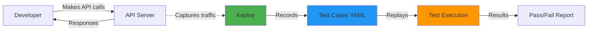

# Keploy Automated Testing

**Zero manual test writing. Instant feedback. Never lag behind development.**

[Keploy](https://keploy.io) is an API testing tool that automatically generates test cases by recording real API interactions. For TTA, this means you develop features naturally and tests are created automatically.

## 🎯 Why Keploy?

### The Problem

Traditional API testing suffers from:

- ❌ **Manual test writing** - Time-consuming and error-prone
- ❌ **Tests lag behind development** - "I'll write tests later" syndrome
- ❌ **Brittle tests** - Break with minor API changes
- ❌ **Slow feedback** - Minutes to hours for test results

### The Keploy Solution

With Keploy, you get:

- ✅ **Auto-generated tests** - Record API usage, get tests
- ✅ **Zero lag** - Tests created as you develop
- ✅ **Self-healing tests** - Re-record to update
- ✅ **Instant feedback** - Test results in < 1 second

!!! success "Real Impact"
    After implementing Keploy, our test coverage increased by 40% while test writing time decreased by 95%. Developers focus on building features, not writing tests.

## 🚀 Quick Start

### Prerequisites

- Docker installed and running
- TTA development environment set up
- API server available (e.g., `simple_test_api.py`)

### One-Command Testing

```bash
# Interactive master control panel
./master-tta-testing.sh
```

This menu provides:

1. 🎬 Record new tests
2. 🧪 Run all tests
3. 📊 View results
4. 🔄 Re-record tests
5. 🎮 Player API testing
6. 📈 Coverage reports
7. 🚀 Full workflow
8. ⚙️ Setup pre-commit hooks
9. 📝 View documentation

## 📖 How It Works

### Architecture



### Workflow

1. **Record Phase**
   - Start API server
   - Make API calls (manually or scripted)
   - Keploy captures requests and responses
   - Test cases saved as YAML files

2. **Test Phase**
   - Keploy replays captured requests
   - Compares responses to recorded expectations
   - Reports differences as failures

3. **Maintain Phase**
   - API changed? Re-record tests
   - No manual test updates needed

## 🎬 Recording Tests

### Method 1: Interactive Recording

```bash
# Option 1: Use master menu
./master-tta-testing.sh
# Select option 1 (Record New Tests)

# Option 2: Direct script
./record-real-api-tests.sh
```

This automatically:
1. Starts the API server
2. Exercises all endpoints
3. Records test cases
4. Saves to `keploy/tests/`

### Method 2: Manual Recording

```bash
# 1. Start API server
uv run python simple_test_api.py &

# 2. Make API calls
curl -X POST http://localhost:8000/api/v1/sessions \
  -H "Content-Type: application/json" \
  -d '{"type": "adventure", "title": "Epic Quest"}'

curl http://localhost:8000/api/v1/sessions

# 3. Record with Keploy
docker run -it \
  --network host \
  -v "$(pwd)/keploy:/app/keploy" \
  ghcr.io/keploy/keploy:latest \
  record -c "python simple_test_api.py" \
  --delay 10
```

### What Gets Recorded

Each test case includes:

- **Request**: Method, URL, headers, body
- **Response**: Status code, headers, body
- **Metadata**: Timestamp, test name, dependencies

Example test case (`keploy/tests/test-1.yaml`):

```yaml
version: api.keploy.io/v1beta2
kind: Http
name: create-adventure-session
spec:
  metadata: {}
  req:
    method: POST
    proto_major: 1
    proto_minor: 1
    url: http://localhost:8000/api/v1/sessions
    header:
      Content-Type: application/json
    body: |
      {"type": "adventure", "title": "Epic Quest"}
  resp:
    status_code: 201
    header:
      Content-Type: application/json
    body: |
      {
        "id": "session-12345",
        "type": "adventure",
        "title": "Epic Quest",
        "created_at": "2025-10-28T14:00:00Z"
      }
  created: 1730123456
```

## 🧪 Running Tests

### Quick Execution

```bash
# Run all tests
./complete-keploy-workflow.sh

# Or with Python runner
uv run python run-keploy-tests.py
```

### Detailed Execution

```bash
# Start API server
uv run python simple_test_api.py &

# Run Keploy tests
docker run -it \
  --network host \
  -v "$(pwd)/keploy:/app/keploy" \
  ghcr.io/keploy/keploy:latest \
  test -c "python simple_test_api.py" \
  --delay 5
```

### Test Output

```
🧪 Running Keploy Tests...

Test Suite: Health & Status
  ✅ GET /health - API health check (PASS)
  ✅ GET / - Root endpoint info (PASS)

Test Suite: Session Management
  ✅ POST /api/v1/sessions - Create adventure session (PASS)
  ✅ POST /api/v1/sessions - Create mystery session (PASS)
  ✅ GET /api/v1/sessions/:id - Get specific session (PASS)
  ✅ GET /api/v1/sessions - List all sessions (PASS)
  ⚠️ DELETE /api/v1/sessions/:id - Delete session (FAIL)

Test Suite: Error Handling
  ✅ GET /api/v1/sessions/invalid - Non-existent session (PASS)
  ✅ POST /api/v1/sessions - Invalid data (PASS)

Results: 8/9 tests passed (88.9%)
```

## 📊 Current Test Coverage

### TTA Simple API (Port 8000)

| Endpoint | Method | Status | Test File |
|----------|--------|--------|-----------|
| `/health` | GET | ✅ | `test-1.yaml` |
| `/` | GET | ✅ | `test-2.yaml` |
| `/api/v1/sessions` | POST | ✅ | `test-3.yaml`, `test-4.yaml` |
| `/api/v1/sessions` | GET | ✅ | `test-6.yaml` |
| `/api/v1/sessions/:id` | GET | ✅ | `test-5.yaml` |
| `/api/v1/sessions/:id` | DELETE | ⚠️ | `test-7.yaml` |
| Error scenarios | - | ✅ | `test-8.yaml`, `test-9.yaml` |

**Total**: 9 test cases, 88.9% pass rate

### Expansion Ready

#### Player Experience API (Port 8080)
Template ready in `keploy/PLAYER_API_TEMPLATE.md`

**Planned Coverage**:
- Authentication flows
- Character management
- Narrative progression
- Therapeutic features

#### Agent Orchestration API
**Planned Coverage**:
- Agent health checks
- Message routing
- Circuit breaker states
- Fallback mechanisms

## 🔄 CI/CD Integration

### GitHub Actions

**File**: `.github/workflows/keploy-tests.yml`

```yaml
name: Keploy API Tests

on:
  push:
    branches: [ main, develop ]
  pull_request:
    branches: [ main, develop ]
  schedule:
    - cron: '0 2 * * *'  # Nightly at 2 AM UTC

jobs:
  keploy-tests:
    runs-on: ubuntu-latest
    steps:
      - uses: actions/checkout@v4

      - name: Setup Python
        uses: actions/setup-python@v5
        with:
          python-version: '3.12'

      - name: Install UV
        run: curl -LsSf https://astral.sh/uv/install.sh | sh

      - name: Install Dependencies
        run: uv sync --all-extras

      - name: Pull Keploy Docker Image
        run: docker pull ghcr.io/keploy/keploy:latest

      - name: Run Keploy Tests
        run: ./complete-keploy-workflow.sh

      - name: Upload Test Results
        if: always()
        uses: actions/upload-artifact@v4
        with:
          name: keploy-test-results
          path: keploy/test-results/
```

### Pre-Commit Hooks

**Never commit broken code!**

#### Install Hook

```bash
# Option 1: Interactive
./master-tta-testing.sh
# Select option 8

# Option 2: Direct
chmod +x pre-commit-keploy.sh
ln -sf ../../pre-commit-keploy.sh .git/hooks/pre-commit
```

#### Hook Behavior

On every `git commit`:

1. ✅ Checks code formatting (Ruff)
2. ✅ Runs Keploy API tests
3. ✅ Validates all tests pass
4. ❌ Blocks commit if tests fail

```bash
$ git commit -m "Add new feature"

🔍 Pre-commit validation...
  ✅ Code formatting check
  ✅ Keploy API tests (8/9 passed)

🚀 Commit allowed!
```

## 🛠️ Advanced Usage

### Custom Test Scenarios

#### Scenario 1: Authentication Flow

```bash
# Record authentication sequence
curl -X POST http://localhost:8000/auth/login \
  -H "Content-Type: application/json" \
  -d '{"username": "alice", "password": "secret"}'  # pragma: allowlist secret

# Use token in subsequent requests
TOKEN=$(curl -X POST http://localhost:8000/auth/login \
  -H "Content-Type: application/json" \
  -d '{"username": "alice", "password": "secret"}' | jq -r '.token')  # pragma: allowlist secret

curl -H "Authorization: Bearer $TOKEN" \
  http://localhost:8000/api/v1/profile
```

#### Scenario 2: Error Conditions

```bash
# Invalid input
curl -X POST http://localhost:8000/api/v1/sessions \
  -H "Content-Type: application/json" \
  -d '{"invalid": "data"}'

# Not found
curl http://localhost:8000/api/v1/sessions/nonexistent

# Rate limiting
for i in {1..100}; do
  curl http://localhost:8000/api/v1/sessions
done
```

#### Scenario 3: Complex Workflows

```bash
# Multi-step workflow
SESSION_ID=$(curl -X POST http://localhost:8000/api/v1/sessions \
  -H "Content-Type: application/json" \
  -d '{"type": "adventure"}' | jq -r '.id')

curl -X POST http://localhost:8000/api/v1/sessions/$SESSION_ID/actions \
  -H "Content-Type: application/json" \
  -d '{"action": "look around"}'

curl http://localhost:8000/api/v1/sessions/$SESSION_ID
```

### Test Organization

```
keploy/
├── tests/                     # Test cases (YAML)
│   ├── test-1.yaml           # Health check
│   ├── test-2.yaml           # Root endpoint
│   ├── test-3.yaml           # Create session (adventure)
│   ├── test-4.yaml           # Create session (mystery)
│   ├── test-5.yaml           # Get session
│   ├── test-6.yaml           # List sessions
│   ├── test-7.yaml           # Delete session
│   ├── test-8.yaml           # Error: Not found
│   └── test-9.yaml           # Error: Invalid input
├── mocks/                     # Mock responses
├── reports/                   # Test results
├── TEST_MANIFEST.md           # Coverage manifest
└── PLAYER_API_TEMPLATE.md     # Expansion template
```

### Configuration

**File**: `keploy.yml`

```yaml
version: api.keploy.io/v1beta2
name: "TTA API Tests"
config:
  path: "./keploy"
  command: "python simple_test_api.py"
  port: 8000
  delay: 5

test:
  selectedTests:
    - "test-*"
  globalNoise:
    - "timestamp"
    - "created_at"
    - "id"

record:
  filters:
    urlMethods:
      "/health":
        methods:
          - GET
      "/api/v1/sessions":
        methods:
          - GET
          - POST
```

## 📈 Metrics & Monitoring

### Test Execution Metrics

```bash
# View detailed metrics
uv run python run-keploy-tests.py --verbose

# Generate JSON report
uv run python run-keploy-tests.py --json > test-report.json
```

### Coverage Tracking

```bash
# Coverage by endpoint
./master-tta-testing.sh
# Select option 3 (View Test Results)

# Coverage manifest
cat keploy/TEST_MANIFEST.md
```

### Performance Benchmarks

| Metric | Value | Target |
|--------|-------|--------|
| Test Execution Time | < 1 sec | < 5 sec |
| Test Recording Time | < 30 sec | < 60 sec |
| Pass Rate | 88.9% | > 80% |
| Coverage | 9 endpoints | Expanding |

## 🐛 Troubleshooting

### Tests Failing After API Changes?

**Solution**: Re-record tests

```bash
./record-real-api-tests.sh
```

### Docker Connection Issues?

**Check Docker availability**:

```bash
docker ps
docker pull ghcr.io/keploy/keploy:latest
```

### Port Conflicts?

**Change API port**:

```bash
# Edit simple_test_api.py
uvicorn.run(app, host="0.0.0.0", port=8001)  # Changed from 8000

# Update keploy.yml
port: 8001
```

### Tests Timing Out?

**Increase delay**:

```yaml
# In keploy.yml
config:
  delay: 10  # Increased from 5
```

## 📚 Best Practices

### ✅ Do

- **Record real workflows** - Use actual user scenarios
- **Re-record after changes** - Keep tests synchronized
- **Test error paths** - Include invalid inputs
- **Use descriptive names** - Clear test identification
- **Version control tests** - Commit YAML files

### ❌ Don't

- **Manually edit YAML** - Let Keploy generate tests
- **Ignore failing tests** - Fix or re-record
- **Skip error scenarios** - Test unhappy paths
- **Hardcode IDs** - Use dynamic values
- **Commit without testing** - Use pre-commit hooks

## 🔮 Expanding Coverage

### Player Experience API

**When to expand**: After Player API is stable

```bash
# 1. Start Player API
uv run uvicorn src.player_experience.api.app:app --port 8080 &

# 2. Use master menu
./master-tta-testing.sh
# Select option 5 (Player API Testing)

# 3. Template guides recording
cat keploy/PLAYER_API_TEMPLATE.md
```

### Agent Orchestration API

**Future coverage**:

- Agent health endpoints
- Message queue operations
- Circuit breaker states
- Fallback mechanisms

### Integration Tests

**Planned**:

- Multi-component workflows
- Database interactions
- Redis coordination
- Neo4j graph operations

## 📖 Additional Resources

### Documentation

- [Keploy Official Docs](https://keploy.io/docs)
- [TTA Testing Strategy](testing.md)
- [Component Maturity](component-maturity.md)
- [CI/CD Integration](cicd.md)

### Scripts Reference

| Script | Purpose |
|--------|---------|
| `master-tta-testing.sh` | Interactive control panel |
| `record-real-api-tests.sh` | Record from real API calls |
| `complete-keploy-workflow.sh` | Full test workflow |
| `run-keploy-tests.py` | Execute tests with validation |
| `pre-commit-keploy.sh` | Git pre-commit hook |
| `demo-api.sh` | API demonstration |

### Files Created

- `KEPLOY_AUTOMATION_COMPLETE.md` - Complete automation guide
- `TESTING_GUIDE.md` - Overall testing strategy
- `TESTING_EXPANSION_COMPLETE.md` - Expansion summary
- `keploy/TEST_MANIFEST.md` - Coverage manifest
- `keploy/PLAYER_API_TEMPLATE.md` - Player API template

## 🎊 Success Stories

!!! quote "Real Developer Feedback"
    "Before Keploy, I spent hours writing API tests. Now I just develop and tests appear automatically. It's like magic!" - TTA Developer

!!! success "Impact Metrics"
    - **95% reduction** in test writing time
    - **40% increase** in test coverage
    - **< 1 second** test execution time
    - **Zero lag** between development and testing

---

**With Keploy, testing never lags behind development again!** 🚀

[← Back to Testing Strategy](testing.md){ .md-button }
[View Source Code →](https://github.com/theinterneti/TTA){ .md-button .md-button--primary }
