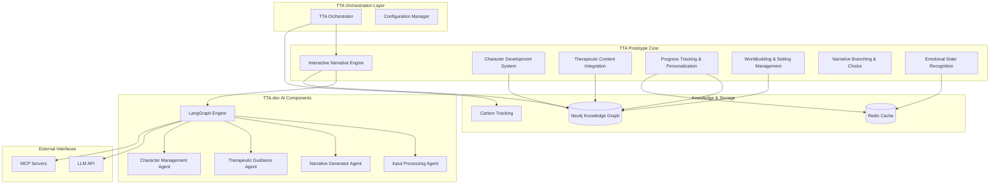

# Design Document

## Overview

The TTA Prototype Core Features design implements a sophisticated therapeutic text adventure platform that seamlessly integrates AI-powered narrative generation with evidence-based therapeutic interventions. The system leverages the existing TTA architecture, including Neo4j knowledge graphs, LangGraph agent orchestration, and multi-component orchestration to deliver personalized therapeutic experiences through interactive storytelling.

## Architecture

### High-Level Architecture



### Component Integration

The design builds upon the existing TTA architecture:

- **TTA Orchestration Layer**: Manages component lifecycle and configuration
- **TTA.dev Integration**: Leverages existing AI agents and LangGraph engine
- **Neo4j Knowledge Graph**: Stores narrative elements, character states, and therapeutic progress
- **Redis Caching**: Handles session state and performance optimization
- **MCP Integration**: Enables extensible tool and agent capabilities

## Components and Interfaces

### 1. Interactive Narrative Engine

**Purpose**: Core storytelling system that manages narrative flow and user interactions.

**Key Interfaces**:
```python
class InteractiveNarrativeEngine:
    def start_session(self, user_id: str, scenario_id: str) -> SessionState
    def process_user_choice(self, session_id: str, choice: UserChoice) -> NarrativeResponse
    def get_current_scenario(self, session_id: str) -> ScenarioState
    def advance_narrative(self, session_id: str, narrative_event: NarrativeEvent) -> bool
```

**Integration Points**:
- Uses LangGraph Engine for agent orchestration
- Queries Neo4j for narrative content and world state
- Caches session state in Redis
- Integrates with Therapeutic Content Integration for seamless therapy delivery

### 2. Character Development System

**Purpose**: Manages character personalities, relationships, and evolution over time.

**Key Interfaces**:
```python
class CharacterDevelopmentSystem:
    def get_character_state(self, character_id: str, session_id: str) -> CharacterState
    def update_relationship(self, char1_id: str, char2_id: str, interaction: Interaction) -> bool
    def evolve_character(self, character_id: str, story_events: List[StoryEvent]) -> CharacterState
    def generate_character_dialogue(self, character_id: str, context: DialogueContext) -> str
```

**Integration Points**:
- Stores character data and relationships in Neo4j
- Uses Character Management Agent for personality consistency
- Integrates with Therapeutic Guidance Agent for therapeutic dialogue
- Maintains character memory through Redis caching

### 3. Therapeutic Content Integration

**Purpose**: Seamlessly embeds therapeutic interventions within narrative contexts.

**Key Interfaces**:
```python
class TherapeuticContentIntegration:
    def identify_therapeutic_moments(self, narrative_context: NarrativeContext) -> List[TherapeuticOpportunity]
    def generate_therapeutic_intervention(self, opportunity: TherapeuticOpportunity) -> TherapeuticContent
    def assess_user_emotional_state(self, user_responses: List[UserResponse]) -> EmotionalState
    def adapt_therapy_approach(self, user_profile: UserProfile, progress: TherapyProgress) -> TherapyStrategy
```

**Integration Points**:
- Uses Therapeutic Guidance Agent for evidence-based interventions
- Stores therapeutic progress in Neo4j
- Integrates with Emotional State Recognition for real-time adaptation
- Leverages MCP servers for specialized therapeutic tools

### 4. Progress Tracking and Personalization

**Purpose**: Monitors user progress and personalizes the therapeutic experience.

**Key Interfaces**:
```python
class ProgressTrackingPersonalization:
    def track_therapeutic_progress(self, user_id: str, session_data: SessionData) -> ProgressUpdate
    def personalize_content(self, user_profile: UserProfile, content_request: ContentRequest) -> PersonalizedContent
    def analyze_user_patterns(self, user_id: str, timeframe: TimeFrame) -> UserPatterns
    def recommend_next_steps(self, user_id: str, current_progress: Progress) -> List[Recommendation]
```

**Integration Points**:
- Stores user progress and preferences in Neo4j
- Uses Redis for real-time personalization data
- Integrates with all other components for holistic personalization
- Leverages Carbon tracking for usage analytics

### 5. Worldbuilding and Setting Management

**Purpose**: Maintains consistent fictional worlds that support therapeutic narratives.

**Key Interfaces**:
```python
class WorldbuildingSettingManagement:
    def get_location_details(self, location_id: str) -> LocationDetails
    def update_world_state(self, world_changes: List[WorldChange]) -> bool
    def generate_setting_description(self, location_id: str, context: NarrativeContext) -> str
    def validate_world_consistency(self, proposed_changes: List[WorldChange]) -> ValidationResult
```

**Integration Points**:
- Stores world data and lore in Neo4j knowledge graph
- Uses Narrative Generator Agent for rich descriptions
- Integrates with Interactive Narrative Engine for consistent storytelling
- Maintains world state through Redis caching

### 6. Narrative Branching and Choice Consequences

**Purpose**: Manages story branching and meaningful choice consequences.

**Key Interfaces**:
```python
class NarrativeBranchingChoice:
    def generate_choice_options(self, narrative_context: NarrativeContext) -> List[ChoiceOption]
    def process_user_choice(self, choice: UserChoice, context: NarrativeContext) -> ChoiceConsequence
    def calculate_story_impact(self, choice_history: List[UserChoice]) -> StoryImpact
    def create_narrative_branch(self, branching_point: BranchingPoint) -> NarrativeBranch
```

**Integration Points**:
- Uses Neo4j to store choice trees and consequences
- Integrates with Therapeutic Content Integration for meaningful therapeutic choices
- Leverages LangGraph Engine for complex decision processing
- Maintains choice history in Redis for performance

### 7. Emotional State Recognition and Response

**Purpose**: Recognizes user emotional states and provides appropriate responses.

**Key Interfaces**:
```python
class EmotionalStateRecognitionResponse:
    def analyze_emotional_indicators(self, user_input: UserInput) -> EmotionalState
    def detect_emotional_patterns(self, user_history: UserHistory) -> EmotionalPatterns
    def generate_supportive_response(self, emotional_state: EmotionalState) -> SupportiveResponse
    def trigger_crisis_support(self, crisis_indicators: CrisisIndicators) -> CrisisResponse
```

**Integration Points**:
- Uses advanced NLP through LLM API for emotion detection
- Stores emotional patterns in Neo4j for long-term tracking
- Integrates with Therapeutic Content Integration for appropriate interventions
- Uses Redis for real-time emotional state caching

## Data Models

### Core Data Structures

```python
# Session Management
@dataclass
class SessionState:
    session_id: str
    user_id: str
    current_scenario_id: str
    current_location_id: str
    narrative_position: int
    character_states: Dict[str, CharacterState]
    user_inventory: List[str]
    therapeutic_progress: TherapeuticProgress
    emotional_state: EmotionalState
    created_at: datetime
    last_updated: datetime

# Character System
@dataclass
class CharacterState:
    character_id: str
    name: str
    personality_traits: Dict[str, float]
    current_mood: str
    relationship_scores: Dict[str, float]
    memory_fragments: List[MemoryFragment]
    therapeutic_role: str
    dialogue_style: DialogueStyle

# Therapeutic Integration
@dataclass
class TherapeuticProgress:
    user_id: str
    therapeutic_goals: List[TherapeuticGoal]
    completed_interventions: List[CompletedIntervention]
    emotional_growth_metrics: Dict[str, float]
    coping_strategies_learned: List[CopingStrategy]
    next_recommended_focus: str

# Narrative Management
@dataclass
class NarrativeContext:
    current_location: LocationDetails
    active_characters: List[CharacterState]
    recent_events: List[NarrativeEvent]
    user_choice_history: List[UserChoice]
    therapeutic_opportunities: List[TherapeuticOpportunity]
    world_state_flags: Dict[str, Any]
```

### Neo4j Schema Design

```cypher
// Core Entities
CREATE CONSTRAINT character_id IF NOT EXISTS FOR (c:Character) REQUIRE c.character_id IS UNIQUE;
CREATE CONSTRAINT location_id IF NOT EXISTS FOR (l:Location) REQUIRE l.location_id IS UNIQUE;
CREATE CONSTRAINT user_id IF NOT EXISTS FOR (u:User) REQUIRE u.user_id IS UNIQUE;
CREATE CONSTRAINT session_id IF NOT EXISTS FOR (s:Session) REQUIRE s.session_id IS UNIQUE;

// Relationships
(:Character)-[:LOCATED_AT]->(:Location)
(:Character)-[:KNOWS]->(:Character)
(:Character)-[:HAS_RELATIONSHIP {type: string, strength: float}]->(:Character)
(:User)-[:HAS_SESSION]->(:Session)
(:Session)-[:CURRENT_LOCATION]->(:Location)
(:Session)-[:INVOLVES_CHARACTER]->(:Character)
(:Location)-[:CONNECTS_TO {direction: string, description: string}]->(:Location)
(:TherapeuticGoal)-[:BELONGS_TO]->(:User)
(:TherapeuticIntervention)-[:APPLIED_IN]->(:Session)
```

## Error Handling

### Graceful Degradation Strategy

1. **LLM API Failures**: Fall back to template-based responses and cached content
2. **Neo4j Connectivity Issues**: Use Redis cache for essential game state
3. **Redis Failures**: Store critical session data in local memory with periodic Neo4j sync
4. **Agent Processing Errors**: Implement rule-based fallbacks for core game functions

### Error Recovery Mechanisms

```python
class ErrorRecoveryManager:
    def handle_llm_failure(self, context: NarrativeContext) -> FallbackResponse
    def handle_database_failure(self, operation: DatabaseOperation) -> RecoveryAction
    def handle_agent_failure(self, agent_type: str, input_data: Any) -> FallbackResult
    def log_error_for_analysis(self, error: Exception, context: Dict[str, Any]) -> None
```

## Testing Strategy

### Test Categories

1. **Unit Tests**: Individual component functionality
2. **Integration Tests**: Component interaction and data flow
3. **Therapeutic Validation Tests**: Verify therapeutic content appropriateness
4. **Performance Tests**: Response time and scalability under load
5. **User Experience Tests**: Narrative flow and immersion quality

### Test Data Management

- **Synthetic User Profiles**: Generated test users with various therapeutic needs
- **Narrative Test Scenarios**: Predefined story paths for consistent testing
- **Therapeutic Content Validation**: Expert-reviewed therapeutic interventions
- **Performance Benchmarks**: Response time targets for different operations

### Continuous Testing Pipeline

```python
class TestingPipeline:
    def run_therapeutic_content_validation(self) -> ValidationResults
    def run_narrative_consistency_tests(self) -> ConsistencyResults
    def run_performance_benchmarks(self) -> PerformanceResults
    def run_integration_tests(self) -> IntegrationResults
```

## Performance Considerations

### Optimization Strategies

1. **Caching Strategy**: Multi-layer caching with Redis for session data and in-memory caching for frequently accessed content
2. **Database Optimization**: Neo4j query optimization and connection pooling
3. **LLM Efficiency**: Response caching and batch processing for similar requests
4. **Agent Optimization**: Parallel agent execution where possible

### Scalability Design

- **Horizontal Scaling**: Stateless component design for easy scaling
- **Load Balancing**: Session affinity for consistent user experience
- **Resource Management**: Dynamic resource allocation based on user load
- **Carbon Efficiency**: Optimized AI model usage to minimize environmental impact

### Performance Monitoring

```python
class PerformanceMonitor:
    def track_response_times(self, component: str, operation: str, duration: float) -> None
    def monitor_resource_usage(self, component: str, metrics: ResourceMetrics) -> None
    def track_user_engagement(self, session_id: str, engagement_metrics: EngagementMetrics) -> None
    def generate_performance_reports(self, timeframe: TimeFrame) -> PerformanceReport
```

## Security and Privacy

### Data Protection

- **User Data Encryption**: All therapeutic progress and personal data encrypted at rest and in transit
- **Session Security**: Secure session management with automatic timeout
- **Access Control**: Role-based access to therapeutic data
- **Audit Logging**: Comprehensive logging of all therapeutic interactions

### Privacy Compliance

- **Data Minimization**: Collect only necessary data for therapeutic purposes
- **User Consent**: Clear consent mechanisms for data collection and use
- **Data Retention**: Automatic data purging based on retention policies
- **Anonymization**: User data anonymization for research and analytics

### Therapeutic Ethics

- **Crisis Detection**: Automatic detection and appropriate response to mental health crises
- **Professional Boundaries**: Clear limitations and referral mechanisms
- **Content Appropriateness**: Validation of all therapeutic content by qualified professionals
- **User Safety**: Safeguards against harmful or triggering content
