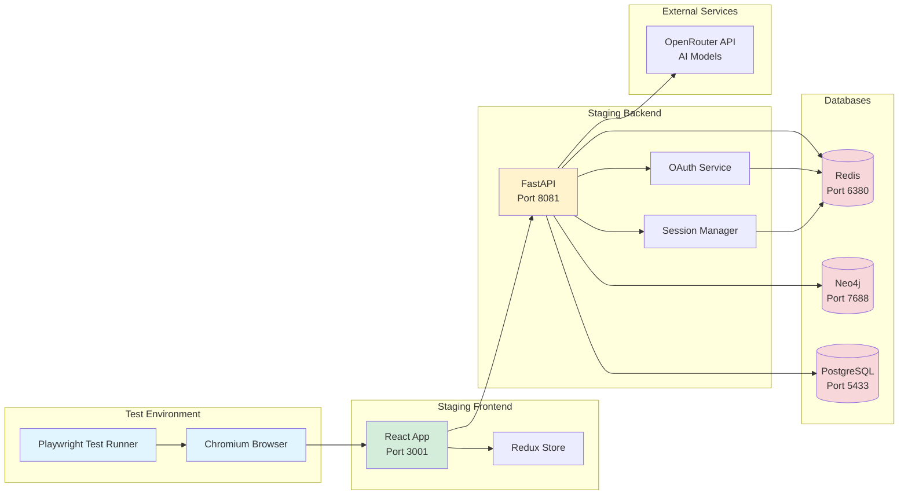
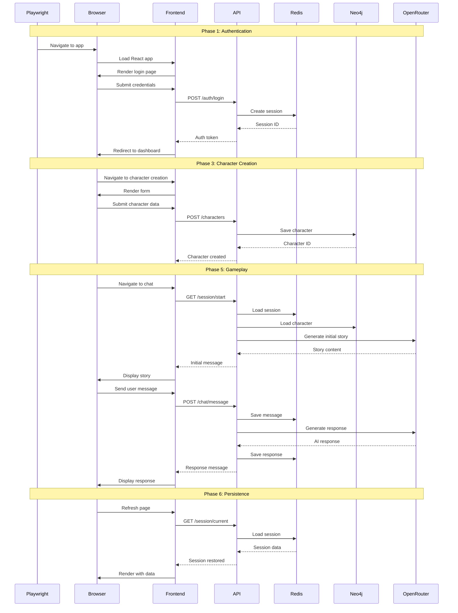
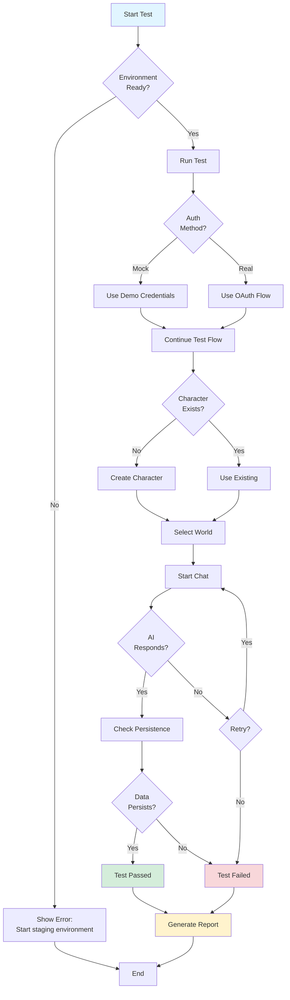
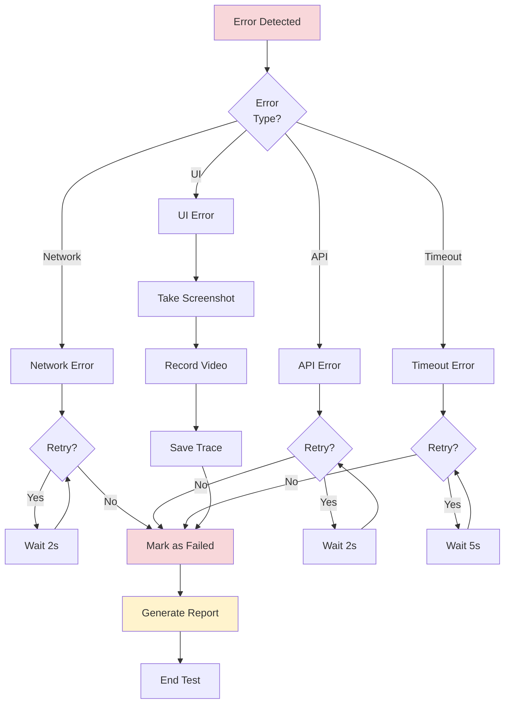

# TTA Staging E2E Test Flow Diagram

## Complete User Journey Test Flow

```mermaid
graph TD
    Start[Start Test] --> Setup[Global Setup]
    Setup --> ValidateEnv{Environment<br/>Validation}

    ValidateEnv -->|Pass| Phase1[Phase 1: Landing & Auth]
    ValidateEnv -->|Fail| Error[❌ Environment Not Ready]

    Phase1 --> P1_1[Load Application]
    P1_1 --> P1_2[Check Sign-in Visible]
    P1_2 --> P1_3{OAuth or<br/>Demo?}

    P1_3 -->|Mock OAuth| P1_4a[Use Demo Credentials]
    P1_3 -->|Real OAuth| P1_4b[OAuth Flow]

    P1_4a --> P1_5[Authenticate]
    P1_4b --> P1_5
    P1_5 --> P1_6{Auth<br/>Success?}

    P1_6 -->|Yes| Phase2[Phase 2: Dashboard]
    P1_6 -->|No| Error

    Phase2 --> P2_1[Check Dashboard Loads]
    P2_1 --> P2_2[Verify Welcome Content]
    P2_2 --> P2_3[Check Clear Next Steps]
    P2_3 --> Phase3[Phase 3: Character Creation]

    Phase3 --> P3_1{Character<br/>Exists?}
    P3_1 -->|No| P3_2[Navigate to Creation]
    P3_1 -->|Yes| P3_5[Use Existing Character]

    P3_2 --> P3_3[Fill Character Form]
    P3_3 --> P3_4[Submit Character]
    P3_4 --> P3_5
    P3_5 --> Phase4[Phase 4: World Selection]

    Phase4 --> P4_1[View Available Worlds]
    P4_1 --> P4_2[Check World Display]
    P4_2 --> P4_3[Select World]
    P4_3 --> Phase5[Phase 5: Gameplay]

    Phase5 --> P5_1[Load Chat Interface]
    P5_1 --> P5_2[Wait for Initial Story]
    P5_2 --> P5_3[Send User Message]
    P5_3 --> P5_4[Wait for AI Response]
    P5_4 --> P5_5{Response<br/>Received?}

    P5_5 -->|Yes| Phase6[Phase 6: Persistence]
    P5_5 -->|No| Error

    Phase6 --> P6_1[Refresh Page]
    P6_1 --> P6_2[Check Session Persists]
    P6_2 --> P6_3{Data<br/>Persisted?}

    P6_3 -->|Yes| Success[✅ Test Passed]
    P6_3 -->|No| Error

    Success --> Teardown[Global Teardown]
    Error --> Teardown
    Teardown --> End[End Test]

    style Start fill:#e1f5ff
    style Success fill:#d4edda
    style Error fill:#f8d7da
    style Phase1 fill:#fff3cd
    style Phase2 fill:#fff3cd
    style Phase3 fill:#fff3cd
    style Phase4 fill:#fff3cd
    style Phase5 fill:#fff3cd
    style Phase6 fill:#fff3cd
```

## System Architecture During Testing

## Test Execution Timeline

```mermaid
gantt
    title Complete User Journey Test Timeline
    dateFormat  ss
    axisFormat %S

    section Setup
    Global Setup           :setup, 00, 5s
    Environment Validation :validate, after setup, 5s

    section Phase 1: Auth
    Load Application       :p1_1, after validate, 3s
    Check Sign-in          :p1_2, after p1_1, 2s
    Authenticate           :p1_3, after p1_2, 5s

    section Phase 2: Dashboard
    Load Dashboard         :p2_1, after p1_3, 3s
    Verify Content         :p2_2, after p2_1, 2s

    section Phase 3: Character
    Navigate to Creation   :p3_1, after p2_2, 2s
    Fill Form              :p3_2, after p3_1, 5s
    Submit Character       :p3_3, after p3_2, 3s

    section Phase 4: World
    View Worlds            :p4_1, after p3_3, 3s
    Select World           :p4_2, after p4_1, 2s

    section Phase 5: Gameplay
    Load Chat              :p5_1, after p4_2, 3s
    Initial Story          :p5_2, after p5_1, 5s
    Send Message           :p5_3, after p5_2, 2s
    AI Response            :p5_4, after p5_3, 8s

    section Phase 6: Persistence
    Refresh Page           :p6_1, after p5_4, 3s
    Verify Persistence     :p6_2, after p6_1, 2s

    section Teardown
    Global Teardown        :teardown, after p6_2, 2s
```

## Data Flow During Test

## Test Decision Tree

## Key Validation Points

### ✅ Phase 1: Authentication
- Application loads without errors
- Sign-in button is visible
- OAuth flow completes (or demo works)
- User is redirected to dashboard

### ✅ Phase 2: Dashboard
- Dashboard renders correctly
- Welcome message is visible
- Next steps are clear
- Navigation is intuitive

### ✅ Phase 3: Character Creation
- Form is accessible
- All required fields are present
- Validation works
- Character saves to Neo4j

### ✅ Phase 4: World Selection
- Worlds are displayed
- Selection is clear
- World loads successfully

### ✅ Phase 5: Gameplay
- Chat interface loads
- Initial story appears
- User can send messages
- AI responds within timeout
- Messages persist to Redis

### ✅ Phase 6: Persistence
- Page refresh doesn't lose session
- Character data is maintained
- Story progress is preserved
- Redis session is valid

## Performance Targets

| Phase | Target Time | Max Time |
|-------|-------------|----------|
| Setup | 5s | 10s |
| Authentication | 5s | 15s |
| Dashboard | 3s | 10s |
| Character Creation | 5s | 15s |
| World Selection | 3s | 10s |
| Initial Story | 5s | 20s |
| AI Response | 8s | 30s |
| Persistence Check | 3s | 10s |
| **Total** | **37s** | **120s** |

## Error Handling

---

**Note:** These diagrams provide a visual representation of the test flow, system architecture, and decision points. Use them to understand how the tests work and troubleshoot issues.
